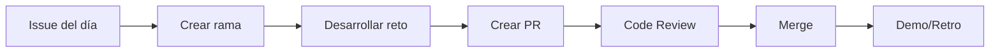

# ¡Bienvenido a Indaptados! 🚀

¡Bienvenido al onboarding técnico de **Indaptados**! Durante las próximas **2 semanas** aprenderás haciendo, enfocándote en crear productos que realmente resuelvan problemas.

## 🎯 Objetivo del Onboarding

Este programa está diseñado para que adquieras las competencias técnicas y metodológicas esenciales para trabajar en nuestros proyectos:

- **Pensamiento centrado en el usuario** con metodologías ágiles
- **Desarrollo full-stack** moderno (React/Next.js + Node/Express)
- **Seguridad desde el diseño** (Secure SDLC)
- **Uso productivo de IA** para desarrollo y prototipado

## 📅 Estructura del Programa (10 días hábiles)

### Semana 1: Fundamentos y Metodología

- **Día 1**: Ágil & UX - Entender al usuario
- **Día 2**: Scrum - Organización y entrega de valor
- **Día 3**: Secure SDLC - Seguridad desde el diseño
- **Día 4**: Next.js/React - Frontend moderno
- **Día 5**: Demo de la semana + retrospectiva

### Semana 2: Desarrollo y Especialización

- **Día 6**: Node/Express - Backend robusto
- **Día 7**: Prompt Engineering - IA aplicada
- **Día 8**: Vibe Coding - Prototipado rápido
- **Día 9**: Integración de conocimientos
- **Día 10**: Presentación final + cierre

## 🛠️ Cómo Trabajamos

### Flujo de Trabajo Diario



### Herramientas Principales

- **GitHub**: Control de versiones y colaboración
- **VS Code**: Editor de código
- **Node.js**: Runtime de JavaScript
- **Docker**: Contenedores (opcional)
- **Figma**: Prototipado UI/UX

### Comunicación

- **Daily standup**: 9:00 AM (15 min máximo)
  - ¿Qué hiciste ayer?
  - ¿Qué harás hoy?
  - ¿Hay algún bloqueador?
- **Demo del día**: 5:00 PM (mostrar progreso)
- **Slack**: Comunicación asíncrona
- **Issues de GitHub**: Dudas técnicas documentadas

## 📋 Entregables Diarios

### 1. Pull Request del Reto ✅

Cada día completarás un reto práctico que deberás entregar vía PR:

- Código funcional y probado
- Documentación básica en README
- Tests unitarios (donde aplique)

### 2. Bitácora de Aprendizaje 📝

En formato markdown, documentar:

- **3-5 conceptos clave** aprendidos
- **1-2 desafíos** enfrentados y cómo los resolviste
- **1 recurso útil** encontrado
- **Próximos pasos** o dudas pendientes

**Ejemplo de bitácora:**

```markdown
# Día 1 - Ágil & UX

## Conceptos clave aprendidos

- Jobs To Be Done (JTBD): enfoque en el "trabajo" que el usuario necesita hacer
- Hipótesis validables: suposición + métrica + experimento
- User Story mapping: visualizar el journey completo del usuario

## Desafíos enfrentados

- **Desafío**: Distinguir entre características y beneficios
- **Solución**: Usar la técnica "So What?" - preguntarse el beneficio real 3 veces

## Recurso útil

- [Jobs To Be Done Framework](https://jtbd.info/) - metodología completa

## Próximos pasos

- Practicar con casos reales del producto
- Revisar métricas actuales para validar hipótesis
```

### 3. Checklist de Calidad y Seguridad ✓

Antes de cada entrega, verificar:

- [ ] **Código**: Linters pasan sin errores
- [ ] **Tests**: Al menos smoke tests incluidos
- [ ] **Seguridad**: Inputs validados, no secrets expuestos
- [ ] **UX**: Flujo claro e intuitivo
- [ ] **Documentación**: README actualizado
- [ ] **Git**: Commits atómicos con mensajes descriptivos

## 🎓 Criterios de Éxito

Al final del onboarding serás capaz de:

### Competencias Técnicas

- ✅ Crear aplicaciones React/Next.js con buenas prácticas
- ✅ Desarrollar APIs REST seguras con Node/Express
- ✅ Implementar autenticación y autorización básica
- ✅ Escribir tests unitarios y de integración
- ✅ Usar Git con flujo profesional

### Competencias Metodológicas

- ✅ Aplicar Design Thinking y metodologías ágiles
- ✅ Escribir user stories y criterios de aceptación
- ✅ Priorizar features por valor e impacto
- ✅ Realizar code reviews constructivos
- ✅ Documentar decisiones técnicas

### Competencias de IA

- ✅ Crear prompts efectivos para desarrollo
- ✅ Usar IA para prototipado rápido
- ✅ Generar casos de prueba y documentación
- ✅ Optimizar workflows con herramientas IA

## 🆘 ¿Necesitas Ayuda?

### Escalación de Problemas

1. **Level 1** (0-30 min): Intenta resolver por ti mismo
2. **Level 2** (30+ min): Consulta documentación/recursos
3. **Level 3** (60+ min): Pregunta en Slack con contexto
4. **Level 4** (Bloqueador crítico): Escala a mentor/lead

### Formato para Pedir Ayuda

```markdown
**Contexto**: ¿Qué estás tratando de hacer?
**Problema**: ¿Qué específicamente no funciona?
**Intentado**: ¿Qué has probado ya?
**Error/Síntoma**: Logs, pantallazos, mensajes de error
**Entorno**: OS, versiones, configuración relevante
```

## 🎉 ¡Estamos Emocionados de Tenerte!

Este onboarding es tu oportunidad de aprender, hacer preguntas, equivocarte y crecer. Recuerda:

> **"El único error real es no intentarlo"**

¡Vamos a construir algo increíble juntos! 🚀
