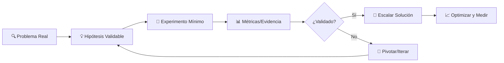

# Ágil & UX: Construyendo Productos que Importan 🎯

En **Indaptados** no construimos features, **resolvemos problemas reales**. Este módulo te enseña a pensar como un Product Owner, validar hipótesis y crear experiencias que generen valor genuino.

## 🧠 Mentalidad Product-First

### El Proceso: Problema → Hipótesis → Experimento

En lugar del tradicional "Requisitos → Desarrollo → Entrega", trabajamos con:



### ¿Por qué este enfoque funciona?

- **Reduce riesgo**: Validas antes de construir a gran escala
- **Acelera aprendizaje**: Fallas rápido y barato
- **Centra en el usuario**: Datos reales vs. suposiciones
- **Aumenta ROI**: Recursos invertidos en lo que realmente importa

## 🔧 Jobs to Be Done (JTBD) Framework

### Concepto Central

**"Las personas no compran productos, contratan productos para hacer un trabajo"**

Un "Job" tiene 3 componentes:

1. **Functional**: ¿Qué tarea práctica necesita hacer?
2. **Emotional**: ¿Cómo quiere sentirse al hacerlo?
3. **Social**: ¿Cómo quiere ser percibido por otros?

### Template JTBD

```
Cuando [SITUACIÓN],
quiero [MOTIVACIÓN],
para poder [RESULTADO ESPERADO].
```

### Ejemplos Prácticos

**❌ Feature-thinking:**
"Construir un sistema de QR para asistencias"

**✅ JTBD-thinking:**
"Cuando llego a clase corriendo porque vengo del trabajo, quiero confirmar mi asistencia rápidamente sin hacer fila, para poder concentrarme en la clase y no perder tiempo valioso."

**Análisis del JTBD:**

- **Functional Job**: Registrar asistencia eficientemente
- **Emotional Job**: Sentirse tranquilo y enfocado
- **Social Job**: No ser visto como impuntual o desorganizado

## 📊 Design Thinking en la Práctica

### Las 5 Etapas del Design Thinking

#### 1. **Empatizar** 🤝

**Objetivo**: Entender profundamente al usuario

**Herramientas**:

- **User interviews**: Preguntas abiertas sobre comportamientos actuales
- **Observación directa**: Cómo resuelven el problema hoy
- **Jobs-to-be-Done interviews**: ¿Qué "contratan" actualmente?

**Ejemplo de preguntas para asistencias:**

- "Cuéntame sobre la última vez que llegaste tarde a clase"
- "¿Qué haces cuando olvidas marcar asistencia?"
- "¿Cómo te sientes cuando hay fila para registrarse?"

#### 2. **Definir** 🎯

**Objetivo**: Sintetizar insights en un problema enfocado

**Herramientas**:

- **Point of View Statement**:
  ```
  [USUARIO] necesita [NECESIDAD/PROBLEMA]
  porque [INSIGHT/MOTIVACIÓN PROFUNDA]
  ```
- **How Might We**: Convertir problemas en oportunidades
  ```
  HMW reducir el tiempo de registro de asistencia?
  HMW hacer que llegar tarde no genere ansiedad?
  HMW ayudar a profesores a tomar asistencia sin interrumpir la clase?
  ```

#### 3. **Idear** 💡

**Objetivo**: Generar múltiples soluciones creativas

**Herramientas**:

- **Brainstorming**: Cantidad sobre calidad inicial
- **Crazy 8s**: 8 ideas en 8 minutos
- **SCAMPER**: Sustituir, Combinar, Adaptar, Modificar, Poner otros usos, Eliminar, Revertir

**Ejemplo de ideación para asistencias:**

- QR codes únicos por sesión
- Geofencing automático
- Reconocimiento facial
- Check-in por Bluetooth
- Integración con calendario personal
- Gamificación de puntualidad

#### 4. **Prototipar** 🛠️

**Objetivo**: Hacer tangible las ideas para probar

**Niveles de fidelidad**:

- **Papel**: Sketches y wireframes básicos
- **Digital**: Mockups en Figma
- **Interactivo**: Prototipos clicables
- **Funcional**: MVP técnico

#### 5. **Testear** 🧪

**Objetivo**: Validar suposiciones con usuarios reales

**Métodos**:

- **Usability testing**: ¿Pueden completar la tarea?
- **A/B testing**: ¿Qué versión funciona mejor?
- **Prototype interviews**: ¿Qué piensan del concepto?

## 🎯 Validación de Hipótesis

### Anatomía de una Hipótesis Validable

```
Creemos que [SOLUCIÓN]
para [USUARIO/SEGMENTO]
resultará en [RESULTADO MEDIBLE]
Lo sabremos cuando veamos [MÉTRICA/SEÑAL]
```

### Ejemplo práctico:

```
Creemos que un sistema de QR para asistencias
para estudiantes de horarios mixtos trabajo/estudio
resultará en 50% menos tiempo en registro de asistencia
Lo sabremos cuando veamos promedio &lt;30 segundos por registro
vs. 60+ segundos del método actual
```

### Jerarquía de Evidencia

1. **Opiniones** (menos confiable)
2. **Encuestas**
3. **Comportamiento observado**
4. **Métricas de uso real** (más confiable)

## 📋 User Stories y Criterios de Aceptación

### Template de User Story

```
Como [ROL/USUARIO]
Quiero [OBJETIVO/FUNCIONALIDAD]
Para [BENEFICIO/VALOR]
```

### Características de buenas User Stories (INVEST)

- **I**ndependent: Puede desarrollarse por separado
- **N**egotiable: Detalles pueden discutirse
- **V**aluable: Aporta valor al usuario
- **E**stimable: Se puede calcular esfuerzo
- **S**mall: Cabe en un sprint
- **T**estable: Tiene criterios de aceptación claros

### Ejemplo completo:

**User Story**:

```
Como estudiante que combina trabajo y estudios,
quiero registrar mi asistencia escaneando un código QR,
para poder ingresar a clase rápidamente sin hacer fila.
```

**Criterios de Aceptación**:

```gherkin
Feature: Registro de asistencia por QR

Scenario: Escaneo exitoso dentro del horario
  Given un estudiante autenticado con la app
  And hay una sesión de clase activa
  And el estudiante está dentro del rango geográfico permitido
  When escanea el código QR de la sesión
  Then el sistema registra la asistencia
  And muestra confirmación "Asistencia registrada ✓"
  And actualiza el contador de asistencias del estudiante

Scenario: Escaneo fuera del horario permitido
  Given un estudiante autenticado
  And la sesión de clase terminó hace más de 15 minutos
  When intenta escanear el QR
  Then el sistema muestra "Tiempo límite expirado"
  And no registra la asistencia
  And sugiere contactar al profesor si es un caso especial
```

## 🗺️ User Story Mapping

### ¿Qué es User Story Mapping?

Una técnica visual para organizar user stories que ayuda a:

- Ver el journey completo del usuario
- Priorizar features por impacto
- Identificar gaps en la experiencia
- Planificar releases incrementales

### Estructura básica:

```
Actividades del Usuario (Nivel alto)
    ↓
Tareas Específicas (User Stories)
    ↓
Detalles/Subtareas (Criterios)
```

### Ejemplo práctico - Sistema de Asistencias:

```
[Prepararse para clase] → [Llegar a clase] → [Durante clase] → [Después clase]
         |                      |                |               |
    - Revisar horario      - Encontrar aula    - Concentrarse    - Ver asistencias
    - Ver asistencias      - Registrar         - Participar      - Repasar notas
      previas               asistencia         - Tomar notas     - Planificar estudio
    - Planificar ruta      - Preparar          - Hacer
                            materiales          preguntas
```

**Priorización por releases:**

- **Release 1 (MVP)**: Registrar asistencia básico
- **Release 2**: Notificaciones y recordatorios
- **Release 3**: Analytics y reportes
- **Release 4**: Integración con calendario

## 🎨 Principios de UX Aplicados

### 1. Usabilidad (Jakob Nielsen)

- **Visibilidad del estado**: Usuario siempre sabe qué pasa
- **Correspondencia mundo real**: Lenguaje y conceptos familiares
- **Control y libertad**: Usuario puede deshacer acciones
- **Consistencia**: Mismos elementos funcionan igual siempre
- **Prevención de errores**: Diseño previene problemas

### 2. Leyes de UX Aplicadas

**Ley de Fitts**: Targets más grandes son más fáciles de tocar

```css
/* ✅ Botón de acción principal */
.primary-button {
  min-height: 44px; /* Minimum touch target */
  min-width: 44px;
  padding: 12px 24px;
}
```

**Ley de Hick**: Menos opciones = decisiones más rápidas

```jsx
// ✅ Acción principal clara
<div>
  <Button primary>Escanear QR</Button>
  <Button secondary>Ver historial</Button>
</div>

// ❌ Demasiadas opciones
<div>
  <Button>Escanear</Button>
  <Button>Historial</Button>
  <Button>Configuración</Button>
  <Button>Reportes</Button>
  <Button>Ayuda</Button>
  <Button>Perfil</Button>
</div>
```

**Principio de proximidad**: Elementos relacionados deben estar cerca

```jsx
// ✅ Información agrupada lógicamente
<Card>
  <h3>Programación Avanzada</h3>
  <p>Aula 201 • 14:00-16:00</p>
  <Button>Registrar Asistencia</Button>
</Card>
```

## 🧪 Experimentación y Métricas

### Framework de Experimentación

#### 1. Definir Hipótesis

```
Si implementamos [CAMBIO],
entonces [MÉTRICA] cambiará en [DIRECCIÓN] y [CANTIDAD],
porque [RAZONAMIENTO].
```

#### 2. Diseñar Experimento

- **Variable independiente**: Lo que cambias
- **Variable dependiente**: Lo que mides
- **Variables de control**: Lo que mantienes igual
- **Muestra**: Quién participa y por cuánto tiempo

#### 3. Métricas Clave (según el funnel)

**Acquisition**: ¿Llegan usuarios?

- Tasa de descarga de la app
- Registros por día
- Origen de tráfico

**Activation**: ¿Experimentan valor?

- Completación de onboarding
- Primera asistencia registrada exitosa
- Tiempo hasta primera acción

**Retention**: ¿Siguen usando?

- DAU/MAU (Daily/Monthly Active Users)
- Frecuencia de uso
- Tasa de churn

**Referral**: ¿Recomiendan?

- Net Promoter Score (NPS)
- Compartidos orgánicos
- Crecimiento viral

**Revenue**: ¿Genera valor?

- Ahorro de tiempo operativo
- Reducción de costos administrativos
- Satisfacción del usuario

### Herramientas de Medición

- **Google Analytics**: Comportamiento web
- **Mixpanel/Amplitude**: Eventos de producto
- **Hotjar**: Heatmaps y grabaciones
- **UserVoice**: Feedback directo
- **A/B testing**: Optimizely, LaunchDarkly

## 🎯 Mini Check de Validación

Antes de cada desarrollo, pregúntate:

### 🤔 **¿Qué suposición validas?**

- "Los estudiantes prefieren QR vs. lista manual"
- "El tiempo de registro es el problema principal"
- "La ubicación geográfica previene fraude efectivamente"

### 📊 **¿Cómo sabrás que funcionó?**

- Tiempo promedio de registro &lt;30 segundos
- 90% de estudiantes usan QR vs. método alternativo
- &lt;5% de reportes de problemas técnicos
- NPS &gt;8 en encuesta post-implementación

### 🚀 **¿Qué entregable mínimo usarás para probarlo?**

- **Prototipo en papel**: Flujo básico con estudiantes
- **Landing page**: Gauging de interés con signup
- **MVP funcional**: Una sola clase piloto por una semana
- **A/B test**: 50% QR vs. 50% método actual

## 🛠️ Herramientas Recomendadas

### Investigación de Usuarios

- **Calendly**: Agendar entrevistas
- **Zoom**: Sesiones remotas
- **Otter.ai**: Transcripción automática
- **Miro**: Mapeo de insights

### Prototipado

- **Figma**: Diseño colaborativo
- **InVision/Marvel**: Prototipos interactivos
- **Principle**: Animaciones
- **Framer**: Prototipos avanzados

### Testing

- **Maze**: Usability testing remoto
- **UserTesting**: Feedback de usuarios
- **Lookback**: Live user research
- **Google Optimize**: A/B testing

## 📚 Recursos Adicionales

### Libros Esenciales

- **"The Mom Test"** - Rob Fitzpatrick (Cómo hacer preguntas que importan)
- **"Jobs to Be Done"** - Anthony Ulwick (Framework completo)
- **"The Design of Everyday Things"** - Don Norman (Principios de diseño)
- **"Don't Make Me Think"** - Steve Krug (Usabilidad web)

### Cursos y Certificaciones

- **Google UX Design Certificate** (Coursera)
- **Design Thinking Bootcamp** (d.school Stanford)
- **Jobs to Be Done Masterclass** (Clayton Christensen Institute)

### Comunidades

- **IxDA** (Interaction Design Association)
- **Designer Hangout** (Slack community)
- **Product Hunt** (Nuevas tendencias)
- **UX Mastery** (Recursos y templates)

---

## 🎯 Próximo Paso: Reto Práctico

Ahora que tienes el framework teórico, es momento de aplicarlo. En el siguiente reto crearás un **Brief UX completo** para el sistema de "Asistencias por QR", aplicando todo lo aprendido.

**Recuerda**: No estamos construyendo software por construir, estamos **resolviendo problemas reales** para **personas reales**. ¡Esa es la magia del enfoque centrado en el usuario! 🚀
