# 🔐 Secure SDLC — Desarrollo Seguro

> **Objetivo del módulo**: Integrar prácticas de seguridad desde el diseño hasta el despliegue, implementando controles preventivos que protejan datos y usuarios.

## 📋 ¿Qué aprenderás?

Al finalizar este módulo serás capaz de:

- ✅ **Aplicar OWASP Top 10** en desarrollo web moderno
- ✅ **Implementar autenticación y autorización** robustas
- ✅ **Validar y sanitizar inputs** de forma sistemática
- ✅ **Manejar secretos y configuraciones** de forma segura
- ✅ **Configurar logging y monitoreo** sin exponer datos sensibles
- ✅ **Realizar Security Testing** automatizado en CI/CD
- ✅ **Code Review con enfoque de seguridad**

---

## 🎯 ¿Por qué es crítico?

### El costo de la inseguridad

```mermaid
graph TD
    A[Vulnerability] --> B[Data Breach]
    B --> C[Regulatory Fines]
    B --> D[Reputation Loss]
    B --> E[Customer Churn]
    B --> F[Legal Liability]

    C --> G[💰 Average: $4.45M]
    D --> H[📉 Stock: -7.5%]
    E --> I[😞 Trust: -25%]
    F --> J[⚖️ GDPR: €20M]
```



### Security by Design vs. Patch Later

| Enfoque                  | Costo | Tiempo     | Efectividad  |
| ------------------------ | ----- | ---------- | ------------ |
| **Security by Design**   | 1x    | Inicial    | 95% efectivo |
| **Patch en Desarrollo**  | 6x    | +2 semanas | 80% efectivo |
| **Fix en Producción**    | 30x   | +2 meses   | 60% efectivo |
| **Post-Breach Recovery** | 100x  | +1 año     | 40% efectivo |

---

## 🔍 OWASP Top 10 (2021) — Implementación Práctica

### 1. **A01 - Broken Access Control**

_El 94% de aplicaciones tienen algún tipo de falla de control de acceso_

#### ❌ **Vulnerabilidades comunes**

```javascript
// MAL: Endpoint sin validación de permisos
app.delete("/api/users/:id", (req, res) => {
  User.delete(req.params.id); // ¿Cualquiera puede borrar users?
});

// MAL: Client-side authorization
if (user.role === "admin") {
  showAdminPanel(); // Fácil de bypassear
}
```

#### ✅ **Implementación segura**

```javascript
// BIEN: Middleware de autorización
const requireRole = (roles) => (req, res, next) => {
  if (!req.user || !roles.includes(req.user.role)) {
    return res.status(403).json({ error: "Insufficient permissions" });
  }
  next();
};

app.delete(
  "/api/users/:id",
  authenticateToken,
  requireRole(["admin"]),
  async (req, res) => {
    // Validar ownership adicional si es necesario
    const targetUser = await User.findById(req.params.id);
    if (req.user.role !== "admin" && targetUser.id !== req.user.id) {
      return res.status(403).json({ error: "Can only delete own account" });
    }
    await User.delete(req.params.id);
    res.status(200).json({ message: "User deleted" });
  }
);
```

### 2. **A02 - Cryptographic Failures**

_Protección inadecuada de datos sensibles_

#### ❌ **Errores frecuentes**

```javascript
// MAL: Passwords en plain text
const user = {
  email: "user@example.com",
  password: "123456", // 😱 Nunca hagas esto
};

// MAL: Weak hashing
const hashedPassword = md5(password); // MD5 es inseguro

// MAL: Secretos hardcodeados
const JWT_SECRET = "supersecret123"; // 🚨 En el código fuente
```

#### ✅ **Implementación segura**

```javascript
const bcrypt = require("bcrypt");
const crypto = require("crypto");

// BIEN: Password hashing robusto
const hashPassword = async (password) => {
  const saltRounds = 12; // Ajustar según hardware
  return await bcrypt.hash(password, saltRounds);
};

// BIEN: JWT secrets desde env variables
const JWT_SECRET =
  process.env.JWT_SECRET || crypto.randomBytes(64).toString("hex");

// BIEN: Encryption para datos sensibles
const encrypt = (text) => {
  const algorithm = "aes-256-gcm";
  const key = Buffer.from(process.env.ENCRYPTION_KEY, "hex");
  const iv = crypto.randomBytes(16);

  const cipher = crypto.createCipher(algorithm, key);
  cipher.setAAD(Buffer.from("additional-data"));

  let encrypted = cipher.update(text, "utf8", "hex");
  encrypted += cipher.final("hex");

  const authTag = cipher.getAuthTag();

  return {
    encrypted,
    iv: iv.toString("hex"),
    authTag: authTag.toString("hex"),
  };
};
```

### 3. **A03 - Injection**

_SQL, NoSQL, Command injection_

#### ❌ **Vulnerabilidades de inyección**

```javascript
// MAL: SQL Injection vulnerable
const getUserById = (id) => {
  const query = `SELECT * FROM users WHERE id = ${id}`;
  return db.query(query); // ¿Qué si id = "1; DROP TABLE users;"?
};

// MAL: NoSQL Injection
const findUser = (email) => {
  return User.find({ email: email }); // ¿Qué si email = {$ne: null}?
};
```

#### ✅ **Prevención de inyección**

```javascript
// BIEN: Prepared statements
const getUserById = async (id) => {
  const query = "SELECT * FROM users WHERE id = $1";
  return await db.query(query, [id]); // Parámetros seguros
};

// BIEN: ORM con validación
const findUser = async (email) => {
  return await User.findOne({
    where: {
      email: validator.isEmail(email) ? email : null,
    },
  });
};

// BIEN: Input validation middleware
const validateUserId = (req, res, next) => {
  const { id } = req.params;

  if (!validator.isInt(id.toString(), { min: 1 })) {
    return res.status(400).json({
      error: "Invalid user ID format",
    });
  }

  req.params.id = parseInt(id);
  next();
};
```

### 4. **A04 - Insecure Design**

_Falta de controles de seguridad por diseño_

#### 🏗️ **Threat Modeling Process**


#### ✅ **Security Controls por Diseño**

```javascript
// Ejemplo: Sistema de pagos seguro
class SecurePaymentProcessor {
  constructor() {
    this.rateLimit = new RateLimit({
      windowMs: 15 * 60 * 1000, // 15 minutos
      max: 5, // máximo 5 intentos de pago por IP
    });

    this.transactionLogger = new AuditLogger("payments");
  }

  async processPayment(userId, amount, paymentMethod) {
    // 1. Rate limiting
    await this.rateLimit.check(userId);

    // 2. Input validation
    this.validatePaymentRequest(userId, amount, paymentMethod);

    // 3. Business rules validation
    await this.validateBusinessRules(userId, amount);

    // 4. Transaction integrity
    const transaction = await this.db.beginTransaction();

    try {
      // 5. Audit logging (antes del proceso)
      await this.transactionLogger.log("PAYMENT_ATTEMPT", {
        userId,
        amount,
        timestamp: new Date(),
        ip: req.ip,
      });

      // 6. Secure payment processing
      const result = await this.chargePayment(amount, paymentMethod);

      // 7. Idempotency check
      await this.ensureIdempotency(userId, result.transactionId);

      await transaction.commit();

      // 8. Success audit
      await this.transactionLogger.log("PAYMENT_SUCCESS", {
        userId,
        transactionId: result.transactionId,
        amount,
      });

      return result;
    } catch (error) {
      await transaction.rollback();

      // 9. Error audit (sin exponer detalles técnicos)
      await this.transactionLogger.log("PAYMENT_FAILED", {
        userId,
        amount,
        errorCode: error.code,
        timestamp: new Date(),
      });

      throw new PaymentError("Payment processing failed");
    }
  }
}
```

---

## 🛡️ Autenticación & Autorización

### JWT Security Best Practices

```javascript
const jwt = require("jsonwebtoken");
const crypto = require("crypto");

class SecureJWTManager {
  constructor() {
    this.accessTokenSecret = process.env.JWT_ACCESS_SECRET;
    this.refreshTokenSecret = process.env.JWT_REFRESH_SECRET;
    this.accessTokenExpiry = "15m";
    this.refreshTokenExpiry = "7d";
  }

  // Generar tokens seguros
  generateTokenPair(payload) {
    const jti = crypto.randomUUID(); // Unique token ID

    const accessToken = jwt.sign(
      {
        ...payload,
        type: "access",
        jti,
        iat: Math.floor(Date.now() / 1000),
      },
      this.accessTokenSecret,
      {
        expiresIn: this.accessTokenExpiry,
        algorithm: "HS256",
        issuer: "indaptados-api",
        audience: "indaptados-app",
      }
    );

    const refreshToken = jwt.sign(
      {
        userId: payload.userId,
        type: "refresh",
        jti,
        iat: Math.floor(Date.now() / 1000),
      },
      this.refreshTokenSecret,
      {
        expiresIn: this.refreshTokenExpiry,
        algorithm: "HS256",
        issuer: "indaptados-api",
        audience: "indaptados-app",
      }
    );

    return { accessToken, refreshToken, jti };
  }

  // Verificar y validar tokens
  verifyAccessToken(token) {
    try {
      return jwt.verify(token, this.accessTokenSecret, {
        algorithms: ["HS256"],
        issuer: "indaptados-api",
        audience: "indaptados-app",
      });
    } catch (error) {
      if (error.name === "TokenExpiredError") {
        throw new AuthError("Access token expired", "TOKEN_EXPIRED");
      }
      throw new AuthError("Invalid access token", "TOKEN_INVALID");
    }
  }
}
```

### Role-Based Access Control (RBAC)

```javascript
// Sistema de permisos granular
const PERMISSIONS = {
  // User management
  "users.create": "Create new users",
  "users.read": "View user profiles",
  "users.update": "Modify user data",
  "users.delete": "Delete users",

  // Content management
  "posts.create": "Create posts",
  "posts.publish": "Publish posts",
  "posts.moderate": "Moderate content",

  // System administration
  "system.config": "System configuration",
  "system.logs": "View system logs",
  "system.metrics": "View metrics dashboard",
};

const ROLES = {
  admin: {
    permissions: Object.keys(PERMISSIONS), // Todos los permisos
    inherits: [],
  },
  moderator: {
    permissions: [
      "users.read",
      "posts.create",
      "posts.publish",
      "posts.moderate",
    ],
    inherits: ["user"],
  },
  user: {
    permissions: ["users.read", "posts.create"],
    inherits: [],
  },
};

// Middleware de autorización granular
const requirePermission = (permission) => {
  return async (req, res, next) => {
    try {
      const user = req.user;

      if (!user) {
        return res.status(401).json({ error: "Authentication required" });
      }

      const hasPermission = await checkUserPermission(user.id, permission);

      if (!hasPermission) {
        return res.status(403).json({
          error: "Insufficient permissions",
          required: permission,
        });
      }

      next();
    } catch (error) {
      return res.status(500).json({ error: "Authorization check failed" });
    }
  };
};

// Uso en rutas
app.post(
  "/api/users",
  authenticateToken,
  requirePermission("users.create"),
  createUserHandler
);
```

---

## ⚡ Input Validation & Sanitization

### Schema-based Validation

```javascript
const Joi = require("joi");

// Schemas de validación robustos
const userRegistrationSchema = Joi.object({
  email: Joi.string()
    .email({ tlds: { allow: false } })
    .max(254) // RFC 5321 limit
    .required()
    .messages({
      "string.email": "Email format is invalid",
      "string.max": "Email is too long",
      "any.required": "Email is required",
    }),

  password: Joi.string()
    .min(8)
    .max(128)
    .pattern(new RegExp("^(?=.*[a-z])(?=.*[A-Z])(?=.*[0-9])(?=.*[!@#$%^&*])"))
    .required()
    .messages({
      "string.min": "Password must be at least 8 characters",
      "string.pattern.base":
        "Password must contain: uppercase, lowercase, number, and special character",
    }),

  firstName: Joi.string()
    .trim()
    .min(2)
    .max(50)
    .pattern(/^[a-zA-ZÀ-ÿ\s]+$/) // Solo letras y espacios
    .required(),

  age: Joi.number()
    .integer()
    .min(13) // COPPA compliance
    .max(150)
    .required(),

  phone: Joi.string()
    .pattern(/^\+[1-9]\d{1,14}$/) // E.164 format
    .optional(),

  metadata: Joi.object()
    .unknown(false) // No permitir propiedades adicionales
    .optional(),
});

// Middleware de validación
const validateRequest = (schema, property = "body") => {
  return (req, res, next) => {
    const { error, value } = schema.validate(req[property], {
      abortEarly: false, // Reportar todos los errores
      stripUnknown: true, // Remover propiedades no definidas
      convert: true, // Convertir tipos automáticamente
    });

    if (error) {
      const errors = error.details.map((detail) => ({
        field: detail.path.join("."),
        message: detail.message,
        value: detail.context?.value,
      }));

      return res.status(400).json({
        error: "Validation failed",
        details: errors,
      });
    }

    req[property] = value; // Usar el valor validado y sanitizado
    next();
  };
};
```

### XSS Prevention

```javascript
const DOMPurify = require("dompurify");
const { JSDOM } = require("jsdom");

// Configurar DOMPurify para Node.js
const window = new JSDOM("").window;
const purify = DOMPurify(window);

// Sanitización de contenido HTML
const sanitizeHTML = (dirtyHTML) => {
  return purify.sanitize(dirtyHTML, {
    ALLOWED_TAGS: ["b", "i", "em", "strong", "p", "br", "ul", "ol", "li"],
    ALLOWED_ATTR: [],
    KEEP_CONTENT: true,
    RETURN_DOM: false,
    RETURN_DOM_FRAGMENT: false,
    RETURN_DOM_IMPORT: false,
  });
};

// Output encoding para diferentes contextos
const outputEncode = {
  html: (str) => {
    return str
      .replace(/&/g, "&")
      .replace(/</g, "&lt;")
      .replace(/>/g, "&gt;")
      .replace(/"/g, "&quot;")
      .replace(/'/g, "&#x27;");
  },

  attribute: (str) => {
    return str.replace(/[^a-zA-Z0-9.-]/g, (char) => {
      return "&#x" + char.charCodeAt(0).toString(16) + ";";
    });
  },

  javascript: (str) => {
    return JSON.stringify(str).slice(1, -1); // Remove quotes
  },

  url: (str) => {
    return encodeURIComponent(str);
  },
};
```

---

## 🔍 Security Testing & Monitoring

### Automated Security Testing

```yaml
# .github/workflows/security-check.yml
name: Security Checks

on: [push, pull_request]

jobs:
  security-audit:
    runs-on: ubuntu-latest
    steps:
      - uses: actions/checkout@v3

      - name: Setup Node.js
        uses: actions/setup-node@v3
        with:
          node-version: "18"
          cache: "npm"

      - name: Install dependencies
        run: npm ci

      - name: NPM Audit
        run: npm audit --audit-level moderate

      - name: Snyk Security Test
        uses: snyk/actions/node@master
        env:
          SNYK_TOKEN: ${{ secrets.SNYK_TOKEN }}

      - name: OWASP ZAP Baseline Scan
        uses: zaproxy/action-baseline@v0.7.0
        with:
          target: "http://localhost:3000"

      - name: CodeQL Analysis
        uses: github/codeql-action/init@v2
        with:
          languages: javascript
```

### Security Monitoring

```javascript
// Logger de seguridad
class SecurityLogger {
  constructor() {
    this.winston = require("winston");

    this.logger = this.winston.createLogger({
      level: "info",
      format: this.winston.format.combine(
        this.winston.format.timestamp(),
        this.winston.format.errors({ stack: true }),
        this.winston.format.json()
      ),
      transports: [
        new this.winston.transports.File({
          filename: "logs/security-error.log",
          level: "error",
        }),
        new this.winston.transports.File({
          filename: "logs/security-audit.log",
        }),
      ],
    });
  }

  // Log de eventos de seguridad
  logSecurityEvent(event, details) {
    this.logger.info("SECURITY_EVENT", {
      event,
      timestamp: new Date().toISOString(),
      ...this.sanitizeLogData(details),
    });
  }

  // Sanitizar datos para logs (no exponer info sensible)
  sanitizeLogData(data) {
    const sensitive = ["password", "token", "secret", "key", "authorization"];
    const sanitized = { ...data };

    Object.keys(sanitized).forEach((key) => {
      if (sensitive.some((s) => key.toLowerCase().includes(s))) {
        sanitized[key] = "[REDACTED]";
      }
    });

    return sanitized;
  }
}

// Rate limiting con detección de ataques
const rateLimit = require("express-rate-limit");
const MongoStore = require("rate-limit-mongo");

const createRateLimit = (options) => {
  return rateLimit({
    store: new MongoStore({
      uri: process.env.MONGODB_URI,
      collectionName: "rate_limits",
      expireTimeMs: options.windowMs,
    }),
    windowMs: options.windowMs,
    max: options.max,
    message: {
      error: "Too many requests",
      retryAfter: Math.ceil(options.windowMs / 1000),
    },
    standardHeaders: true,
    legacyHeaders: false,
    // Callback cuando se excede el límite
    onLimitReached: (req, res, options) => {
      securityLogger.logSecurityEvent("RATE_LIMIT_EXCEEDED", {
        ip: req.ip,
        endpoint: req.path,
        userAgent: req.get("User-Agent"),
        limit: options.max,
        windowMs: options.windowMs,
      });
    },
  });
};
```

---

## 📊 Métricas de Seguridad

### Security KPIs para monitorear

| Métrica                        | Objetivo             | Medición        |
| ------------------------------ | -------------------- | --------------- |
| **Vulnerabilidades críticas**  | 0 en producción      | Weekly scan     |
| **Time to Fix**                | &lt; 24hrs críticas  | JIRA/GitHub     |
| **Security Test Coverage**     | &gt; 80% endpoints   | Automated tests |
| **Failed Login Rate**          | &lt; 2% total logins | Auth logs       |
| **Suspicious Activity**        | &lt; 0.1% requests   | WAF/Monitoring  |
| **Dependency Vulnerabilities** | 0 high/critical      | npm audit       |

### Security Dashboard

```javascript
// Endpoint para métricas de seguridad
app.get(
  "/api/security/metrics",
  requirePermission("system.metrics"),
  async (req, res) => {
    const metrics = {
      vulnerabilities: {
        critical: await getVulnerabilityCount("critical"),
        high: await getVulnerabilityCount("high"),
        medium: await getVulnerabilityCount("medium"),
      },

      authentication: {
        failedLogins: await getFailedLoginCount(24), // last 24hrs
        suspiciousIPs: await getSuspiciousIPs(),
        activeTokens: await getActiveTokenCount(),
      },

      dependencies: {
        outdated: await getOutdatedDependencies(),
        vulnerable: await getVulnerableDependencies(),
      },

      monitoring: {
        alertsActive: await getActiveSecurityAlerts(),
        lastScan: await getLastSecurityScan(),
        coveragePercent: await getSecurityTestCoverage(),
      },
    };

    res.json(metrics);
  }
);
```

---

## ✅ Checklist Desarrollo Seguro

### Pre-Development

- [ ] **Threat modeling** completado para nueva funcionalidad
- [ ] **Security requirements** definidos y priorizados
- [ ] **Third-party dependencies** evaluadas por seguridad
- [ ] **Data classification** realizada (PII, confidential, public)

### Durante Development

- [ ] **Input validation** implementada en todos los endpoints
- [ ] **Authentication/Authorization** verificada en cada ruta
- [ ] **Error handling** sin filtrar información sensible
- [ ] **Logging** configurado apropiadamente (sin PII)
- [ ] **Secrets management** usando variables de entorno/vaults

### Pre-Commit

- [ ] **Static analysis** (ESLint security rules, Semgrep)
- [ ] **Dependency scan** (`npm audit`) sin vulnerabilidades critical/high
- [ ] **Unit tests** incluyen security test cases
- [ ] **Code review** con enfoque en seguridad

### Pre-Deploy

- [ ] **Integration tests** incluyen security scenarios
- [ ] **OWASP ZAP** baseline scan passed
- [ ] **Infrastructure security** validada (HTTPS, headers, firewall)
- [ ] **Secrets rotation** si es necesario

### Post-Deploy

- [ ] **Monitoring alerts** configuradas y funcionando
- [ ] **Security logs** siendo recolectados correctamente
- [ ] **Incident response** plan actualizado si aplica
- [ ] **Penetration testing** agendado si es major release

---

## 🎯 Próximos pasos

1. **Revisar [Checklist OWASP](./checklist-owasp.md)** — Lista práctica para PRs
2. **Implementar security testing** en tu pipeline actual
3. **Configurar monitoring** para detectar anomalías
4. **Practicar threat modeling** en tu próximo feature

> 💡 **Pro tip**: La seguridad no es un feature que se agrega al final, es una mentalidad que guía cada decisión de arquitectura y código.

---

_¿Preguntas sobre implementación específica? ¿Necesitas ayuda configurando alguna herramienta de seguridad? ¡Pregunta en el canal #security de Slack!_ 🔐
