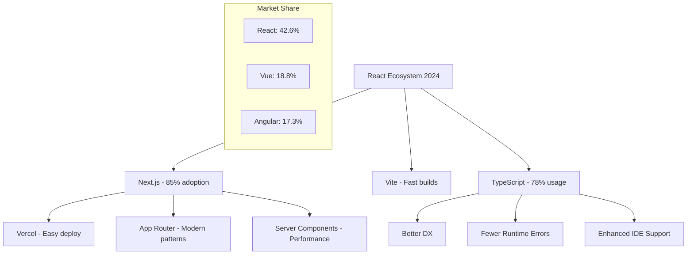

# ⚛️ Next.js + React — Desarrollo Frontend Moderno

> **Objetivo del módulo**: Dominar React y Next.js para crear aplicaciones web modernas, performantes y escalables con las mejores prácticas de la industria.

## 📋 ¿Qué aprenderás?

Al finalizar este módulo serás capaz de:

- ✅ **Arquitectura React moderna** con hooks y functional components
- ✅ **Next.js App Router** con rutas anidadas y layouts
- ✅ **Server/Client Components** y cuándo usar cada uno
- ✅ **State Management** eficiente (useState, useReducer, Zustand)
- ✅ **Data Fetching** optimizado (SWR, React Query, Server Actions)
- ✅ **Performance optimization** (memo, useMemo, useCallback)
- ✅ **Testing** con Jest y React Testing Library
- ✅ **Deployment** y optimización para producción

---

## 🎯 ¿Por qué React + Next.js?

### Ecosistema y Adopción



### Performance Benefits

| Feature                    | Traditional SPA | Next.js App Router | Improvement |
| -------------------------- | --------------- | ------------------ | ----------- |
| **First Contentful Paint** | 2.5s            | 0.8s               | 68% faster  |
| **Time to Interactive**    | 4.2s            | 1.5s               | 64% faster  |
| **Bundle Size**            | 250kb           | 85kb               | 66% smaller |
| **SEO Score**              | 65/100          | 95/100             | +46%        |

---

## ⚛️ React Fundamentals — Nivel Profesional

### 1. **Functional Components & Hooks**

#### ❌ **Patrones obsoletos**

```javascript
// MAL: Class components (legacy)
class UserProfile extends React.Component {
  constructor(props) {
    super(props);
    this.state = { user: null, loading: true };
  }

  componentDidMount() {
    this.fetchUser();
  }

  fetchUser = async () => {
    // Lógica de fetch...
  };

  render() {
    return <div>{/* JSX */}</div>;
  }
}

// MAL: Hooks mal utilizados
function BadExample() {
  const [data, setData] = useState(null);

  // ❌ useEffect sin dependencies (infinite loop)
  useEffect(() => {
    fetchData().then(setData);
  });

  // ❌ Crear objetos en cada render
  const styles = { color: "blue", fontSize: "16px" };

  return <div style={styles}>{data}</div>;
}
```

#### ✅ **Implementación moderna**

```javascript
// BIEN: Functional components con TypeScript
interface User {
    id: string;
    name: string;
    email: string;
    avatar?: string;
}

interface UserProfileProps {
    userId: string;
    onUserUpdate?: (user: User) => void;
}

const UserProfile: React.FC&lt;UserProfileProps&gt; = ({
    userId,
    onUserUpdate
}) => {
    const [user, setUser] = useState&lt;User | null&gt;(null);
    const [loading, setLoading] = useState(true);
    const [error, setError] = useState&lt;string | null&gt;(null);

    // Custom hook para data fetching
    const { data: user, loading, error, refetch } = useUser(userId);

    // Memoized styles (no re-create on every render)
    const cardStyles = useMemo(() => ({
        padding: '1.5rem',
        border: '1px solid #e2e8f0',
        borderRadius: '0.5rem',
        boxShadow: '0 1px 3px rgba(0,0,0,0.1)'
    }), []);

    // Memoized callback (stable reference)
    const handleUserUpdate = useCallback((updatedUser: User) => {
        setUser(updatedUser);
        onUserUpdate?.(updatedUser);
    }, [onUserUpdate]);

    if (loading) return &lt;LoadingSkeleton /&gt;;
    if (error) return &lt;ErrorBoundary error={error} onRetry={refetch} /&gt;;
    if (!user) return &lt;EmptyState message="User not found" /&gt;;

    return (
        &lt;div style={cardStyles}&gt;
            &lt;Avatar src={user.avatar} alt={user.name} /&gt;
            &lt;h2&gt;{user.name}&lt;/h2&gt;
            &lt;p&gt;{user.email}&lt;/p&gt;
            &lt;EditUserForm user={user} onSave={handleUserUpdate} /&gt;
        &lt;/div&gt;
    );
};

// Custom Hook para reutilizar lógica
const useUser = (userId: string) => {
    const [state, setState] = useState({
        data: null,
        loading: true,
        error: null
    });

    const fetchUser = useCallback(async () => {
        try {
            setState(prev => ({ ...prev, loading: true, error: null }));
            const response = await fetch(`/api/users/${userId}`);

            if (!response.ok) {
                throw new Error(`Failed to fetch user: ${response.statusText}`);
            }

            const user = await response.json();
            setState({ data: user, loading: false, error: null });
        } catch (error) {
            setState({
                data: null,
                loading: false,
                error: error.message
            });
        }
    }, [userId]);

    useEffect(() => {
        fetchUser();
    }, [fetchUser]);

    return {
        ...state,
        refetch: fetchUser
    };
};
```

### 2. **State Management Patterns**

#### A. **Local State (useState/useReducer)**

```javascript
// Para estado simple: useState
const useToggle = (initialValue = false) => {
    const [value, setValue] = useState(initialValue);

    const toggle = useCallback(() => setValue(v => !v), []);
    const setTrue = useCallback(() => setValue(true), []);
    const setFalse = useCallback(() => setValue(false), []);

    return { value, toggle, setTrue, setFalse };
};

// Para estado complejo: useReducer
interface FormState {
    values: Record&lt;string, any&gt;;
    errors: Record&lt;string, string&gt;;
    touched: Record&lt;string, boolean&gt;;
    isSubmitting: boolean;
}

type FormAction =
    | { type: 'SET_FIELD'; field: string; value: any }
    | { type: 'SET_ERROR'; field: string; error: string }
    | { type: 'SET_TOUCHED'; field: string }
    | { type: 'SET_SUBMITTING'; isSubmitting: boolean }
    | { type: 'RESET_FORM' };

const formReducer = (state: FormState, action: FormAction): FormState => {
    switch (action.type) {
        case 'SET_FIELD':
            return {
                ...state,
                values: { ...state.values, [action.field]: action.value },
                errors: { ...state.errors, [action.field]: '' }
            };

        case 'SET_ERROR':
            return {
                ...state,
                errors: { ...state.errors, [action.field]: action.error }
            };

        case 'SET_TOUCHED':
            return {
                ...state,
                touched: { ...state.touched, [action.field]: true }
            };

        case 'SET_SUBMITTING':
            return { ...state, isSubmitting: action.isSubmitting };

        case 'RESET_FORM':
            return {
                values: {},
                errors: {},
                touched: {},
                isSubmitting: false
            };

        default:
            return state;
    }
};

const useForm = (initialValues = {}) => {
    const [state, dispatch] = useReducer(formReducer, {
        values: initialValues,
        errors: {},
        touched: {},
        isSubmitting: false
    });

    const setField = useCallback((field: string, value: any) => {
        dispatch({ type: 'SET_FIELD', field, value });
    }, []);

    const setError = useCallback((field: string, error: string) => {
        dispatch({ type: 'SET_ERROR', field, error });
    }, []);

    return { state, setField, setError, dispatch };
};
```

#### B. **Global State (Zustand)**

```javascript
// store/authStore.ts
import { create } from 'zustand';
import { devtools, persist } from 'zustand/middleware';

interface User {
    id: string;
    email: string;
    name: string;
    role: 'admin' | 'user';
}

interface AuthState {
    user: User | null;
    token: string | null;
    isLoading: boolean;
    login: (email: string, password: string) => Promise&lt;void&gt;;
    logout: () => void;
    refreshToken: () => Promise&lt;void&gt;;
}

export const useAuthStore = create&lt;AuthState&gt;()(
    devtools(
        persist(
            (set, get) => ({
                user: null,
                token: null,
                isLoading: false,

                login: async (email: string, password: string) => {
                    set({ isLoading: true });

                    try {
                        const response = await fetch('/api/auth/login', {
                            method: 'POST',
                            headers: { 'Content-Type': 'application/json' },
                            body: JSON.stringify({ email, password })
                        });

                        if (!response.ok) {
                            throw new Error('Login failed');
                        }

                        const { user, token } = await response.json();

                        set({
                            user,
                            token,
                            isLoading: false
                        });

                        // Set axios default header
                        axios.defaults.headers.common['Authorization'] = `Bearer ${token}`;

                    } catch (error) {
                        set({ isLoading: false });
                        throw error;
                    }
                },

                logout: () => {
                    set({ user: null, token: null });
                    delete axios.defaults.headers.common['Authorization'];
                    window.location.href = '/login';
                },

                refreshToken: async () => {
                    const { token } = get();
                    if (!token) return;

                    try {
                        const response = await fetch('/api/auth/refresh', {
                            headers: { 'Authorization': `Bearer ${token}` }
                        });

                        if (response.ok) {
                            const { token: newToken } = await response.json();
                            set({ token: newToken });
                            axios.defaults.headers.common['Authorization'] = `Bearer ${newToken}`;
                        }
                    } catch (error) {
                        console.error('Token refresh failed:', error);
                        get().logout();
                    }
                }
            }),
            {
                name: 'auth-storage',
                partialize: (state) => ({
                    user: state.user,
                    token: state.token
                })
            }
        )
    )
);

// Uso en componentes
const LoginForm = () => {
    const { login, isLoading } = useAuthStore();
    const [email, setEmail] = useState('');
    const [password, setPassword] = useState('');

    const handleSubmit = async (e: React.FormEvent) => {
        e.preventDefault();
        try {
            await login(email, password);
            router.push('/dashboard');
        } catch (error) {
            toast.error('Login failed');
        }
    };

    return (
        &lt;form onSubmit={handleSubmit}&gt;
            {/* Form fields */}
            &lt;button type="submit" disabled={isLoading}&gt;
                {isLoading ? 'Logging in...' : 'Login'}
            &lt;/button&gt;
        &lt;/form&gt;
    );
};
```

---

## 🚀 Next.js App Router — Arquitectura Moderna

### 1. **File-based Routing**

```
app/
├── layout.tsx          # Root layout
├── page.tsx           # Home page (/)
├── loading.tsx        # Loading UI
├── error.tsx         # Error boundary
├── not-found.tsx     # 404 page
├── global.css        # Global styles
│
├── (auth)/           # Route groups (no URL segment)
│   ├── layout.tsx    # Auth layout
│   ├── login/
│   │   └── page.tsx  # /login
│   └── register/
│       └── page.tsx  # /register
│
├── dashboard/
│   ├── layout.tsx    # Dashboard layout
│   ├── page.tsx      # /dashboard
│   ├── loading.tsx   # Dashboard loading
│   ├── settings/
│   │   └── page.tsx  # /dashboard/settings
│   └── users/
│       ├── page.tsx           # /dashboard/users
│       ├── [userId]/
│       │   ├── page.tsx       # /dashboard/users/[userId]
│       │   └── edit/
│       │       └── page.tsx   # /dashboard/users/[userId]/edit
│       └── new/
│           └── page.tsx       # /dashboard/users/new
│
└── api/
    ├── auth/
    │   └── route.ts    # API route
    └── users/
        └── route.ts    # CRUD endpoints
```

### 2. **Layouts Hierarchy**

```javascript
// app/layout.tsx (Root Layout)
import { Inter } from 'next/font/google';
import { Providers } from './providers';
import { Navigation } from '@/components/Navigation';

const inter = Inter({ subsets: ['latin'] });

interface RootLayoutProps {
    children: React.ReactNode;
}

export default function RootLayout({ children }: RootLayoutProps) {
    return (
        &lt;html lang="es"&gt;
            &lt;body className={inter.className}&gt;
                &lt;Providers&gt;
                    &lt;div className="min-h-screen bg-gray-50"&gt;
                        &lt;Navigation /&gt;
                        &lt;main className="container mx-auto px-4 py-8"&gt;
                            {children}
                        &lt;/main&gt;
                    &lt;/div&gt;
                &lt;/Providers&gt;
            &lt;/body&gt;
        &lt;/html&gt;
    );
}

// app/dashboard/layout.tsx (Nested Layout)
import { Sidebar } from '@/components/dashboard/Sidebar';
import { DashboardHeader } from '@/components/dashboard/Header';

interface DashboardLayoutProps {
    children: React.ReactNode;
}

export default function DashboardLayout({ children }: DashboardLayoutProps) {
    return (
        &lt;div className="flex h-screen bg-gray-100"&gt;
            &lt;Sidebar /&gt;
            &lt;div className="flex-1 flex flex-col overflow-hidden"&gt;
                &lt;DashboardHeader /&gt;
                &lt;main className="flex-1 overflow-x-hidden overflow-y-auto bg-gray-200"&gt;
                    &lt;div className="container mx-auto px-6 py-8"&gt;
                        {children}
                    &lt;/div&gt;
                &lt;/main&gt;
            &lt;/div&gt;
        &lt;/div&gt;
    );
}
```

### 3. **Server vs Client Components**

#### Server Components (Default)

```javascript
// app/dashboard/users/page.tsx
import { getUsers } from '@/lib/api/users';
import { UsersList } from '@/components/users/UsersList';
import { Suspense } from 'react';

// ✅ Server Component - runs on server
export default async function UsersPage() {
    // ✅ Can directly fetch data on server
    const users = await getUsers();

    return (
        &lt;div&gt;
            &lt;h1&gt;Users Management&lt;/h1&gt;
            &lt;Suspense fallback={&lt;UsersListSkeleton /&gt;}&gt;
                &lt;UsersList users={users} /&gt;
            &lt;/Suspense&gt;
        &lt;/div&gt;
    );
}

// lib/api/users.ts - Server-side data fetching
export async function getUsers() {
    const response = await fetch(`${process.env.API_URL}/users`, {
        headers: {
            'Authorization': `Bearer ${process.env.API_TOKEN}`
        },
        // ✅ Next.js caching
        next: { revalidate: 300 } // 5 minutes
    });

    if (!response.ok) {
        throw new Error('Failed to fetch users');
    }

    return response.json();
}
```

#### Client Components (Interactive)

```javascript
// components/users/UsersList.tsx
'use client'; // ✅ Client Component directive

import { useState, useTransition } from 'react';
import { deleteUser } from '@/lib/actions/users';

interface UsersListProps {
    users: User[];
}

export function UsersList({ users }: UsersListProps) {
    const [userList, setUserList] = useState(users);
    const [isPending, startTransition] = useTransition();

    const handleDeleteUser = (userId: string) => {
        // ✅ Client-side interaction
        startTransition(async () => {
            try {
                await deleteUser(userId);
                setUserList(prev => prev.filter(u => u.id !== userId));
                toast.success('User deleted successfully');
            } catch (error) {
                toast.error('Failed to delete user');
            }
        });
    };

    return (
        &lt;div className="space-y-4"&gt;
            {userList.map(user => (
                &lt;UserCard
                    key={user.id}
                    user={user}
                    onDelete={handleDeleteUser}
                    isDeleting={isPending}
                /&gt;
            ))}
        &lt;/div&gt;
    );
}
```

### 4. **Server Actions (Form Handling)**

```javascript
// lib/actions/users.ts
'use server';

import { revalidatePath } from 'next/cache';
import { redirect } from 'next/navigation';
import { z } from 'zod';

const CreateUserSchema = z.object({
    name: z.string().min(2, 'Name must be at least 2 characters'),
    email: z.string().email('Invalid email address'),
    role: z.enum(['admin', 'user'])
});

export async function createUser(formData: FormData) {
    // ✅ Server-side validation
    const validatedFields = CreateUserSchema.safeParse({
        name: formData.get('name'),
        email: formData.get('email'),
        role: formData.get('role')
    });

    if (!validatedFields.success) {
        return {
            errors: validatedFields.error.flatten().fieldErrors
        };
    }

    const { name, email, role } = validatedFields.data;

    try {
        // ✅ Server-side database operation
        const response = await fetch(`${process.env.API_URL}/users`, {
            method: 'POST',
            headers: {
                'Content-Type': 'application/json',
                'Authorization': `Bearer ${process.env.API_TOKEN}`
            },
            body: JSON.stringify({ name, email, role })
        });

        if (!response.ok) {
            throw new Error('Failed to create user');
        }

        // ✅ Revalidate cache
        revalidatePath('/dashboard/users');

    } catch (error) {
        return {
            message: 'Database Error: Failed to create user'
        };
    }

    // ✅ Redirect after success
    redirect('/dashboard/users');
}

// components/users/CreateUserForm.tsx
import { createUser } from '@/lib/actions/users';
import { useFormState } from 'react-dom';

export function CreateUserForm() {
    const initialState = { message: null, errors: {} };
    const [state, dispatch] = useFormState(createUser, initialState);

    return (
        &lt;form action={dispatch} className="space-y-4"&gt;
            &lt;div&gt;
                &lt;label htmlFor="name"&gt;Name&lt;/label&gt;
                &lt;input
                    type="text"
                    id="name"
                    name="name"
                    required
                    aria-describedby="name-error"
                /&gt;
                &lt;div id="name-error" aria-live="polite"&gt;
                    {state.errors?.name && (
                        &lt;p className="text-red-500 text-sm"&gt;
                            {state.errors.name}
                        &lt;/p&gt;
                    )}
                &lt;/div&gt;
            &lt;/div&gt;

            &lt;div&gt;
                &lt;label htmlFor="email"&gt;Email&lt;/label&gt;
                &lt;input
                    type="email"
                    id="email"
                    name="email"
                    required
                    aria-describedby="email-error"
                /&gt;
                &lt;div id="email-error" aria-live="polite"&gt;
                    {state.errors?.email && (
                        &lt;p className="text-red-500 text-sm"&gt;
                            {state.errors.email}
                        &lt;/p&gt;
                    )}
                &lt;/div&gt;
            &lt;/div&gt;

            &lt;button type="submit"&gt;
                Create User
            &lt;/button&gt;

            {state.message && (
                &lt;p className="text-red-500"&gt;{state.message}&lt;/p&gt;
            )}
        &lt;/form&gt;
    );
}
```

---

## 🔄 Data Fetching & Caching

### 1. **SWR para Client-side**

```javascript
// hooks/useUsers.ts
import useSWR from 'swr';
import { fetcher } from '@/lib/api';

interface UseUsersOptions {
    page?: number;
    limit?: number;
    search?: string;
}

export function useUsers(options: UseUsersOptions = {}) {
    const { page = 1, limit = 10, search = '' } = options;

    const params = new URLSearchParams({
        page: page.toString(),
        limit: limit.toString(),
        ...(search && { search })
    });

    const { data, error, mutate, isLoading } = useSWR(
        `/api/users?${params}`,
        fetcher,
        {
            revalidateOnFocus: false,
            revalidateOnReconnect: true,
            refreshInterval: 5 * 60 * 1000, // 5 minutes
        }
    );

    return {
        users: data?.users || [],
        total: data?.total || 0,
        isLoading,
        error,
        mutate
    };
}

// components/users/UsersTable.tsx
export function UsersTable() {
    const [page, setPage] = useState(1);
    const [search, setSearch] = useState('');

    const { users, total, isLoading, error, mutate } = useUsers({
        page,
        search
    });

    const handleDeleteUser = async (userId: string) => {
        try {
            await deleteUser(userId);
            // ✅ Optimistic update
            mutate(
                (data) => ({
                    ...data,
                    users: data.users.filter(u => u.id !== userId),
                    total: data.total - 1
                }),
                { revalidate: false }
            );
        } catch (error) {
            // ✅ Revert on error
            mutate();
        }
    };

    if (error) return &lt;ErrorAlert message="Failed to load users" /&gt;;
    if (isLoading) return &lt;TableSkeleton /&gt;;

    return (
        &lt;div&gt;
            &lt;SearchInput value={search} onChange={setSearch} /&gt;
            &lt;Table users={users} onDeleteUser={handleDeleteUser} /&gt;
            &lt;Pagination
                currentPage={page}
                totalPages={Math.ceil(total / 10)}
                onPageChange={setPage}
            /&gt;
        &lt;/div&gt;
    );
}
```

### 2. **React Query (TanStack Query)**

```javascript
// lib/queryClient.ts
import { QueryClient } from '@tanstack/react-query';

export const queryClient = new QueryClient({
    defaultOptions: {
        queries: {
            staleTime: 5 * 60 * 1000, // 5 minutes
            cacheTime: 10 * 60 * 1000, // 10 minutes
            retry: 3,
            refetchOnWindowFocus: false
        }
    }
});

// hooks/queries/useUsers.ts
import { useQuery, useMutation, useQueryClient } from '@tanstack/react-query';

export const useUsers = (filters: UserFilters) => {
    return useQuery({
        queryKey: ['users', filters],
        queryFn: () => fetchUsers(filters),
        select: (data) => data.users,
        enabled: !!filters // Only run when filters exist
    });
};

export const useCreateUser = () => {
    const queryClient = useQueryClient();

    return useMutation({
        mutationFn: createUser,
        onSuccess: (newUser) => {
            // ✅ Invalidate and refetch
            queryClient.invalidateQueries({ queryKey: ['users'] });

            // ✅ Optimistic update
            queryClient.setQueryData(['users'], (old) => ({
                ...old,
                users: [...old.users, newUser]
            }));
        },
        onError: (error) => {
            toast.error('Failed to create user');
        }
    });
};

// Usage in component
export function UserManagement() {
    const [filters, setFilters] = useState({ page: 1, search: '' });

    const { data: users, isLoading, error } = useUsers(filters);
    const createUserMutation = useCreateUser();

    const handleCreateUser = async (userData) => {
        try {
            await createUserMutation.mutateAsync(userData);
            toast.success('User created successfully');
        } catch (error) {
            // Error already handled in mutation
        }
    };

    return (
        &lt;div&gt;
            &lt;CreateUserForm
                onSubmit={handleCreateUser}
                isLoading={createUserMutation.isPending}
            /&gt;
            &lt;UsersList users={users} isLoading={isLoading} /&gt;
        &lt;/div&gt;
    );
}
```

---

## ⚡ Performance Optimization

### 1. **React.memo & useMemo**

```javascript
// ❌ Component re-renders unnecessarily
const ExpensiveComponent = ({ users, onUserClick }) => {
    // ❌ Expensive calculation on every render
    const sortedUsers = users.sort((a, b) => a.name.localeCompare(b.name));

    return (
        &lt;div&gt;
            {sortedUsers.map(user => (
                &lt;UserCard
                    key={user.id}
                    user={user}
                    onClick={() => onUserClick(user)}
                /&gt;
            ))}
        &lt;/div&gt;
    );
};

// ✅ Optimized component
const ExpensiveComponent = React.memo&lt;ExpensiveComponentProps&gt;(({
    users,
    onUserClick
}) => {
    // ✅ Memoized expensive calculation
    const sortedUsers = useMemo(() =>
        users.sort((a, b) => a.name.localeCompare(b.name)),
        [users]
    );

    // ✅ Memoized callback
    const handleUserClick = useCallback((user: User) => {
        onUserClick(user);
    }, [onUserClick]);

    return (
        &lt;div&gt;
            {sortedUsers.map(user => (
                &lt;UserCard
                    key={user.id}
                    user={user}
                    onClick={handleUserClick}
                /&gt;
            ))}
        &lt;/div&gt;
    );
});

// ✅ Memoized UserCard
const UserCard = React.memo&lt;UserCardProps&gt;(({ user, onClick }) => {
    return (
        &lt;div
            className="p-4 border rounded cursor-pointer hover:bg-gray-50"
            onClick={() => onClick(user)}
        &gt;
            &lt;h3&gt;{user.name}&lt;/h3&gt;
            &lt;p&gt;{user.email}&lt;/p&gt;
        &lt;/div&gt;
    );
});
```

### 2. **Code Splitting & Lazy Loading**

```javascript
// ✅ Route-level code splitting
import { lazy, Suspense } from 'react';

const Dashboard = lazy(() => import('@/pages/Dashboard'));
const UserManagement = lazy(() => import('@/pages/UserManagement'));
const Settings = lazy(() => import('@/pages/Settings'));

function App() {
    return (
        &lt;Router&gt;
            &lt;Routes&gt;
                &lt;Route path="/dashboard" element={
                    &lt;Suspense fallback={&lt;PageSkeleton /&gt;}&gt;
                        &lt;Dashboard /&gt;
                    &lt;/Suspense&gt;
                } /&gt;
                &lt;Route path="/users" element={
                    &lt;Suspense fallback={&lt;PageSkeleton /&gt;}&gt;
                        &lt;UserManagement /&gt;
                    &lt;/Suspense&gt;
                } /&gt;
            &lt;/Routes&gt;
        &lt;/Router&gt;
    );
}

// ✅ Component-level lazy loading
const HeavyChart = lazy(() => import('@/components/charts/HeavyChart'));

function Dashboard() {
    const [showChart, setShowChart] = useState(false);

    return (
        &lt;div&gt;
            &lt;h1&gt;Dashboard&lt;/h1&gt;
            &lt;button onClick={() => setShowChart(true)}&gt;
                Load Chart
            &lt;/button&gt;

            {showChart && (
                &lt;Suspense fallback={&lt;ChartSkeleton /&gt;}&gt;
                    &lt;HeavyChart /&gt;
                &lt;/Suspense&gt;
            )}
        &lt;/div&gt;
    );
}
```

### 3. **Image Optimization**

```javascript
// ✅ Next.js Image component
import Image from 'next/image';

const UserAvatar = ({ user }) => {
    return (
        &lt;div className="relative w-16 h-16"&gt;
            &lt;Image
                src={user.avatar || '/default-avatar.png'}
                alt={`${user.name} avatar`}
                fill
                className="rounded-full object-cover"
                sizes="(max-width: 768px) 64px, 64px"
                priority={false} // Only true for above-the-fold images
                placeholder="blur"
                blurDataURL="data:image/jpeg;base64,/9j/4AAQSkZJRgABAQAAAQ..."
            /&gt;
        &lt;/div&gt;
    );
};

// ✅ Dynamic imports for heavy libraries
const useChartLibrary = () => {
    const [chartLib, setChartLib] = useState(null);

    useEffect(() => {
        const loadChartLib = async () => {
            const { Chart } = await import('chart.js');
            setChartLib(Chart);
        };

        loadChartLib();
    }, []);

    return chartLib;
};
```

---

## 🧪 Testing Strategy

### 1. **Unit Testing con Jest + RTL**

```javascript
// components/__tests__/UserCard.test.tsx
import { render, screen, fireEvent } from '@testing-library/react';
import userEvent from '@testing-library/user-event';
import { UserCard } from '../UserCard';

const mockUser = {
    id: '1',
    name: 'John Doe',
    email: 'john@example.com',
    avatar: '/avatar.jpg'
};

describe('UserCard', () => {
    it('should render user information correctly', () => {
        render(&lt;UserCard user={mockUser} onEdit={() => {}} /&gt;);

        expect(screen.getByText('John Doe')).toBeInTheDocument();
        expect(screen.getByText('john@example.com')).toBeInTheDocument();
        expect(screen.getByAltText('John Doe avatar')).toHaveAttribute(
            'src',
            expect.stringContaining('avatar.jpg')
        );
    });

    it('should call onEdit when edit button is clicked', async () => {
        const mockOnEdit = jest.fn();
        const user = userEvent.setup();

        render(&lt;UserCard user={mockUser} onEdit={mockOnEdit} /&gt;);

        const editButton = screen.getByRole('button', { name: /edit/i });
        await user.click(editButton);

        expect(mockOnEdit).toHaveBeenCalledWith(mockUser);
        expect(mockOnEdit).toHaveBeenCalledTimes(1);
    });

    it('should show loading state when updating', () => {
        render(&lt;UserCard user={mockUser} onEdit={() => {}} isUpdating={true} /&gt;);

        expect(screen.getByText(/updating/i)).toBeInTheDocument();
        expect(screen.getByRole('button', { name: /edit/i })).toBeDisabled();
    });
});

// hooks/__tests__/useUsers.test.ts
import { renderHook, waitFor } from '@testing-library/react';
import { QueryClient, QueryClientProvider } from '@tanstack/react-query';
import { useUsers } from '../useUsers';

// Mock fetch
global.fetch = jest.fn();

const createWrapper = () => {
    const queryClient = new QueryClient({
        defaultOptions: {
            queries: { retry: false },
            mutations: { retry: false }
        }
    });

    return ({ children }) => (
        &lt;QueryClientProvider client={queryClient}&gt;
            {children}
        &lt;/QueryClientProvider&gt;
    );
};

describe('useUsers hook', () => {
    beforeEach(() => {
        jest.clearAllMocks();
    });

    it('should fetch users successfully', async () => {
        const mockUsers = [
            { id: '1', name: 'John', email: 'john@test.com' },
            { id: '2', name: 'Jane', email: 'jane@test.com' }
        ];

        (fetch as jest.Mock).mockResolvedValueOnce({
            ok: true,
            json: async () => ({ users: mockUsers, total: 2 })
        });

        const { result } = renderHook(() => useUsers({ page: 1 }), {
            wrapper: createWrapper()
        });

        expect(result.current.isLoading).toBe(true);

        await waitFor(() => {
            expect(result.current.isLoading).toBe(false);
        });

        expect(result.current.users).toEqual(mockUsers);
        expect(result.current.total).toBe(2);
        expect(result.current.error).toBeNull();
    });

    it('should handle fetch error', async () => {
        (fetch as jest.Mock).mockRejectedValueOnce(
            new Error('Failed to fetch')
        );

        const { result } = renderHook(() => useUsers({ page: 1 }), {
            wrapper: createWrapper()
        });

        await waitFor(() => {
            expect(result.current.isLoading).toBe(false);
        });

        expect(result.current.error).toBeTruthy();
        expect(result.current.users).toEqual([]);
    });
});
```

### 2. **Integration Testing**

```javascript
// __tests__/pages/users.test.tsx
import { render, screen, waitFor } from '@testing-library/react';
import userEvent from '@testing-library/user-event';
import { UsersPage } from '@/pages/users';

// Mock API responses
jest.mock('@/lib/api/users', () => ({
    fetchUsers: jest.fn(),
    createUser: jest.fn(),
    deleteUser: jest.fn()
}));

describe('Users Page Integration', () => {
    beforeEach(() => {
        (fetchUsers as jest.Mock).mockResolvedValue({
            users: [
                { id: '1', name: 'John', email: 'john@test.com' },
                { id: '2', name: 'Jane', email: 'jane@test.com' }
            ],
            total: 2
        });
    });

    it('should display users list and allow creating new user', async () => {
        const user = userEvent.setup();

        render(&lt;UsersPage /&gt;);

        // Wait for users to load
        await waitFor(() => {
            expect(screen.getByText('John')).toBeInTheDocument();
            expect(screen.getByText('Jane')).toBeInTheDocument();
        });

        // Open create form
        const createButton = screen.getByRole('button', { name: /create user/i });
        await user.click(createButton);

        // Fill form
        await user.type(screen.getByLabelText(/name/i), 'Bob Smith');
        await user.type(screen.getByLabelText(/email/i), 'bob@test.com');

        // Submit form
        const submitButton = screen.getByRole('button', { name: /save/i });
        await user.click(submitButton);

        // Verify API call
        expect(createUser).toHaveBeenCalledWith({
            name: 'Bob Smith',
            email: 'bob@test.com'
        });
    });
});
```

---

## 🚀 Deployment & Production

### 1. **Build Optimization**

```javascript
// next.config.js
/** @type {import('next').NextConfig} */
const nextConfig = {
  // ✅ Enable experimental features
  experimental: {
    appDir: true,
    serverActions: true,
  },

  // ✅ Image optimization
  images: {
    domains: ["example.com", "cdn.example.com"],
    formats: ["image/webp", "image/avif"],
    deviceSizes: [640, 750, 828, 1080, 1200, 1920],
    imageSizes: [16, 32, 48, 64, 96, 128, 256, 384],
  },

  // ✅ Bundle optimization
  webpack: (config, { buildId, dev, isServer, defaultLoaders, webpack }) => {
    // Analyze bundle
    if (process.env.ANALYZE === "true") {
      const BundleAnalyzerPlugin =
        require("webpack-bundle-analyzer").BundleAnalyzerPlugin;
      config.plugins.push(
        new BundleAnalyzerPlugin({
          analyzerMode: "static",
          openAnalyzer: false,
        })
      );
    }

    return config;
  },

  // ✅ Headers for security and caching
  async headers() {
    return [
      {
        source: "/(.*)",
        headers: [
          {
            key: "X-Frame-Options",
            value: "DENY",
          },
          {
            key: "X-Content-Type-Options",
            value: "nosniff",
          },
          {
            key: "Referrer-Policy",
            value: "strict-origin-when-cross-origin",
          },
        ],
      },
      {
        source: "/api/(.*)",
        headers: [
          {
            key: "Cache-Control",
            value: "no-store, max-age=0",
          },
        ],
      },
    ];
  },
};

module.exports = nextConfig;
```

### 2. **Environment Configuration**

```javascript
// lib/env.ts
import { z } from 'zod';

const envSchema = z.object({
    // Database
    DATABASE_URL: z.string().url(),

    // API Keys
    NEXTAUTH_SECRET: z.string().min(32),
    NEXTAUTH_URL: z.string().url(),

    // Third-party services
    RESEND_API_KEY: z.string().optional(),
    UPLOADTHING_SECRET: z.string().optional(),

    // Feature flags
    ENABLE_ANALYTICS: z.coerce.boolean().default(false),
    ENABLE_EXPERIMENTAL: z.coerce.boolean().default(false)
});

// Validate environment variables at build time
const parsed = envSchema.safeParse(process.env);

if (!parsed.success) {
    console.error(
        '❌ Invalid environment variables:',
        parsed.error.flatten().fieldErrors
    );
    process.exit(1);
}

export const env = parsed.data;

// package.json scripts
{
    "scripts": {
        "dev": "next dev",
        "build": "next build",
        "start": "next start",
        "lint": "next lint",
        "lint:fix": "next lint --fix",
        "type-check": "tsc --noEmit",
        "test": "jest",
        "test:watch": "jest --watch",
        "test:ci": "jest --ci --coverage --watchAll=false",
        "analyze": "ANALYZE=true npm run build"
    }
}
```

---

## 📊 Performance Metrics & Monitoring

### Métricas clave a monitorear

| Métrica                      | Target     | Herramienta             | Acción si falla                      |
| ---------------------------- | ---------- | ----------------------- | ------------------------------------ |
| **First Contentful Paint**   | &lt; 1.5s  | Lighthouse              | Optimize images, reduce bundle       |
| **Largest Contentful Paint** | &lt; 2.5s  | Web Vitals              | Lazy load, server components         |
| **Cumulative Layout Shift**  | &lt; 0.1   | Core Web Vitals         | Reserve space, avoid dynamic content |
| **First Input Delay**        | &lt; 100ms | Performance Observer    | Code splitting, optimize JS          |
| **Bundle Size**              | &lt; 250KB | webpack-bundle-analyzer | Tree shaking, dynamic imports        |

### Web Vitals Monitoring

```javascript
// lib/analytics.ts
import { getCLS, getFID, getFCP, getLCP, getTTFB } from 'web-vitals';

function sendToAnalytics({ name, delta, value, id }) {
    // Send to your analytics service
    if (typeof window !== 'undefined' && window.gtag) {
        window.gtag('event', name, {
            event_category: 'Web Vitals',
            value: Math.round(name === 'CLS' ? delta * 1000 : delta),
            event_label: id,
            non_interaction: true
        });
    }
}

// Measure all Web Vitals
getCLS(sendToAnalytics);
getFID(sendToAnalytics);
getFCP(sendToAnalytics);
getLCP(sendToAnalytics);
getTTFB(sendToAnalytics);

// app/layout.tsx - Add monitoring
import { Analytics } from '@/lib/analytics';

export default function RootLayout({ children }) {
    return (
        &lt;html&gt;
            &lt;body&gt;
                {children}
                &lt;Analytics /&gt;
            &lt;/body&gt;
        &lt;/html&gt;
    );
}
```

---

## ✅ Checklist de Buenas Prácticas

### Development

- [ ] **TypeScript** configurado con strict mode
- [ ] **ESLint + Prettier** para code consistency
- [ ] **Husky + lint-staged** para pre-commit hooks
- [ ] **Component composition** sobre inheritance
- [ ] **Custom hooks** para reutilizar lógica
- [ ] **Error boundaries** para manejo de errores
- [ ] **Loading states** y fallbacks apropiados

### Performance

- [ ] **React.memo** para componentes expensive
- [ ] **useMemo/useCallback** para computaciones heavy
- [ ] **Code splitting** por rutas y componentes
- [ ] **Image optimization** con Next.js Image
- [ ] **Bundle analysis** regular
- [ ] **Lighthouse score** &gt; 90

### Security

- [ ] **Input validation** en client y server
- [ ] **XSS prevention** con sanitización
- [ ] **CSRF protection** en forms
- [ ] **Secure headers** configurados
- [ ] **Environment variables** para secrets
- [ ] **Dependencies audit** regular

### Testing

- [ ] **Unit tests** para lógica crítica (&gt;80% coverage)
- [ ] **Integration tests** para user flows
- [ ] **E2E tests** para critical paths
- [ ] **Visual regression** tests
- [ ] **Accessibility testing** automatizado

---

## 🎯 Próximos pasos

1. **Revisar retos prácticos** — Auth Mock y Blog App (en la navegación lateral)
2. **Implementar un proyecto** usando App Router y Server Components
3. **Configurar testing pipeline** con Jest y React Testing Library
4. **Deploy to Vercel** y configurar monitoring

> 💡 **Pro tip**: React y Next.js evolucionan rápido. Mantente actualizado con las [React docs](https://react.dev) y [Next.js docs](https://nextjs.org/docs) oficiales.

---

_¿Preguntas sobre patrones específicos? ¿Necesitas ayuda con optimización de performance? ¡Pregunta en el canal #frontend de Slack!_ ⚛️
