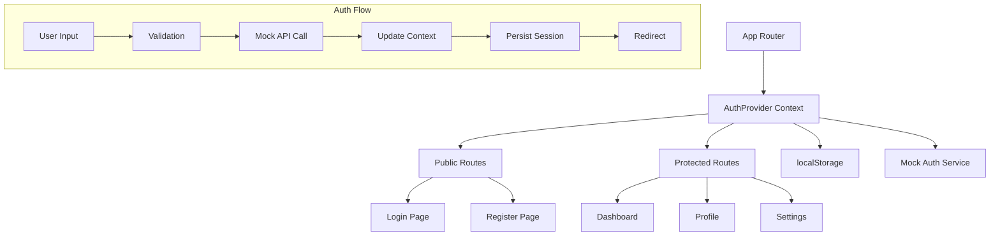

# 🎯 Reto Práctico: Sistema de Autenticación Mock

> **Duración estimada**: 90-120 minutos
> **Dificultad**: Intermedia
> **Objetivo**: Implementar un sistema completo de autenticación frontend usando React Context, TypeScript y validaciones robustas.

## 📋 Contexto

Necesitas crear un sistema de autenticación para una aplicación Next.js sin backend real. El sistema debe simular login/register, mantener estado global de usuario, y persistir la sesión usando localStorage.

## 🎯 Objetivos de Aprendizaje

Al completar este reto serás capaz de:

- ✅ **Implementar React Context** para estado global
- ✅ **Crear formularios robustos** con validación en tiempo real
- ✅ **Manejar persistencia** con localStorage de forma segura
- ✅ **Aplicar TypeScript** para type safety completo
- ✅ **Implementar protected routes** y redirecciones
- ✅ **Crear UI/UX fluida** con loading states y feedback

---

## 🏗️ Arquitectura del Sistema



---

## 📁 Estructura del Proyecto Requerida

```
src/
├── app/
│   ├── (auth)/
│   │   ├── layout.tsx
│   │   ├── login/
│   │   │   └── page.tsx
│   │   └── register/
│   │       └── page.tsx
│   ├── (protected)/
│   │   ├── layout.tsx
│   │   ├── dashboard/
│   │   │   └── page.tsx
│   │   └── profile/
│   │       └── page.tsx
│   ├── layout.tsx
│   └── page.tsx
├── components/
│   ├── auth/
│   │   ├── LoginForm.tsx
│   │   ├── RegisterForm.tsx
│   │   └── ProtectedRoute.tsx
│   ├── forms/
│   │   ├── FormField.tsx
│   │   └── FormValidation.tsx
│   └── ui/
│       ├── Button.tsx
│       ├── Input.tsx
│       └── Alert.tsx
├── contexts/
│   └── AuthContext.tsx
├── hooks/
│   ├── useAuth.ts
│   └── useLocalStorage.ts
├── lib/
│   ├── auth.ts
│   ├── validation.ts
│   └── types.ts
└── utils/
    └── constants.ts
```

---

## 🔧 Implementación Paso a Paso

### 1. **Tipos TypeScript Fundamentales**

```typescript
// lib/types.ts
export interface User {
    id: string;
    email: string;
    name: string;
    role: 'admin' | 'user';
    avatar?: string;
    createdAt: string;
    preferences: {
        theme: 'light' | 'dark';
        language: 'es' | 'en';
        notifications: boolean;
    };
}

export interface LoginCredentials {
    email: string;
    password: string;
    rememberMe?: boolean;
}

export interface RegisterData {
    name: string;
    email: string;
    password: string;
    confirmPassword: string;
    acceptTerms: boolean;
}

export interface AuthState {
    user: User | null;
    isLoading: boolean;
    isAuthenticated: boolean;
    error: string | null;
}

export interface AuthContextType extends AuthState {
    login: (credentials: LoginCredentials) => Promise&lt;void&gt;;
    register: (data: RegisterData) => Promise&lt;void&gt;;
    logout: () => void;
    updateProfile: (data: Partial&lt;User&gt;) => Promise&lt;void&gt;;
    clearError: () => void;
}

export interface ValidationErrors {
    [key: string]: string;
}

export interface FormFieldProps {
    name: string;
    label: string;
    type?: string;
    required?: boolean;
    error?: string;
    value: string;
    onChange: (value: string) => void;
    placeholder?: string;
    disabled?: boolean;
}
```

### 2. **Mock Authentication Service**

```typescript
// lib/auth.ts
import { LoginCredentials, RegisterData, User } from './types';

// Simulated users database
const MOCK_USERS: User[] = [
    {
        id: '1',
        email: 'admin@indaptados.com',
        name: 'Admin User',
        role: 'admin',
        avatar: '/avatars/admin.jpg',
        createdAt: new Date().toISOString(),
        preferences: {
            theme: 'light',
            language: 'es',
            notifications: true
        }
    },
    {
        id: '2',
        email: 'user@indaptados.com',
        name: 'Regular User',
        role: 'user',
        createdAt: new Date().toISOString(),
        preferences: {
            theme: 'dark',
            language: 'es',
            notifications: false
        }
    }
];

// Simulate network delay
const delay = (ms: number) => new Promise(resolve => setTimeout(resolve, ms));

export class AuthError extends Error {
    constructor(message: string, public code: string) {
        super(message);
        this.name = 'AuthError';
    }
}

export const mockAuthService = {
    async login(credentials: LoginCredentials): Promise&lt;User&gt; {
        await delay(1000); // Simulate API call

        const { email, password } = credentials;

        // Simulate validation
        if (!email || !password) {
            throw new AuthError('Email y password son requeridos', 'MISSING_CREDENTIALS');
        }

        // Find user
        const user = MOCK_USERS.find(u => u.email.toLowerCase() === email.toLowerCase());

        if (!user) {
            throw new AuthError('Usuario no encontrado', 'USER_NOT_FOUND');
        }

        // Simulate password validation (in real app, never store plain text passwords)
        const validPasswords = {
            'admin@indaptados.com': 'admin123',
            'user@indaptados.com': 'user123'
        };

        if (validPasswords[user.email] !== password) {
            throw new AuthError('Password incorrecto', 'INVALID_PASSWORD');
        }

        return user;
    },

    async register(data: RegisterData): Promise&lt;User&gt; {
        await delay(1500); // Simulate API call

        const { name, email, password } = data;

        // Check if user already exists
        const existingUser = MOCK_USERS.find(u => u.email.toLowerCase() === email.toLowerCase());

        if (existingUser) {
            throw new AuthError('El email ya está registrado', 'EMAIL_ALREADY_EXISTS');
        }

        // Create new user
        const newUser: User = {
            id: Math.random().toString(36).substr(2, 9),
            email: email.toLowerCase(),
            name,
            role: 'user',
            createdAt: new Date().toISOString(),
            preferences: {
                theme: 'light',
                language: 'es',
                notifications: true
            }
        };

        // Add to mock database
        MOCK_USERS.push(newUser);

        return newUser;
    },

    async updateProfile(userId: string, updates: Partial&lt;User&gt;): Promise&lt;User&gt; {
        await delay(800);

        const userIndex = MOCK_USERS.findIndex(u => u.id === userId);

        if (userIndex === -1) {
            throw new AuthError('Usuario no encontrado', 'USER_NOT_FOUND');
        }

        MOCK_USERS[userIndex] = { ...MOCK_USERS[userIndex], ...updates };

        return MOCK_USERS[userIndex];
    },

    async verifyToken(token: string): Promise&lt;User | null&gt; {
        await delay(300);

        try {
            // In a real app, you'd verify JWT token
            const userData = JSON.parse(atob(token.split('.')[1] || ''));
            const user = MOCK_USERS.find(u => u.id === userData.userId);

            return user || null;
        } catch {
            return null;
        }
    }
};

// Generate mock JWT-like token
export const generateMockToken = (user: User): string => {
    const header = btoa(JSON.stringify({ alg: 'HS256', typ: 'JWT' }));
    const payload = btoa(JSON.stringify({
        userId: user.id,
        email: user.email,
        exp: Date.now() + (7 * 24 * 60 * 60 * 1000) // 7 days
    }));
    const signature = btoa('mock-signature');

    return `${header}.${payload}.${signature}`;
};
```

### 3. **Form Validation System**

```typescript
// lib/validation.ts
import { LoginCredentials, RegisterData, ValidationErrors } from './types';

export const validationRules = {
    email: {
        required: true,
        pattern: /^[^\s@]+@[^\s@]+\.[^\s@]+$/,
        message: 'Ingresa un email válido'
    },
    password: {
        required: true,
        minLength: 6,
        pattern: /^(?=.*[a-z])(?=.*[A-Z])(?=.*\d)/,
        message: 'Password debe tener al menos 6 caracteres, una mayúscula, una minúscula y un número'
    },
    name: {
        required: true,
        minLength: 2,
        maxLength: 50,
        pattern: /^[a-zA-ZÀ-ÿ\s]+$/,
        message: 'Nombre debe tener entre 2-50 caracteres, solo letras y espacios'
    }
};

export const validateField = (name: string, value: string): string => {
    const rules = validationRules[name as keyof typeof validationRules];

    if (!rules) return '';

    if (rules.required && !value.trim()) {
        return `${name.charAt(0).toUpperCase() + name.slice(1)} es requerido`;
    }

    if (rules.minLength && value.length &lt; rules.minLength) {
        return `Mínimo ${rules.minLength} caracteres`;
    }

    if (rules.maxLength && value.length > rules.maxLength) {
        return `Máximo ${rules.maxLength} caracteres`;
    }

    if (rules.pattern && !rules.pattern.test(value)) {
        return rules.message;
    }

    return '';
};

export const validateLoginForm = (data: LoginCredentials): ValidationErrors => {
    const errors: ValidationErrors = {};

    const emailError = validateField('email', data.email);
    if (emailError) errors.email = emailError;

    const passwordError = validateField('password', data.password);
    if (passwordError) errors.password = passwordError;

    return errors;
};

export const validateRegisterForm = (data: RegisterData): ValidationErrors => {
    const errors: ValidationErrors = {};

    const nameError = validateField('name', data.name);
    if (nameError) errors.name = nameError;

    const emailError = validateField('email', data.email);
    if (emailError) errors.email = emailError;

    const passwordError = validateField('password', data.password);
    if (passwordError) errors.password = passwordError;

    if (data.password !== data.confirmPassword) {
        errors.confirmPassword = 'Las contraseñas no coinciden';
    }

    if (!data.acceptTerms) {
        errors.acceptTerms = 'Debes aceptar los términos y condiciones';
    }

    return errors;
};

export const hasErrors = (errors: ValidationErrors): boolean => {
    return Object.keys(errors).length > 0;
};
```

### 4. **Auth Context Implementation**

```typescript
// contexts/AuthContext.tsx
'use client';

import React, { createContext, useContext, useReducer, useEffect, useCallback } from 'react';
import { AuthContextType, AuthState, User, LoginCredentials, RegisterData } from '@/lib/types';
import { mockAuthService, generateMockToken, AuthError } from '@/lib/auth';
import { useLocalStorage } from '@/hooks/useLocalStorage';

// Auth Reducer
type AuthAction =
    | { type: 'SET_LOADING'; payload: boolean }
    | { type: 'SET_USER'; payload: User }
    | { type: 'SET_ERROR'; payload: string }
    | { type: 'CLEAR_ERROR' }
    | { type: 'LOGOUT' };

const authReducer = (state: AuthState, action: AuthAction): AuthState => {
    switch (action.type) {
        case 'SET_LOADING':
            return { ...state, isLoading: action.payload };

        case 'SET_USER':
            return {
                ...state,
                user: action.payload,
                isAuthenticated: true,
                isLoading: false,
                error: null
            };

        case 'SET_ERROR':
            return {
                ...state,
                error: action.payload,
                isLoading: false
            };

        case 'CLEAR_ERROR':
            return { ...state, error: null };

        case 'LOGOUT':
            return {
                ...state,
                user: null,
                isAuthenticated: false,
                error: null,
                isLoading: false
            };

        default:
            return state;
    }
};

const initialState: AuthState = {
    user: null,
    isLoading: false,
    isAuthenticated: false,
    error: null
};

// Context creation
const AuthContext = createContext&lt;AuthContextType | undefined&gt;(undefined);

// Provider component
interface AuthProviderProps {
    children: React.ReactNode;
}

export const AuthProvider: React.FC&lt;AuthProviderProps&gt; = ({ children }) => {
    const [state, dispatch] = useReducer(authReducer, initialState);
    const [storedToken, setStoredToken] = useLocalStorage&lt;string | null&gt;('auth_token', null);

    // Initialize auth state from localStorage
    useEffect(() => {
        const initializeAuth = async () => {
            if (storedToken) {
                dispatch({ type: 'SET_LOADING', payload: true });

                try {
                    const user = await mockAuthService.verifyToken(storedToken);
                    if (user) {
                        dispatch({ type: 'SET_USER', payload: user });
                    } else {
                        // Invalid token, clear it
                        setStoredToken(null);
                        dispatch({ type: 'LOGOUT' });
                    }
                } catch (error) {
                    console.error('Token verification failed:', error);
                    setStoredToken(null);
                    dispatch({ type: 'LOGOUT' });
                }
            }
        };

        initializeAuth();
    }, [storedToken, setStoredToken]);

    const login = useCallback(async (credentials: LoginCredentials) => {
        dispatch({ type: 'SET_LOADING', payload: true });
        dispatch({ type: 'CLEAR_ERROR' });

        try {
            const user = await mockAuthService.login(credentials);
            const token = generateMockToken(user);

            setStoredToken(token);
            dispatch({ type: 'SET_USER', payload: user });

            // Optional: Track login event
            console.log('User logged in:', user.email);

        } catch (error) {
            if (error instanceof AuthError) {
                dispatch({ type: 'SET_ERROR', payload: error.message });
            } else {
                dispatch({ type: 'SET_ERROR', payload: 'Error inesperado durante el login' });
            }
            throw error;
        }
    }, [setStoredToken]);

    const register = useCallback(async (data: RegisterData) => {
        dispatch({ type: 'SET_LOADING', payload: true });
        dispatch({ type: 'CLEAR_ERROR' });

        try {
            const user = await mockAuthService.register(data);
            const token = generateMockToken(user);

            setStoredToken(token);
            dispatch({ type: 'SET_USER', payload: user });

            console.log('User registered:', user.email);

        } catch (error) {
            if (error instanceof AuthError) {
                dispatch({ type: 'SET_ERROR', payload: error.message });
            } else {
                dispatch({ type: 'SET_ERROR', payload: 'Error inesperado durante el registro' });
            }
            throw error;
        }
    }, [setStoredToken]);

    const logout = useCallback(() => {
        setStoredToken(null);
        dispatch({ type: 'LOGOUT' });

        // Optional: Clear other app data
        localStorage.removeItem('user_preferences');

        console.log('User logged out');
    }, [setStoredToken]);

    const updateProfile = useCallback(async (updates: Partial&lt;User&gt;) => {
        if (!state.user) throw new Error('No authenticated user');

        dispatch({ type: 'SET_LOADING', payload: true });

        try {
            const updatedUser = await mockAuthService.updateProfile(state.user.id, updates);
            dispatch({ type: 'SET_USER', payload: updatedUser });

        } catch (error) {
            if (error instanceof AuthError) {
                dispatch({ type: 'SET_ERROR', payload: error.message });
            } else {
                dispatch({ type: 'SET_ERROR', payload: 'Error actualizando perfil' });
            }
            throw error;
        }
    }, [state.user]);

    const clearError = useCallback(() => {
        dispatch({ type: 'CLEAR_ERROR' });
    }, []);

    const contextValue: AuthContextType = {
        ...state,
        login,
        register,
        logout,
        updateProfile,
        clearError
    };

    return (
        &lt;AuthContext.Provider value={contextValue}&gt;
            {children}
        &lt;/AuthContext.Provider&gt;
    );
};

// Custom hook
export const useAuth = (): AuthContextType => {
    const context = useContext(AuthContext);

    if (context === undefined) {
        throw new Error('useAuth must be used within an AuthProvider');
    }

    return context;
};
```

### 5. **Custom Hooks**

```typescript
// hooks/useLocalStorage.ts
import { useState, useEffect } from 'react';

export function useLocalStorage&lt;T&gt;(key: string, initialValue: T) {
    // Get value from localStorage or use initial value
    const [storedValue, setStoredValue] = useState&lt;T&gt;(() => {
        if (typeof window === 'undefined') {
            return initialValue;
        }

        try {
            const item = window.localStorage.getItem(key);
            return item ? JSON.parse(item) : initialValue;
        } catch (error) {
            console.warn(`Error reading localStorage key "${key}":`, error);
            return initialValue;
        }
    });

    // Return a wrapped version of useState's setter function that persists to localStorage
    const setValue = (value: T | ((val: T) => T)) => {
        try {
            // Allow value to be a function so we have same API as useState
            const valueToStore = value instanceof Function ? value(storedValue) : value;
            setStoredValue(valueToStore);

            // Save to localStorage
            if (typeof window !== 'undefined') {
                if (valueToStore === null || valueToStore === undefined) {
                    window.localStorage.removeItem(key);
                } else {
                    window.localStorage.setItem(key, JSON.stringify(valueToStore));
                }
            }
        } catch (error) {
            console.warn(`Error setting localStorage key "${key}":`, error);
        }
    };

    return [storedValue, setValue] as const;
}

// hooks/useFormValidation.ts
import { useState, useCallback } from 'react';
import { ValidationErrors } from '@/lib/types';

interface UseFormValidationOptions&lt;T&gt; {
    initialValues: T;
    validationSchema: (values: T) => ValidationErrors;
    onSubmit: (values: T) => Promise&lt;void&gt; | void;
}

export function useFormValidation&lt;T&gt;({
    initialValues,
    validationSchema,
    onSubmit
}: UseFormValidationOptions&lt;T&gt;) {
    const [values, setValues] = useState&lt;T&gt;(initialValues);
    const [errors, setErrors] = useState&lt;ValidationErrors&gt;({});
    const [touched, setTouched] = useState&lt;Record&lt;string, boolean&gt;&gt;({});
    const [isSubmitting, setIsSubmitting] = useState(false);

    const validateField = useCallback((name: string, value: any) => {
        const fieldErrors = validationSchema({ ...values, [name]: value });
        setErrors(prev => ({ ...prev, [name]: fieldErrors[name] || '' }));
    }, [values, validationSchema]);

    const handleChange = useCallback((name: string, value: any) => {
        setValues(prev => ({ ...prev, [name]: value }));

        // Validate if field was touched
        if (touched[name]) {
            validateField(name, value);
        }
    }, [touched, validateField]);

    const handleBlur = useCallback((name: string) => {
        setTouched(prev => ({ ...prev, [name]: true }));
        validateField(name, values[name as keyof T]);
    }, [values, validateField]);

    const handleSubmit = useCallback(async (e: React.FormEvent) => {
        e.preventDefault();

        // Mark all fields as touched
        const allTouched = Object.keys(values as object).reduce(
            (acc, key) => ({ ...acc, [key]: true }),
            {}
        );
        setTouched(allTouched);

        // Validate all fields
        const validationErrors = validationSchema(values);
        setErrors(validationErrors);

        // Submit if no errors
        if (Object.keys(validationErrors).length === 0) {
            setIsSubmitting(true);
            try {
                await onSubmit(values);
            } catch (error) {
                console.error('Form submission error:', error);
            } finally {
                setIsSubmitting(false);
            }
        }
    }, [values, validationSchema, onSubmit]);

    const resetForm = useCallback(() => {
        setValues(initialValues);
        setErrors({});
        setTouched({});
        setIsSubmitting(false);
    }, [initialValues]);

    return {
        values,
        errors,
        touched,
        isSubmitting,
        handleChange,
        handleBlur,
        handleSubmit,
        resetForm
    };
}
```

---

## 🎨 UI Components

### Implementar los siguientes componentes:

```typescript
// components/ui/Input.tsx
interface InputProps extends React.InputHTMLAttributes&lt;HTMLInputElement&gt; {
    label: string;
    error?: string;
    required?: boolean;
}

export const Input: React.FC&lt;InputProps&gt; = ({
    label,
    error,
    required,
    className = '',
    ...props
}) => {
    const inputId = `input-${Math.random().toString(36).substr(2, 9)}`;

    return (
        &lt;div className="space-y-2"&gt;
            &lt;label
                htmlFor={inputId}
                className={`block text-sm font-medium ${
                    error ? 'text-red-700' : 'text-gray-700'
                }`}
            &gt;
                {label}
                {required && &lt;span className="text-red-500 ml-1"&gt;*&lt;/span&gt;}
            &lt;/label&gt;

            &lt;input
                id={inputId}
                className={`
                    block w-full px-3 py-2 border rounded-md shadow-sm
                    focus:outline-none focus:ring-2 focus:ring-blue-500 focus:border-blue-500
                    ${error
                        ? 'border-red-300 focus:ring-red-500 focus:border-red-500'
                        : 'border-gray-300'
                    }
                    ${className}
                `}
                aria-invalid={error ? 'true' : 'false'}
                aria-describedby={error ? `${inputId}-error` : undefined}
                {...props}
            /&gt;

            {error && (
                &lt;p
                    id={`${inputId}-error`}
                    className="text-sm text-red-600"
                    role="alert"
                &gt;
                    {error}
                &lt;/p&gt;
            )}
        &lt;/div&gt;
    );
};
```

---

## ✅ Criterios de Evaluación

### Excelente (90-100%)

- ✅ Context implementado con TypeScript completo
- ✅ Validación robusta en tiempo real
- ✅ UI/UX fluida con loading states y error handling
- ✅ Persistencia segura en localStorage
- ✅ Protected routes funcionando correctamente
- ✅ Código limpio y bien documentado

### Bueno (75-89%)

- ✅ Funcionalidad básica de auth implementada
- ✅ Formularios con validación básica
- ✅ Estado global funcionando
- ✅ Algunas mejoras en UX
- ✅ TypeScript usado apropiadamente

### Satisfactorio (60-74%)

- ✅ Login/logout básico funcionando
- ✅ Context básico implementado
- ✅ Formularios simples sin validación robusta
- ✅ Persistencia básica
- ✅ TypeScript básico

---

## 🎯 Entregables

1. **Aplicación Next.js funcionando** con todas las features implementadas
2. **README.md** con instrucciones de setup y uso
3. **Demo video** (5-10 min) mostrando todas las funcionalidades
4. **Código en GitHub** con commits descriptivos

---

## 🚀 Bonus Features (Opcional)

- **Dark mode** toggle persistido
- **Remember me** functionality
- **Password strength indicator**
- **Email verification** simulation
- **Profile picture upload** con preview
- **Two-factor authentication** simulation
- **Session timeout** automático
- **Audit log** de acciones del usuario

---

_¿Necesitas ayuda con alguna parte específica? ¡Pregunta en el canal #react-help de Slack!_ ⚛️
