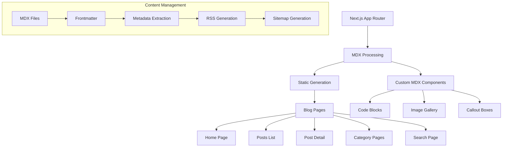

# 🎯 Reto Práctico: Blog con MDX y App Router

> **Duración estimada**: 120-150 minutos
> **Dificultad**: Intermedio-Avanzado
> **Objetivo**: Crear un blog completo con MDX, routing dinámico, SEO optimizado y funcionalidades modernas.

## 📋 Contexto

Necesitas crear un blog técnico para Indaptados usando Next.js App Router y MDX. El blog debe ser performante, SEO-friendly, y tener funcionalidades modernas como búsqueda, categorías, y modo oscuro.

## 🎯 Objetivos de Aprendizaje

Al completar este reto serás capaz de:

- ✅ **Configurar MDX** con componentes personalizados
- ✅ **Implementar routing dinámico** con App Router
- ✅ **Optimizar SEO** con metadata API
- ✅ **Crear sistema de categorías** y tags
- ✅ **Implementar búsqueda** client-side
- ✅ **Añadir dark mode** persistente
- ✅ **Optimizar performance** con ISR y caching

---

## 🏗️ Arquitectura del Blog



---

## 📁 Estructura del Proyecto

```
src/
├── app/
│   ├── globals.css
│   ├── layout.tsx
│   ├── page.tsx                    # Home/Landing
│   ├── blog/
│   │   ├── layout.tsx             # Blog layout
│   │   ├── page.tsx               # Posts listing
│   │   ├── [slug]/
│   │   │   └── page.tsx           # Individual post
│   │   ├── category/
│   │   │   └── [category]/
│   │   │       └── page.tsx       # Category listing
│   │   └── search/
│   │       └── page.tsx           # Search results
│   ├── rss.xml/
│   │   └── route.ts               # RSS feed
│   └── sitemap.xml/
│       └── route.ts               # Sitemap
├── components/
│   ├── blog/
│   │   ├── PostCard.tsx
│   │   ├── PostGrid.tsx
│   │   ├── PostHeader.tsx
│   │   ├── PostContent.tsx
│   │   └── PostNavigation.tsx
│   ├── mdx/
│   │   ├── CodeBlock.tsx
│   │   ├── Callout.tsx
│   │   ├── ImageGallery.tsx
│   │   └── MDXComponents.tsx
│   ├── search/
│   │   ├── SearchBar.tsx
│   │   └── SearchResults.tsx
│   └── ui/
│       ├── Header.tsx
│       ├── Footer.tsx
│       ├── ThemeToggle.tsx
│       └── Badge.tsx
├── content/
│   └── posts/
│       ├── getting-started-next.mdx
│       ├── react-best-practices.mdx
│       ├── typescript-guide.mdx
│       └── deployment-guide.mdx
├── lib/
│   ├── mdx.ts
│   ├── posts.ts
│   └── search.ts
└── types/
    └── blog.ts
```

---

## 🔧 Implementación Paso a Paso

### 1. **Configuración MDX y Tipos**

```typescript
// types/blog.ts
export interface Post {
  slug: string;
  title: string;
  description: string;
  date: string;
  category: string;
  tags: string[];
  author: {
    name: string;
    avatar: string;
    bio: string;
  };
  readingTime: number;
  featured: boolean;
  published: boolean;
  content: string;
  coverImage?: string;
  seo?: {
    title: string;
    description: string;
    keywords: string[];
  };
}

export interface BlogCategory {
  name: string;
  slug: string;
  description: string;
  count: number;
  color: string;
}

export interface SearchResult {
  post: Post;
  score: number;
  matches: {
    title?: number;
    description?: number;
    content?: number;
    tags?: number;
  };
}

// next.config.js
import createMDX from "@next/mdx";
import remarkGfm from "remark-gfm";
import remarkFrontmatter from "remark-frontmatter";
import remarkMdxFrontmatter from "remark-mdx-frontmatter";
import rehypePrettyCode from "rehype-pretty-code";
import rehypeSlug from "rehype-slug";
import rehypeAutolinkHeadings from "rehype-autolink-headings";

/** @type {import('next').NextConfig} */
const nextConfig = {
  pageExtensions: ["js", "jsx", "mdx", "ts", "tsx"],
  experimental: {
    appDir: true,
  },
  images: {
    domains: ["images.unsplash.com", "via.placeholder.com"],
  },
};

const withMDX = createMDX({
  extension: /\.mdx?$/,
  options: {
    remarkPlugins: [remarkGfm, remarkFrontmatter, remarkMdxFrontmatter],
    rehypePlugins: [
      rehypeSlug,
      [rehypeAutolinkHeadings, { behavior: "wrap" }],
      [
        rehypePrettyCode,
        {
          theme: {
            dark: "github-dark",
            light: "github-light",
          },
          keepBackground: false,
        },
      ],
    ],
  },
});

export default withMDX(nextConfig);
```

### 2. **Sistema de Posts y Metadata**

```typescript
// lib/posts.ts
import fs from 'fs';
import path from 'path';
import matter from 'gray-matter';
import { Post, BlogCategory } from '@/types/blog';

const postsDirectory = path.join(process.cwd(), 'content/posts');

export async function getAllPosts(): Promise&lt;Post[]&gt; {
    const fileNames = fs.readdirSync(postsDirectory);

    const allPostsData = await Promise.all(
        fileNames
            .filter((fileName) => fileName.endsWith('.mdx'))
            .map(async (fileName) => {
                const slug = fileName.replace(/\.mdx$/, '');
                return getPostBySlug(slug);
            })
    );

    return allPostsData
        .filter((post): post is Post => post !== null)
        .filter(post => post.published)
        .sort((a, b) => new Date(b.date).getTime() - new Date(a.date).getTime());
}

export async function getPostBySlug(slug: string): Promise&lt;Post | null&gt; {
    try {
        const fullPath = path.join(postsDirectory, `${slug}.mdx`);
        const fileContents = fs.readFileSync(fullPath, 'utf8');
        const { data, content } = matter(fileContents);

        // Calculate reading time (average 200 words per minute)
        const wordCount = content.split(/\s+/).length;
        const readingTime = Math.ceil(wordCount / 200);

        return {
            slug,
            title: data.title,
            description: data.description,
            date: data.date,
            category: data.category,
            tags: data.tags || [],
            author: data.author || {
                name: 'Indaptados Team',
                avatar: '/avatars/team.jpg',
                bio: 'Equipo técnico de Indaptados'
            },
            readingTime,
            featured: data.featured || false,
            published: data.published !== false,
            content,
            coverImage: data.coverImage,
            seo: data.seo
        };
    } catch (error) {
        console.error(`Error loading post ${slug}:`, error);
        return null;
    }
}

export async function getPostsByCategory(category: string): Promise&lt;Post[]&gt; {
    const allPosts = await getAllPosts();
    return allPosts.filter(post =>
        post.category.toLowerCase() === category.toLowerCase()
    );
}

export async function getFeaturedPosts(limit: number = 3): Promise&lt;Post[]&gt; {
    const allPosts = await getAllPosts();
    return allPosts.filter(post => post.featured).slice(0, limit);
}

export async function getRelatedPosts(currentPost: Post, limit: number = 3): Promise&lt;Post[]&gt; {
    const allPosts = await getAllPosts();

    // Score posts by relevance
    const scoredPosts = allPosts
        .filter(post => post.slug !== currentPost.slug)
        .map(post => {
            let score = 0;

            // Same category = +3 points
            if (post.category === currentPost.category) score += 3;

            // Shared tags = +1 point per tag
            const sharedTags = post.tags.filter(tag => currentPost.tags.includes(tag));
            score += sharedTags.length;

            return { post, score };
        })
        .filter(({ score }) => score > 0)
        .sort((a, b) => b.score - a.score)
        .slice(0, limit);

    return scoredPosts.map(({ post }) => post);
}

export async function getCategories(): Promise&lt;BlogCategory[]&gt; {
    const allPosts = await getAllPosts();
    const categoryMap = new Map&lt;string, { count: number; posts: Post[] }&gt;();

    allPosts.forEach(post => {
        const category = post.category;
        if (!categoryMap.has(category)) {
            categoryMap.set(category, { count: 0, posts: [] });
        }
        const categoryData = categoryMap.get(category)!;
        categoryData.count++;
        categoryData.posts.push(post);
    });

    const categories: BlogCategory[] = [
        { name: 'React', slug: 'react', description: 'React y ecosystem', color: 'blue' },
        { name: 'Next.js', slug: 'nextjs', description: 'Framework full-stack', color: 'gray' },
        { name: 'TypeScript', slug: 'typescript', description: 'JavaScript tipado', color: 'blue' },
        { name: 'Node.js', slug: 'nodejs', description: 'Backend development', color: 'green' },
        { name: 'DevOps', slug: 'devops', description: 'Deployment y CI/CD', color: 'purple' },
        { name: 'UI/UX', slug: 'ui-ux', description: 'Design y usabilidad', color: 'pink' }
    ];

    return categories.map(category => ({
        ...category,
        count: categoryMap.get(category.slug)?.count || 0
    }));
}

export function generateRSSFeed(posts: Post[]): string {
    const baseUrl = process.env.NEXT_PUBLIC_BASE_URL || 'http://localhost:3000';

    const rssItems = posts.map(post => `
        &lt;item&gt;
            &lt;title&gt;&lt;![CDATA[${post.title}]]&gt;&lt;/title&gt;
            &lt;description&gt;&lt;![CDATA[${post.description}]]&gt;&lt;/description&gt;
            &lt;link&gt;${baseUrl}/blog/${post.slug}&lt;/link&gt;
            &lt;guid&gt;${baseUrl}/blog/${post.slug}&lt;/guid&gt;
            &lt;pubDate&gt;${new Date(post.date).toUTCString()}&lt;/pubDate&gt;
            &lt;category&gt;${post.category}&lt;/category&gt;
            &lt;author&gt;${post.author.name}&lt;/author&gt;
        &lt;/item&gt;
    `).join('');

    return `&lt;?xml version="1.0" encoding="UTF-8"?&gt;
        &lt;rss version="2.0"&gt;
            &lt;channel&gt;
                &lt;title&gt;Indaptados Blog&lt;/title&gt;
                &lt;description&gt;Blog técnico sobre desarrollo web moderno&lt;/description&gt;
                &lt;link&gt;${baseUrl}&lt;/link&gt;
                &lt;language&gt;es&lt;/language&gt;
                &lt;lastBuildDate&gt;${new Date().toUTCString()}&lt;/lastBuildDate&gt;
                ${rssItems}
            &lt;/channel&gt;
        &lt;/rss&gt;`;
}
```

### 3. **Componentes MDX Personalizados**

```typescript
// components/mdx/MDXComponents.tsx
import Image from 'next/image';
import Link from 'next/link';
import { MDXComponents } from 'mdx/types';
import { CodeBlock } from './CodeBlock';
import { Callout } from './Callout';
import { ImageGallery } from './ImageGallery';

const components: MDXComponents = {
    // Override default elements
    h1: ({ children, ...props }) => (
        &lt;h1 className="text-4xl font-bold mb-6 text-gray-900 dark:text-gray-100" {...props}&gt;
            {children}
        &lt;/h1&gt;
    ),

    h2: ({ children, ...props }) => (
        &lt;h2 className="text-3xl font-semibold mb-4 mt-8 text-gray-800 dark:text-gray-200" {...props}&gt;
            {children}
        &lt;/h2&gt;
    ),

    h3: ({ children, ...props }) => (
        &lt;h3 className="text-2xl font-semibold mb-3 mt-6 text-gray-800 dark:text-gray-200" {...props}&gt;
            {children}
        &lt;/h3&gt;
    ),

    p: ({ children, ...props }) => (
        &lt;p className="mb-4 leading-7 text-gray-700 dark:text-gray-300" {...props}&gt;
            {children}
        &lt;/p&gt;
    ),

    ul: ({ children, ...props }) => (
        &lt;ul className="mb-4 ml-6 list-disc space-y-2 text-gray-700 dark:text-gray-300" {...props}&gt;
            {children}
        &lt;/ul&gt;
    ),

    ol: ({ children, ...props }) => (
        &lt;ol className="mb-4 ml-6 list-decimal space-y-2 text-gray-700 dark:text-gray-300" {...props}&gt;
            {children}
        &lt;/ol&gt;
    ),

    blockquote: ({ children, ...props }) => (
        &lt;blockquote
            className="border-l-4 border-blue-500 pl-4 py-2 mb-4 italic bg-blue-50 dark:bg-blue-900/20"
            {...props}
        &gt;
            {children}
        &lt;/blockquote&gt;
    ),

    code: ({ children, ...props }) => (
        &lt;code
            className="bg-gray-100 dark:bg-gray-800 px-1 py-0.5 rounded text-sm font-mono text-blue-600 dark:text-blue-400"
            {...props}
        &gt;
            {children}
        &lt;/code&gt;
    ),

    pre: ({ children, ...props }) => (
        &lt;div className="relative mb-4"&gt;
            &lt;pre
                className="bg-gray-900 dark:bg-gray-950 p-4 rounded-lg overflow-x-auto text-sm"
                {...props}
            &gt;
                {children}
            &lt;/pre&gt;
        &lt;/div&gt;
    ),

    a: ({ href, children, ...props }) => {
        const isExternal = href?.startsWith('http');

        if (isExternal) {
            return (
                &lt;a
                    href={href}
                    target="_blank"
                    rel="noopener noreferrer"
                    className="text-blue-600 hover:text-blue-800 dark:text-blue-400 dark:hover:text-blue-300 underline"
                    {...props}
                &gt;
                    {children}
                &lt;/a&gt;
            );
        }

        return (
            &lt;Link
                href={href || '#'}
                className="text-blue-600 hover:text-blue-800 dark:text-blue-400 dark:hover:text-blue-300 underline"
                {...props}
            &gt;
                {children}
            &lt;/Link&gt;
        );
    },

    img: ({ src, alt, ...props }) => (
        &lt;div className="relative mb-6"&gt;
            &lt;Image
                src={src || '/placeholder.jpg'}
                alt={alt || ''}
                width={800}
                height={400}
                className="rounded-lg shadow-md"
                {...props}
            /&gt;
            {alt && (
                &lt;p className="text-center text-sm text-gray-500 dark:text-gray-400 mt-2"&gt;
                    {alt}
                &lt;/p&gt;
            )}
        &lt;/div&gt;
    ),

    table: ({ children, ...props }) => (
        &lt;div className="overflow-x-auto mb-6"&gt;
            &lt;table className="min-w-full border-collapse border border-gray-300 dark:border-gray-600" {...props}&gt;
                {children}
            &lt;/table&gt;
        &lt;/div&gt;
    ),

    th: ({ children, ...props }) => (
        &lt;th
            className="border border-gray-300 dark:border-gray-600 bg-gray-50 dark:bg-gray-800 px-4 py-2 text-left font-semibold"
            {...props}
        &gt;
            {children}
        &lt;/th&gt;
    ),

    td: ({ children, ...props }) => (
        &lt;td
            className="border border-gray-300 dark:border-gray-600 px-4 py-2"
            {...props}
        &gt;
            {children}
        &lt;/td&gt;
    ),

    // Custom components
    Callout,
    CodeBlock,
    ImageGallery
};

export default components;

// components/mdx/Callout.tsx
interface CalloutProps {
    type?: 'info' | 'warning' | 'success' | 'error';
    title?: string;
    children: React.ReactNode;
}

export const Callout: React.FC&lt;CalloutProps&gt; = ({
    type = 'info',
    title,
    children
}) => {
    const styles = {
        info: 'bg-blue-50 border-blue-200 text-blue-800 dark:bg-blue-900/20 dark:border-blue-700 dark:text-blue-300',
        warning: 'bg-yellow-50 border-yellow-200 text-yellow-800 dark:bg-yellow-900/20 dark:border-yellow-700 dark:text-yellow-300',
        success: 'bg-green-50 border-green-200 text-green-800 dark:bg-green-900/20 dark:border-green-700 dark:text-green-300',
        error: 'bg-red-50 border-red-200 text-red-800 dark:bg-red-900/20 dark:border-red-700 dark:text-red-300'
    };

    const icons = {
        info: '💡',
        warning: '⚠️',
        success: '✅',
        error: '❌'
    };

    return (
        &lt;div className={`border-l-4 p-4 mb-6 rounded-r-lg ${styles[type]}`}&gt;
            {title && (
                &lt;h4 className="flex items-center font-semibold mb-2"&gt;
                    &lt;span className="mr-2"&gt;{icons[type]}&lt;/span&gt;
                    {title}
                &lt;/h4&gt;
            )}
            &lt;div className="prose-sm"&gt;{children}&lt;/div&gt;
        &lt;/div&gt;
    );
};
```

### 4. **Blog Layout y Páginas**

```typescript
// app/blog/layout.tsx
import { Header } from '@/components/ui/Header';
import { Footer } from '@/components/ui/Footer';
import { getCategories } from '@/lib/posts';

export default async function BlogLayout({
    children
}: {
    children: React.ReactNode;
}) {
    const categories = await getCategories();

    return (
        &lt;div className="min-h-screen bg-gray-50 dark:bg-gray-900"&gt;
            &lt;Header categories={categories} /&gt;
            &lt;main className="container mx-auto px-4 py-8"&gt;
                {children}
            &lt;/main&gt;
            &lt;Footer /&gt;
        &lt;/div&gt;
    );
}

// app/blog/page.tsx
import { getAllPosts, getFeaturedPosts, getCategories } from '@/lib/posts';
import { PostGrid } from '@/components/blog/PostGrid';
import { FeaturedPosts } from '@/components/blog/FeaturedPosts';
import { CategoryFilter } from '@/components/blog/CategoryFilter';
import { SearchBar } from '@/components/search/SearchBar';

export const metadata = {
    title: 'Blog - Indaptados',
    description: 'Artículos técnicos sobre desarrollo web moderno, React, Next.js y más.',
    keywords: ['blog', 'desarrollo web', 'react', 'nextjs', 'javascript', 'typescript']
};

export default async function BlogPage({
    searchParams
}: {
    searchParams: { category?: string; page?: string }
}) {
    const allPosts = await getAllPosts();
    const featuredPosts = await getFeaturedPosts();
    const categories = await getCategories();

    // Filter posts by category if specified
    const filteredPosts = searchParams.category
        ? allPosts.filter(post =>
            post.category.toLowerCase() === searchParams.category?.toLowerCase()
        )
        : allPosts;

    // Pagination
    const page = parseInt(searchParams.page || '1');
    const postsPerPage = 9;
    const startIndex = (page - 1) * postsPerPage;
    const paginatedPosts = filteredPosts.slice(startIndex, startIndex + postsPerPage);
    const totalPages = Math.ceil(filteredPosts.length / postsPerPage);

    return (
        &lt;div className="space-y-12"&gt;
            {/* Hero Section */}
            &lt;section className="text-center py-12"&gt;
                &lt;h1 className="text-4xl md:text-6xl font-bold text-gray-900 dark:text-gray-100 mb-4"&gt;
                    Blog Técnico
                &lt;/h1&gt;
                &lt;p className="text-xl text-gray-600 dark:text-gray-400 max-w-2xl mx-auto mb-8"&gt;
                    Artículos sobre desarrollo web moderno, mejores prácticas, y tendencias tecnológicas.
                &lt;/p&gt;
                &lt;SearchBar /&gt;
            &lt;/section&gt;

            {/* Featured Posts */}
            {!searchParams.category && featuredPosts.length > 0 && (
                &lt;section&gt;
                    &lt;h2 className="text-3xl font-bold text-gray-900 dark:text-gray-100 mb-8"&gt;
                        Artículos Destacados
                    &lt;/h2&gt;
                    &lt;FeaturedPosts posts={featuredPosts} /&gt;
                &lt;/section&gt;
            )}

            {/* Category Filter */}
            &lt;CategoryFilter
                categories={categories}
                activeCategory={searchParams.category}
            /&gt;

            {/* Posts Grid */}
            &lt;section&gt;
                &lt;h2 className="text-3xl font-bold text-gray-900 dark:text-gray-100 mb-8"&gt;
                    {searchParams.category
                        ? `Artículos de ${searchParams.category}`
                        : 'Todos los Artículos'
                    }
                    &lt;span className="text-lg font-normal text-gray-500 ml-2"&gt;
                        ({filteredPosts.length})
                    &lt;/span&gt;
                &lt;/h2&gt;

                {paginatedPosts.length > 0 ? (
                    &lt;&gt;
                        &lt;PostGrid posts={paginatedPosts} /&gt;

                        {/* Pagination */}
                        {totalPages > 1 && (
                            &lt;div className="flex justify-center mt-12"&gt;
                                {/* Pagination component */}
                            &lt;/div&gt;
                        )}
                    &lt;/&gt;
                ) : (
                    &lt;div className="text-center py-12"&gt;
                        &lt;h3 className="text-xl font-semibold text-gray-900 dark:text-gray-100 mb-2"&gt;
                            No hay artículos disponibles
                        &lt;/h3&gt;
                        &lt;p className="text-gray-600 dark:text-gray-400"&gt;
                            {searchParams.category
                                ? `No hay artículos en la categoría "${searchParams.category}"`
                                : 'Próximamente encontrarás artículos increíbles aquí'
                            }
                        &lt;/p&gt;
                    &lt;/div&gt;
                )}
            &lt;/section&gt;
        &lt;/div&gt;
    );
}

// app/blog/[slug]/page.tsx
import { notFound } from 'next/navigation';
import { MDXRemote } from 'next-mdx-remote/rsc';
import { getAllPosts, getPostBySlug, getRelatedPosts } from '@/lib/posts';
import { PostHeader } from '@/components/blog/PostHeader';
import { PostNavigation } from '@/components/blog/PostNavigation';
import { RelatedPosts } from '@/components/blog/RelatedPosts';
import MDXComponents from '@/components/mdx/MDXComponents';

// Generate static params for all posts
export async function generateStaticParams() {
    const posts = await getAllPosts();
    return posts.map(post => ({ slug: post.slug }));
}

// Generate metadata for SEO
export async function generateMetadata({
    params
}: {
    params: { slug: string }
}) {
    const post = await getPostBySlug(params.slug);

    if (!post) {
        return {
            title: 'Post not found',
            description: 'The requested blog post could not be found.'
        };
    }

    return {
        title: post.seo?.title || `${post.title} - Indaptados Blog`,
        description: post.seo?.description || post.description,
        keywords: post.seo?.keywords || post.tags,
        authors: [{ name: post.author.name }],
        openGraph: {
            title: post.title,
            description: post.description,
            type: 'article',
            publishedTime: post.date,
            authors: [post.author.name],
            tags: post.tags,
            images: post.coverImage ? [{ url: post.coverImage }] : []
        },
        twitter: {
            card: 'summary_large_image',
            title: post.title,
            description: post.description,
            images: post.coverImage ? [post.coverImage] : []
        }
    };
}

export default async function PostPage({
    params
}: {
    params: { slug: string }
}) {
    const post = await getPostBySlug(params.slug);

    if (!post) {
        notFound();
    }

    const relatedPosts = await getRelatedPosts(post);

    // Structured data for SEO
    const jsonLd = {
        '@context': 'https://schema.org',
        '@type': 'BlogPosting',
        headline: post.title,
        description: post.description,
        author: {
            '@type': 'Person',
            name: post.author.name
        },
        datePublished: post.date,
        keywords: post.tags.join(', '),
        url: `${process.env.NEXT_PUBLIC_BASE_URL}/blog/${post.slug}`
    };

    return (
        &lt;&gt;
            &lt;script
                type="application/ld+json"
                dangerouslySetInnerHTML={{ __html: JSON.stringify(jsonLd) }}
            /&gt;

            &lt;article className="max-w-4xl mx-auto"&gt;
                &lt;PostHeader post={post} /&gt;

                &lt;div className="prose prose-lg dark:prose-invert max-w-none"&gt;
                    &lt;MDXRemote source={post.content} components={MDXComponents} /&gt;
                &lt;/div&gt;

                &lt;PostNavigation post={post} /&gt;
            &lt;/article&gt;

            {relatedPosts.length > 0 && (
                &lt;section className="mt-16"&gt;
                    &lt;RelatedPosts posts={relatedPosts} /&gt;
                &lt;/section&gt;
            )}
        &lt;/&gt;
    );
}
```

### 5. **Sistema de Búsqueda**

```typescript
// lib/search.ts
import { Post, SearchResult } from '@/types/blog';

export class BlogSearchEngine {
    private posts: Post[] = [];

    constructor(posts: Post[]) {
        this.posts = posts;
    }

    search(query: string): SearchResult[] {
        if (!query.trim()) return [];

        const searchTerms = query.toLowerCase().split(' ').filter(term => term.length > 2);

        const results = this.posts.map(post => {
            let score = 0;
            const matches = {
                title: 0,
                description: 0,
                content: 0,
                tags: 0
            };

            searchTerms.forEach(term => {
                // Title matches (highest weight)
                if (post.title.toLowerCase().includes(term)) {
                    matches.title++;
                    score += 10;
                }

                // Description matches
                if (post.description.toLowerCase().includes(term)) {
                    matches.description++;
                    score += 5;
                }

                // Tag matches
                const tagMatches = post.tags.filter(tag =>
                    tag.toLowerCase().includes(term)
                ).length;
                matches.tags += tagMatches;
                score += tagMatches * 3;

                // Content matches (lowest weight but counts)
                const contentMatches = (post.content.toLowerCase().match(new RegExp(term, 'g')) || []).length;
                matches.content += contentMatches;
                score += contentMatches * 0.5;
            });

            return { post, score, matches };
        })
        .filter(result => result.score > 0)
        .sort((a, b) => b.score - a.score);

        return results;
    }

    searchByCategory(category: string): Post[] {
        return this.posts.filter(post =>
            post.category.toLowerCase() === category.toLowerCase()
        );
    }

    searchByTag(tag: string): Post[] {
        return this.posts.filter(post =>
            post.tags.some(postTag =>
                postTag.toLowerCase() === tag.toLowerCase()
            )
        );
    }

    getPopularTags(limit: number = 10): { tag: string; count: number }[] {
        const tagCount = new Map&lt;string, number&gt;();

        this.posts.forEach(post => {
            post.tags.forEach(tag => {
                tagCount.set(tag, (tagCount.get(tag) || 0) + 1);
            });
        });

        return Array.from(tagCount.entries())
            .map(([tag, count]) => ({ tag, count }))
            .sort((a, b) => b.count - a.count)
            .slice(0, limit);
    }
}

// components/search/SearchBar.tsx
'use client';

import { useState, useEffect, useRef } from 'react';
import { useRouter } from 'next/navigation';
import { MagnifyingGlassIcon } from '@heroicons/react/24/outline';

export const SearchBar: React.FC = () => {
    const [query, setQuery] = useState('');
    const [isOpen, setIsOpen] = useState(false);
    const router = useRouter();
    const inputRef = useRef&lt;HTMLInputElement&gt;(null);

    useEffect(() => {
        const handleKeyDown = (e: KeyboardEvent) => {
            if (e.key === '/' && e.metaKey) {
                e.preventDefault();
                inputRef.current?.focus();
                setIsOpen(true);
            }

            if (e.key === 'Escape') {
                setIsOpen(false);
                inputRef.current?.blur();
            }
        };

        document.addEventListener('keydown', handleKeyDown);
        return () => document.removeEventListener('keydown', handleKeyDown);
    }, []);

    const handleSearch = (e: React.FormEvent) => {
        e.preventDefault();
        if (query.trim()) {
            router.push(`/blog/search?q=${encodeURIComponent(query.trim())}`);
            setIsOpen(false);
        }
    };

    return (
        &lt;form onSubmit={handleSearch} className="relative max-w-lg mx-auto"&gt;
            &lt;div className="relative"&gt;
                &lt;MagnifyingGlassIcon className="absolute left-3 top-1/2 transform -translate-y-1/2 h-5 w-5 text-gray-400" /&gt;
                &lt;input
                    ref={inputRef}
                    type="text"
                    value={query}
                    onChange={(e) => setQuery(e.target.value)}
                    onFocus={() => setIsOpen(true)}
                    placeholder="Buscar artículos... (⌘/)"
                    className="w-full pl-10 pr-4 py-3 border border-gray-300 rounded-lg focus:ring-2 focus:ring-blue-500 focus:border-blue-500 dark:bg-gray-800 dark:border-gray-600 dark:text-white"
                /&gt;
            &lt;/div&gt;

            {query && (
                &lt;button
                    type="submit"
                    className="absolute right-2 top-1/2 transform -translate-y-1/2 px-3 py-1 bg-blue-600 text-white text-sm rounded hover:bg-blue-700"
                &gt;
                    Buscar
                &lt;/button&gt;
            )}
        &lt;/form&gt;
    );
};
```

---

## 🎨 Contenido MDX de Ejemplo

````mdx
---
title: "Getting Started with Next.js 14"
description: "Learn how to build modern web applications with Next.js App Router, Server Components, and the latest features."
date: "2024-01-15"
category: "nextjs"
tags: ["nextjs", "react", "typescript", "web-development"]
author:
  name: "María González"
  avatar: "/avatars/maria.jpg"
  bio: "Frontend Developer at Indaptados"
featured: true
published: true
coverImage: "/blog/nextjs-guide.jpg"
seo:
  title: "Next.js 14 Complete Guide - From Zero to Production"
  description: "Master Next.js 14 with App Router, Server Components, and modern best practices. Complete tutorial for developers."
  keywords:
    ["nextjs 14", "app router", "server components", "react", "typescript"]
---

# Getting Started with Next.js 14

Next.js 14 introduces revolutionary changes that make building full-stack web applications easier and more performant than ever. In this comprehensive guide, we'll explore the new App Router, Server Components, and best practices for modern web development.

&lt;Callout type="info" title="What's New"&gt;
Next.js 14 brings significant improvements in performance, developer experience, and production optimization. The App Router is now stable and ready for production use.
&lt;/Callout&gt;

## Why Choose Next.js?

Next.js has become the go-to framework for React applications because it solves many common challenges:

- **Performance**: Built-in optimizations for images, fonts, and scripts
- **SEO**: Server-side rendering and static generation out of the box
- **Developer Experience**: Hot reloading, TypeScript support, and great tooling
- **Full-stack**: API routes and server components for complete applications

## App Router vs Pages Router

The new App Router introduces a file-system based routing that's more intuitive and powerful:

```typescript
// Old Pages Router
pages / index.js; // → /
about.js; // → /about
blog /
  index.js[slug].js; // → /blog // → /blog/:slug

// New App Router
app / page.tsx; // → /
about / page.tsx; // → /about
blog /
  page.tsx[slug] / // → /blog
  page.tsx; // → /blog/:slug
```
````

### Key Advantages of App Router

1. **Layouts**: Nested layouts that persist across navigation
2. **Loading States**: Built-in loading.tsx files for better UX
3. **Error Boundaries**: Automatic error handling with error.tsx
4. **Server Components**: Render components on the server by default

## Server Components Deep Dive

Server Components are perhaps the most significant change in React's recent history:

&lt;Callout type="success" title="Performance Boost"&gt;
Server Components run on the server, reducing client-side JavaScript bundle size by up to 30-40% in typical applications.
&lt;/Callout&gt;

```typescript
// This runs on the server
export default async function BlogPost({ params }: { params: { slug: string } }) {
  // Direct database access - no API route needed!
  const post = await db.post.findUnique({
    where: { slug: params.slug }
  });

  return (
    &lt;article&gt;
      &lt;h1&gt;{post.title}&lt;/h1&gt;
      &lt;p&gt;{post.content}&lt;/p&gt;
    &lt;/article&gt;
  );
}
```

### When to Use Server vs Client Components

| Server Components  | Client Components |
| ------------------ | ----------------- |
| Data fetching      | Interactivity     |
| Database access    | Event handlers    |
| Server-side logic  | Browser APIs      |
| Heavy computations | State management  |

## Performance Optimization Tips

### 1. Image Optimization

```typescript
import Image from 'next/image';

// ✅ Optimized
&lt;Image
  src="/hero.jpg"
  alt="Hero image"
  width={800}
  height={400}
  priority // For above-the-fold images
  placeholder="blur"
  blurDataURL="data:image/jpeg;base64,..."
/&gt;
```

### 2. Code Splitting

```typescript
import dynamic from 'next/dynamic';

// Lazy load heavy components
const HeavyChart = dynamic(() => import('./HeavyChart'), {
  loading: () => &lt;p&gt;Loading chart...&lt;/p&gt;,
  ssr: false // Client-side only if needed
});
```

### 3. Caching Strategies

```typescript
// Static data - cached indefinitely
export async function generateStaticParams() {
  const posts = await getAllPosts();
  return posts.map((post) => ({ slug: post.slug }));
}

// Revalidated data - cached with revalidation
async function getData() {
  const res = await fetch("https://api.example.com/data", {
    next: { revalidate: 3600 }, // Revalidate every hour
  });

  return res.json();
}
```

## Deployment Best Practices

### Environment Configuration

```bash
# .env.local
NEXT_PUBLIC_APP_URL=http://localhost:3000
DATABASE_URL=your-database-url
NEXTAUTH_SECRET=your-nextauth-secret
```

### Vercel Deployment

Deploying to Vercel is incredibly simple:

1. Connect your GitHub repository
2. Configure environment variables
3. Deploy with automatic CI/CD

&lt;Callout type="warning" title="Production Checklist"&gt;
Before going live, ensure you've optimized images, configured analytics, set up error monitoring, and tested your application thoroughly.
&lt;/Callout&gt;

## What's Next?

Now that you understand the fundamentals of Next.js 14, consider exploring:

- **Authentication** with NextAuth.js
- **Database Integration** with Prisma
- **Styling** with Tailwind CSS
- **State Management** with Zustand
- **Testing** with Jest and Playwright

## Conclusion

Next.js 14 represents a major leap forward in web development. The combination of App Router, Server Components, and excellent developer experience makes it an ideal choice for modern applications.

Ready to build something amazing? Start with our [starter template](https://github.com/indaptados/nextjs-starter) and join our [Discord community](https://discord.gg/indaptados) for support!

---

_¿Te gustó este artículo? Compártelo con tu equipo y síguenos para más contenido técnico._

```

---

## ✅ Criterios de Evaluación

### Excelente (90-100%)
- ✅ MDX configurado correctamente con componentes personalizados
- ✅ Routing dinámico funcionando perfectamente
- ✅ SEO optimizado con metadata y structured data
- ✅ Sistema de búsqueda implementado y funcional
- ✅ Dark mode persistente
- ✅ Performance optimizada (Lighthouse score &gt; 90)
- ✅ RSS feed y sitemap generados automáticamente

### Bueno (75-89%)
- ✅ MDX básico configurado y funcionando
- ✅ Rutas dinámicas implementadas
- ✅ Algunos componentes personalizados para MDX
- ✅ SEO básico configurado
- ✅ Búsqueda simple implementada
- ✅ UI responsive y accesible

### Satisfactorio (60-74%)
- ✅ Blog básico funcionando con MDX
- ✅ Rutas dinámicas básicas
- ✅ Listado y detalle de posts
- ✅ Navegación básica
- ✅ Estilos básicos aplicados

---

## 🎯 Entregables

1. **Aplicación Next.js completa** con todas las funcionalidades
2. **3+ posts MDX** con contenido técnico real
3. **README.md** detallado con instrucciones
4. **Demo en vivo** desplegado en Vercel
5. **Presentación** (10-15 min) explicando la arquitectura

---

## 🚀 Bonus Features (Opcional)

- **Newsletter subscription** con API integration
- **Comments system** usando GitHub Discussions API
- **Analytics** con Vercel Analytics o Google Analytics
- **Reading progress** indicator
- **Share buttons** para redes sociales
- **Print-friendly** CSS
- **Offline support** con Service Worker
- **Multi-language** support con i18n

---

*¿Necesitas ayuda implementando alguna funcionalidad específica? ¡Pregunta en el canal #nextjs-help de Slack!* ⚛️
```
