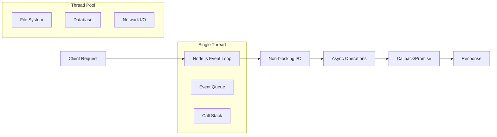

# 🚀 Módulo 05: Node.js + Express - Backend Profesional

> **Duración**: 8-10 horas
> **Nivel**: Intermedio-Avanzado
> **Prerequisitos**: JavaScript ES6+, conceptos HTTP/REST, desarrollo web básico

---

## 🎯 Objetivos de Aprendizaje

Al finalizar este módulo serás capaz de:

- ✅ **Arquitecturar APIs robustas** con patrones profesionales
- ✅ **Implementar middlewares personalizados** para funcionalidad transversal
- ✅ **Gestionar errores de forma centralizada** y consistente
- ✅ **Aplicar validación de datos** rigurosa y segura
- ✅ **Implementar logging estructurado** para debugging y monitoreo
- ✅ **Diseñar testing strategies** completas para APIs
- ✅ **Optimizar performance** con caching y técnicas avanzadas
- ✅ **Aplicar security best practices** desde el diseño

---

## 📚 Fundamentos de Node.js

### ¿Por qué Node.js?

Node.js revolucionó el desarrollo backend al permitir JavaScript en el servidor:



### Event Loop Profundo

El Event Loop es el corazón de Node.js:

```javascript
// Ejemplo del Event Loop en acción
console.log("1: Synchronous");

setTimeout(() => console.log("2: Timer"), 0);

setImmediate(() => console.log("3: Immediate"));

process.nextTick(() => console.log("4: Next Tick"));

Promise.resolve().then(() => console.log("5: Promise"));

console.log("6: Synchronous");

// Output order: 1, 6, 4, 5, 2, 3
```

**Fases del Event Loop**:

1. **Timer Phase**: Ejecuta callbacks de `setTimeout()` y `setInterval()`
2. **Pending Callbacks**: Ejecuta I/O callbacks diferidos
3. **Idle, Prepare**: Uso interno
4. **Poll Phase**: Busca nuevos I/O events
5. **Check Phase**: Ejecuta `setImmediate()` callbacks
6. **Close Callbacks**: Ejecuta callbacks de cierre

### Módulos y Sistema de Archivos

```javascript
// CommonJS vs ES Modules
// CommonJS (Node.js tradicional)
const fs = require("fs");
const express = require("express");

// ES Modules (moderno)
import fs from "fs/promises";
import express from "express";

// Módulo personalizado
// utils/logger.js
export class Logger {
  static info(message) {
    console.log(`[INFO] ${new Date().toISOString()}: ${message}`);
  }

  static error(message, error) {
    console.error(`[ERROR] ${new Date().toISOString()}: ${message}`, error);
  }
}

// Uso del módulo
import { Logger } from "./utils/logger.js";
Logger.info("Application starting...");
```

---

## 🎭 Express.js - Framework Web Minimalista

### Arquitectura de Express

Express sigue el patrón de middleware stack:

```javascript
// app.js - Configuración base robusta
import express from "express";
import cors from "cors";
import helmet from "helmet";
import compression from "compression";
import rateLimit from "express-rate-limit";

const app = express();

// Security middlewares
app.use(
  helmet({
    contentSecurityPolicy: {
      directives: {
        defaultSrc: ["'self'"],
        styleSrc: ["'self'", "'unsafe-inline'"],
        scriptSrc: ["'self'"],
        imgSrc: ["'self'", "data:", "https:"],
      },
    },
    hsts: {
      maxAge: 31536000,
      includeSubDomains: true,
      preload: true,
    },
  })
);

// CORS configuration
app.use(
  cors({
    origin:
      process.env.NODE_ENV === "production"
        ? ["https://yourdomain.com"]
        : ["http://localhost:3000"],
    credentials: true,
    optionsSuccessStatus: 200,
  })
);

// Rate limiting
const limiter = rateLimit({
  windowMs: 15 * 60 * 1000, // 15 minutes
  max: 100, // limit each IP to 100 requests per windowMs
  message: {
    error: "Too many requests from this IP",
    retryAfter: Math.ceil(15 * 60),
  },
  standardHeaders: true,
  legacyHeaders: false,
});

app.use("/api/", limiter);

// Compression y parsing
app.use(compression());
app.use(
  express.json({
    limit: "10mb",
    type: ["application/json", "text/plain"],
  })
);
app.use(
  express.urlencoded({
    extended: true,
    limit: "10mb",
  })
);

export default app;
```

### Middleware Patterns Avanzados

```javascript
// middlewares/auth.js
import jwt from "jsonwebtoken";
import { Logger } from "../utils/logger.js";

export const authenticateToken = (req, res, next) => {
  const authHeader = req.headers["authorization"];
  const token = authHeader && authHeader.split(" ")[1]; // Bearer TOKEN

  if (!token) {
    return res.status(401).json({
      error: "Access token required",
      code: "TOKEN_MISSING",
    });
  }

  jwt.verify(token, process.env.JWT_SECRET, (err, decoded) => {
    if (err) {
      Logger.error("Token verification failed", err);
      return res.status(403).json({
        error: "Invalid or expired token",
        code: "TOKEN_INVALID",
      });
    }

    req.user = decoded;
    next();
  });
};

// middlewares/validation.js
import { validationResult } from "express-validator";

export const handleValidationErrors = (req, res, next) => {
  const errors = validationResult(req);

  if (!errors.isEmpty()) {
    const formattedErrors = errors.array().map((error) => ({
      field: error.path,
      message: error.msg,
      value: error.value,
    }));

    return res.status(400).json({
      error: "Validation failed",
      code: "VALIDATION_ERROR",
      details: formattedErrors,
    });
  }

  next();
};

// middlewares/requestLogger.js
import { Logger } from "../utils/logger.js";

export const requestLogger = (req, res, next) => {
  const start = Date.now();
  const requestId = Math.random().toString(36).substr(2, 9);

  // Add request ID to request object
  req.requestId = requestId;

  // Log request start
  Logger.info(`[${requestId}] ${req.method} ${req.url} - Started`);

  // Override res.json to log response
  const originalJson = res.json;
  res.json = function (data) {
    const duration = Date.now() - start;
    Logger.info(
      `[${requestId}] ${req.method} ${req.url} - ${res.statusCode} (${duration}ms)`
    );
    return originalJson.call(this, data);
  };

  next();
};
```

---

## 🏗️ Arquitectura de APIs Profesionales

### Estructura de Proyecto Escalable

```
src/
├── app.js                  # Express app configuration
├── server.js               # Server startup and graceful shutdown
├── config/
│   ├── database.js         # Database configuration
│   ├── environment.js      # Environment variables
│   └── constants.js        # Application constants
├── controllers/
│   ├── base.controller.js  # Base controller with common functionality
│   ├── user.controller.js  # User-specific business logic
│   └── student.controller.js
├── middlewares/
│   ├── auth.js            # Authentication middleware
│   ├── validation.js      # Input validation
│   ├── rateLimit.js       # Rate limiting
│   └── errorHandler.js    # Global error handling
├── models/
│   ├── User.js            # Data models/schemas
│   └── Student.js
├── routes/
│   ├── index.js           # Route definitions
│   ├── api/
│   │   ├── v1/
│   │   │   ├── users.js   # User routes
│   │   │   └── students.js
│   │   └── health.js      # Health check routes
├── services/
│   ├── userService.js     # Business logic layer
│   ├── emailService.js    # External service integrations
│   └── cacheService.js
├── utils/
│   ├── logger.js          # Logging utilities
│   ├── validator.js       # Custom validators
│   └── constants.js
└── tests/
    ├── unit/              # Unit tests
    ├── integration/       # Integration tests
    └── helpers/           # Test utilities
```

### Base Controller Pattern

```javascript
// controllers/base.controller.js
import { Logger } from "../utils/logger.js";

export class BaseController {
  constructor(service) {
    this.service = service;
  }

  // Wrapper para manejo consistente de errores
  asyncHandler = (fn) => {
    return (req, res, next) => {
      Promise.resolve(fn(req, res, next)).catch(next);
    };
  };

  // Respuesta exitosa estandarizada
  sendSuccess(res, data, message = "Success", statusCode = 200) {
    return res.status(statusCode).json({
      success: true,
      message,
      data,
      timestamp: new Date().toISOString(),
      requestId: res.req.requestId,
    });
  }

  // Respuesta de error estandarizada
  sendError(res, message, statusCode = 500, code = null) {
    Logger.error(`Error in ${this.constructor.name}:`, {
      message,
      statusCode,
      code,
      requestId: res.req.requestId,
    });

    return res.status(statusCode).json({
      success: false,
      error: message,
      code,
      timestamp: new Date().toISOString(),
      requestId: res.req.requestId,
    });
  }

  // Paginación estandarizada
  sendPaginated(res, data, pagination, message = "Success") {
    return res.status(200).json({
      success: true,
      message,
      data,
      pagination: {
        page: parseInt(pagination.page),
        limit: parseInt(pagination.limit),
        total: pagination.total,
        pages: Math.ceil(pagination.total / pagination.limit),
        hasNext: pagination.page * pagination.limit < pagination.total,
        hasPrev: pagination.page > 1,
      },
      timestamp: new Date().toISOString(),
      requestId: res.req.requestId,
    });
  }
}

// controllers/student.controller.js
import { BaseController } from "./base.controller.js";
import { StudentService } from "../services/studentService.js";

export class StudentController extends BaseController {
  constructor() {
    super(new StudentService());
  }

  getAll = this.asyncHandler(async (req, res) => {
    const { page = 1, limit = 10, search, group } = req.query;

    const filters = {};
    if (search) filters.search = search;
    if (group) filters.group = group;

    const result = await this.service.findAll({
      ...filters,
      page: parseInt(page),
      limit: parseInt(limit),
    });

    this.sendPaginated(
      res,
      result.data,
      {
        page,
        limit,
        total: result.total,
      },
      "Students retrieved successfully"
    );
  });

  getById = this.asyncHandler(async (req, res) => {
    const { id } = req.params;

    const student = await this.service.findById(id);

    if (!student) {
      return this.sendError(res, "Student not found", 404, "STUDENT_NOT_FOUND");
    }

    this.sendSuccess(res, student, "Student retrieved successfully");
  });

  create = this.asyncHandler(async (req, res) => {
    const studentData = req.body;

    const newStudent = await this.service.create(studentData);

    this.sendSuccess(res, newStudent, "Student created successfully", 201);
  });

  update = this.asyncHandler(async (req, res) => {
    const { id } = req.params;
    const updateData = req.body;

    const updatedStudent = await this.service.update(id, updateData);

    if (!updatedStudent) {
      return this.sendError(res, "Student not found", 404, "STUDENT_NOT_FOUND");
    }

    this.sendSuccess(res, updatedStudent, "Student updated successfully");
  });

  delete = this.asyncHandler(async (req, res) => {
    const { id } = req.params;

    const deleted = await this.service.delete(id);

    if (!deleted) {
      return this.sendError(res, "Student not found", 404, "STUDENT_NOT_FOUND");
    }

    this.sendSuccess(res, null, "Student deleted successfully", 204);
  });
}
```

---

## 🛠️ Service Layer y Business Logic

```javascript
// services/studentService.js
import { Student } from "../models/Student.js";
import { Logger } from "../utils/logger.js";
import { ValidationError, NotFoundError } from "../utils/errors.js";

export class StudentService {
  constructor() {
    this.model = Student;
  }

  async findAll(options = {}) {
    try {
      const { page = 1, limit = 10, search, group } = options;
      const offset = (page - 1) * limit;

      let query = {};

      // Build search query
      if (search) {
        query.name = { $regex: search, $options: "i" };
      }

      if (group) {
        query.group = group;
      }

      // Execute query with pagination
      const [data, total] = await Promise.all([
        this.model
          .find(query)
          .skip(offset)
          .limit(limit)
          .sort({ createdAt: -1 }),
        this.model.countDocuments(query),
      ]);

      Logger.info(`Found ${data.length} students (${total} total)`);

      return { data, total };
    } catch (error) {
      Logger.error("Error in StudentService.findAll", error);
      throw error;
    }
  }

  async findById(id) {
    try {
      if (!this.isValidId(id)) {
        throw new ValidationError("Invalid student ID format");
      }

      const student = await this.model.findById(id);

      if (!student) {
        throw new NotFoundError("Student not found");
      }

      Logger.info(`Found student: ${student.name} (${id})`);
      return student;
    } catch (error) {
      Logger.error(`Error finding student ${id}`, error);
      throw error;
    }
  }

  async create(data) {
    try {
      // Validate required fields
      this.validateStudentData(data);

      // Check for duplicate name in same group
      const existingStudent = await this.model.findOne({
        name: data.name,
        group: data.group,
      });

      if (existingStudent) {
        throw new ValidationError(
          `Student with name "${data.name}" already exists in group "${data.group}"`
        );
      }

      const student = new this.model({
        ...data,
        id: this.generateId(),
        createdAt: new Date(),
        updatedAt: new Date(),
      });

      await student.save();

      Logger.info(`Created student: ${student.name} (${student.id})`);
      return student;
    } catch (error) {
      Logger.error("Error creating student", error);
      throw error;
    }
  }

  async update(id, data) {
    try {
      if (!this.isValidId(id)) {
        throw new ValidationError("Invalid student ID format");
      }

      // Validate update data
      if (Object.keys(data).length === 0) {
        throw new ValidationError("No update data provided");
      }

      const student = await this.model.findById(id);

      if (!student) {
        throw new NotFoundError("Student not found");
      }

      // Check for duplicate name if name is being updated
      if (data.name && data.name !== student.name) {
        const existingStudent = await this.model.findOne({
          name: data.name,
          group: data.group || student.group,
          _id: { $ne: id },
        });

        if (existingStudent) {
          throw new ValidationError(
            `Student with name "${data.name}" already exists in group "${
              data.group || student.group
            }"`
          );
        }
      }

      // Update student
      Object.assign(student, data, { updatedAt: new Date() });
      await student.save();

      Logger.info(`Updated student: ${student.name} (${id})`);
      return student;
    } catch (error) {
      Logger.error(`Error updating student ${id}`, error);
      throw error;
    }
  }

  async delete(id) {
    try {
      if (!this.isValidId(id)) {
        throw new ValidationError("Invalid student ID format");
      }

      const student = await this.model.findById(id);

      if (!student) {
        throw new NotFoundError("Student not found");
      }

      await this.model.findByIdAndDelete(id);

      Logger.info(`Deleted student: ${student.name} (${id})`);
      return true;
    } catch (error) {
      Logger.error(`Error deleting student ${id}`, error);
      throw error;
    }
  }

  // Utility methods
  isValidId(id) {
    return typeof id === "string" && id.length > 0;
  }

  generateId() {
    return `student_${Date.now()}_${Math.random().toString(36).substr(2, 9)}`;
  }

  validateStudentData(data) {
    const required = ["name", "group"];
    const missing = required.filter((field) => !data[field]);

    if (missing.length > 0) {
      throw new ValidationError(
        `Missing required fields: ${missing.join(", ")}`
      );
    }

    if (typeof data.name !== "string" || data.name.trim().length < 2) {
      throw new ValidationError(
        "Name must be a string with at least 2 characters"
      );
    }

    if (typeof data.group !== "string" || data.group.trim().length < 1) {
      throw new ValidationError("Group must be a non-empty string");
    }
  }
}
```

---

## 🚨 Error Handling Centralizado

```javascript
// utils/errors.js
export class AppError extends Error {
  constructor(message, statusCode, code = null) {
    super(message);
    this.statusCode = statusCode;
    this.code = code;
    this.isOperational = true; // Distinguir errores operacionales de bugs

    Error.captureStackTrace(this, this.constructor);
  }
}

export class ValidationError extends AppError {
  constructor(message) {
    super(message, 400, "VALIDATION_ERROR");
  }
}

export class NotFoundError extends AppError {
  constructor(message) {
    super(message, 404, "NOT_FOUND");
  }
}

export class AuthenticationError extends AppError {
  constructor(message) {
    super(message, 401, "AUTHENTICATION_ERROR");
  }
}

export class AuthorizationError extends AppError {
  constructor(message) {
    super(message, 403, "AUTHORIZATION_ERROR");
  }
}

// middlewares/errorHandler.js
import { Logger } from "../utils/logger.js";
import { AppError } from "../utils/errors.js";

export const errorHandler = (error, req, res, next) => {
  let statusCode = error.statusCode || 500;
  let message = error.message;
  let code = error.code;

  // Log error details
  Logger.error("Error occurred:", {
    message: error.message,
    stack: error.stack,
    requestId: req.requestId,
    url: req.url,
    method: req.method,
    body: req.body,
    params: req.params,
    query: req.query,
  });

  // Handle specific error types
  if (error.name === "ValidationError") {
    statusCode = 400;
    message = "Validation failed";
    code = "VALIDATION_ERROR";
  } else if (error.name === "CastError") {
    statusCode = 400;
    message = "Invalid ID format";
    code = "INVALID_ID";
  } else if (error.code === 11000) {
    statusCode = 409;
    message = "Duplicate resource";
    code = "DUPLICATE_ERROR";
  }

  // Don't expose internal errors in production
  if (!error.isOperational && process.env.NODE_ENV === "production") {
    message = "Something went wrong";
    code = "INTERNAL_ERROR";
  }

  res.status(statusCode).json({
    success: false,
    error: message,
    code,
    ...(process.env.NODE_ENV === "development" && { stack: error.stack }),
    timestamp: new Date().toISOString(),
    requestId: req.requestId,
  });
};

// Handle unhandled promise rejections
export const unhandledRejectionHandler = (reason, promise) => {
  Logger.error("Unhandled Promise Rejection:", reason);
  // Gracefully close server
  process.exit(1);
};

// Handle uncaught exceptions
export const uncaughtExceptionHandler = (error) => {
  Logger.error("Uncaught Exception:", error);
  // Gracefully close server
  process.exit(1);
};
```

---

## 📊 Logging Estructurado

```javascript
// utils/logger.js
import winston from "winston";
import path from "path";

// Custom log levels
const levels = {
  error: 0,
  warn: 1,
  info: 2,
  http: 3,
  debug: 4,
};

// Colors for console output
const colors = {
  error: "red",
  warn: "yellow",
  info: "green",
  http: "magenta",
  debug: "white",
};

winston.addColors(colors);

// Custom format for structured logging
const logFormat = winston.format.combine(
  winston.format.timestamp({ format: "YYYY-MM-DD HH:mm:ss:ms" }),
  winston.format.colorize({ all: true }),
  winston.format.printf((info) => {
    const { timestamp, level, message, ...meta } = info;

    let logMessage = `${timestamp} [${level}]: ${message}`;

    // Add metadata if present
    if (Object.keys(meta).length > 0) {
      logMessage += `\n${JSON.stringify(meta, null, 2)}`;
    }

    return logMessage;
  })
);

// Create logger instance
export const Logger = winston.createLogger({
  level: process.env.NODE_ENV === "production" ? "info" : "debug",
  levels,
  format: logFormat,
  transports: [
    // Console transport for development
    new winston.transports.Console({
      format: logFormat,
    }),

    // File transport for errors
    new winston.transports.File({
      filename: path.join(process.cwd(), "logs", "error.log"),
      level: "error",
      format: winston.format.combine(
        winston.format.timestamp(),
        winston.format.json()
      ),
    }),

    // File transport for all logs
    new winston.transports.File({
      filename: path.join(process.cwd(), "logs", "combined.log"),
      format: winston.format.combine(
        winston.format.timestamp(),
        winston.format.json()
      ),
    }),
  ],
});

// Performance logging utility
export class PerformanceLogger {
  static startTimer(label) {
    console.time(label);
    const start = process.hrtime.bigint();

    return {
      end: () => {
        const end = process.hrtime.bigint();
        const duration = Number(end - start) / 1000000; // Convert to milliseconds
        console.timeEnd(label);
        Logger.info(`Performance: ${label} took ${duration.toFixed(2)}ms`);
        return duration;
      },
    };
  }
}
```

---

## 🧪 Testing Strategies

### Unit Testing con Vitest

```javascript
// tests/unit/services/studentService.test.js
import { describe, it, expect, beforeEach, vi } from "vitest";
import { StudentService } from "../../../src/services/studentService.js";
import { ValidationError, NotFoundError } from "../../../src/utils/errors.js";

// Mock the model
vi.mock("../../../src/models/Student.js", () => ({
  Student: {
    find: vi.fn(),
    findById: vi.fn(),
    findOne: vi.fn(),
    countDocuments: vi.fn(),
    findByIdAndDelete: vi.fn(),
  },
}));

describe("StudentService", () => {
  let studentService;
  let mockStudent;

  beforeEach(() => {
    studentService = new StudentService();
    mockStudent = {
      id: "student_123",
      name: "John Doe",
      group: "Group A",
      createdAt: new Date(),
      updatedAt: new Date(),
      save: vi.fn(),
    };

    // Clear all mocks
    vi.clearAllMocks();
  });

  describe("findAll", () => {
    it("should return paginated students", async () => {
      const mockStudents = [mockStudent];
      const mockTotal = 1;

      studentService.model.find.mockReturnValue({
        skip: vi.fn().mockReturnValue({
          limit: vi.fn().mockReturnValue({
            sort: vi.fn().mockResolvedValue(mockStudents),
          }),
        }),
      });

      studentService.model.countDocuments.mockResolvedValue(mockTotal);

      const result = await studentService.findAll({ page: 1, limit: 10 });

      expect(result.data).toEqual(mockStudents);
      expect(result.total).toBe(mockTotal);
      expect(studentService.model.find).toHaveBeenCalledWith({});
      expect(studentService.model.countDocuments).toHaveBeenCalledWith({});
    });

    it("should filter by search term", async () => {
      const searchTerm = "John";
      const expectedQuery = { name: { $regex: searchTerm, $options: "i" } };

      studentService.model.find.mockReturnValue({
        skip: vi.fn().mockReturnValue({
          limit: vi.fn().mockReturnValue({
            sort: vi.fn().mockResolvedValue([]),
          }),
        }),
      });

      studentService.model.countDocuments.mockResolvedValue(0);

      await studentService.findAll({ search: searchTerm });

      expect(studentService.model.find).toHaveBeenCalledWith(expectedQuery);
      expect(studentService.model.countDocuments).toHaveBeenCalledWith(
        expectedQuery
      );
    });
  });

  describe("create", () => {
    const validStudentData = {
      name: "Jane Smith",
      group: "Group B",
    };

    it("should create a new student successfully", async () => {
      studentService.model.findOne.mockResolvedValue(null); // No duplicate

      const mockNewStudent = { ...mockStudent, ...validStudentData };
      mockNewStudent.save.mockResolvedValue(mockNewStudent);

      // Mock constructor
      studentService.model = vi.fn().mockImplementation((data) => {
        return { ...mockNewStudent, save: mockNewStudent.save };
      });

      const result = await studentService.create(validStudentData);

      expect(result.name).toBe(validStudentData.name);
      expect(result.group).toBe(validStudentData.group);
    });

    it("should throw validation error for missing name", async () => {
      const invalidData = { group: "Group B" };

      await expect(studentService.create(invalidData)).rejects.toThrow(
        ValidationError
      );
    });

    it("should throw validation error for duplicate student", async () => {
      studentService.model.findOne.mockResolvedValue(mockStudent); // Duplicate found

      await expect(studentService.create(validStudentData)).rejects.toThrow(
        ValidationError
      );
    });
  });

  describe("findById", () => {
    it("should return student by id", async () => {
      studentService.model.findById.mockResolvedValue(mockStudent);

      const result = await studentService.findById("student_123");

      expect(result).toEqual(mockStudent);
      expect(studentService.model.findById).toHaveBeenCalledWith("student_123");
    });

    it("should throw error for invalid id format", async () => {
      await expect(studentService.findById("")).rejects.toThrow(
        ValidationError
      );
    });

    it("should throw error when student not found", async () => {
      studentService.model.findById.mockResolvedValue(null);

      await expect(studentService.findById("nonexistent")).rejects.toThrow(
        NotFoundError
      );
    });
  });
});

// Integration tests
// tests/integration/api/students.test.js
import { describe, it, expect, beforeAll, afterAll, beforeEach } from "vitest";
import request from "supertest";
import app from "../../../src/app.js";

describe("/api/v1/students", () => {
  let server;

  beforeAll(async () => {
    server = app.listen(0); // Use random port
  });

  afterAll(async () => {
    await server.close();
  });

  describe("GET /api/v1/students", () => {
    it("should return list of students", async () => {
      const response = await request(server)
        .get("/api/v1/students")
        .expect(200);

      expect(response.body.success).toBe(true);
      expect(response.body.data).toBeInstanceOf(Array);
      expect(response.body.pagination).toBeDefined();
    });

    it("should handle pagination parameters", async () => {
      const response = await request(server)
        .get("/api/v1/students?page=1&limit=5")
        .expect(200);

      expect(response.body.pagination.page).toBe(1);
      expect(response.body.pagination.limit).toBe(5);
    });
  });

  describe("POST /api/v1/students", () => {
    it("should create a new student", async () => {
      const studentData = {
        name: "Test Student",
        group: "Test Group",
      };

      const response = await request(server)
        .post("/api/v1/students")
        .send(studentData)
        .expect(201);

      expect(response.body.success).toBe(true);
      expect(response.body.data.name).toBe(studentData.name);
      expect(response.body.data.group).toBe(studentData.group);
      expect(response.body.data.id).toBeDefined();
    });

    it("should return validation error for missing name", async () => {
      const invalidData = { group: "Test Group" };

      const response = await request(server)
        .post("/api/v1/students")
        .send(invalidData)
        .expect(400);

      expect(response.body.success).toBe(false);
      expect(response.body.code).toBe("VALIDATION_ERROR");
    });
  });
});
```

---

## ⚡ Performance y Optimización

### Caching con Redis

```javascript
// services/cacheService.js
import redis from "redis";
import { Logger } from "../utils/logger.js";

export class CacheService {
  constructor() {
    this.client = redis.createClient({
      host: process.env.REDIS_HOST || "localhost",
      port: process.env.REDIS_PORT || 6379,
      password: process.env.REDIS_PASSWORD,
    });

    this.client.on("connect", () => {
      Logger.info("Connected to Redis");
    });

    this.client.on("error", (error) => {
      Logger.error("Redis error:", error);
    });
  }

  async get(key) {
    try {
      const value = await this.client.get(key);
      return value ? JSON.parse(value) : null;
    } catch (error) {
      Logger.error(`Cache get error for key ${key}:`, error);
      return null;
    }
  }

  async set(key, value, ttl = 300) {
    // 5 minutes default TTL
    try {
      await this.client.setex(key, ttl, JSON.stringify(value));
      Logger.debug(`Cached data for key: ${key} (TTL: ${ttl}s)`);
    } catch (error) {
      Logger.error(`Cache set error for key ${key}:`, error);
    }
  }

  async delete(key) {
    try {
      await this.client.del(key);
      Logger.debug(`Deleted cache for key: ${key}`);
    } catch (error) {
      Logger.error(`Cache delete error for key ${key}:`, error);
    }
  }

  async invalidatePattern(pattern) {
    try {
      const keys = await this.client.keys(pattern);
      if (keys.length > 0) {
        await this.client.del(...keys);
        Logger.debug(
          `Invalidated ${keys.length} keys matching pattern: ${pattern}`
        );
      }
    } catch (error) {
      Logger.error(`Cache pattern invalidation error for ${pattern}:`, error);
    }
  }

  generateKey(...parts) {
    return parts.filter(Boolean).join(":");
  }
}

// Middleware de cache
export const cacheMiddleware = (ttl = 300) => {
  const cache = new CacheService();

  return async (req, res, next) => {
    // Solo cachear GET requests
    if (req.method !== "GET") {
      return next();
    }

    const cacheKey = cache.generateKey(
      "api",
      req.baseUrl,
      req.path,
      JSON.stringify(req.query)
    );

    try {
      const cachedData = await cache.get(cacheKey);

      if (cachedData) {
        Logger.debug(`Cache hit for key: ${cacheKey}`);
        return res.json({
          ...cachedData,
          cached: true,
          timestamp: new Date().toISOString(),
        });
      }

      // Override res.json to cache the response
      const originalJson = res.json;
      res.json = function (data) {
        if (res.statusCode === 200) {
          cache.set(cacheKey, data, ttl);
        }
        return originalJson.call(this, data);
      };

      next();
    } catch (error) {
      Logger.error("Cache middleware error:", error);
      next();
    }
  };
};
```

### Database Connection Pooling

```javascript
// config/database.js
import mongoose from "mongoose";
import { Logger } from "../utils/logger.js";

export class DatabaseConnection {
  constructor() {
    this.isConnected = false;
  }

  async connect() {
    if (this.isConnected) {
      return;
    }

    try {
      const options = {
        useNewUrlParser: true,
        useUnifiedTopology: true,
        maxPoolSize: 10, // Maximum connections in pool
        serverSelectionTimeoutMS: 5000, // Keep trying to send operations for 5 seconds
        socketTimeoutMS: 45000, // Close sockets after 45 seconds of inactivity
        family: 4, // Use IPv4, skip trying IPv6
        bufferMaxEntries: 0,
        bufferCommands: false,
      };

      await mongoose.connect(process.env.MONGODB_URI, options);

      this.isConnected = true;
      Logger.info("Connected to MongoDB");

      // Handle connection events
      mongoose.connection.on("error", (error) => {
        Logger.error("MongoDB connection error:", error);
        this.isConnected = false;
      });

      mongoose.connection.on("disconnected", () => {
        Logger.warn("MongoDB disconnected");
        this.isConnected = false;
      });
    } catch (error) {
      Logger.error("Failed to connect to MongoDB:", error);
      throw error;
    }
  }

  async disconnect() {
    if (!this.isConnected) {
      return;
    }

    try {
      await mongoose.connection.close();
      this.isConnected = false;
      Logger.info("Disconnected from MongoDB");
    } catch (error) {
      Logger.error("Error disconnecting from MongoDB:", error);
      throw error;
    }
  }

  getConnectionStatus() {
    return {
      isConnected: this.isConnected,
      readyState: mongoose.connection.readyState,
      host: mongoose.connection.host,
      port: mongoose.connection.port,
      name: mongoose.connection.name,
    };
  }
}
```

---

## 🔒 Security Best Practices

```javascript
// middlewares/security.js
import rateLimit from "express-rate-limit";
import slowDown from "express-slow-down";
import hpp from "hpp";
import mongoSanitize from "express-mongo-sanitize";

// Rate limiting para diferentes endpoints
export const createRateLimit = (windowMs, max, message) => {
  return rateLimit({
    windowMs,
    max,
    message: {
      error: message || "Too many requests",
      retryAfter: Math.ceil(windowMs / 1000),
    },
    standardHeaders: true,
    legacyHeaders: false,
    handler: (req, res) => {
      Logger.warn(`Rate limit exceeded for IP: ${req.ip}`);
      res.status(429).json({
        error: "Too many requests",
        retryAfter: Math.ceil(windowMs / 1000),
      });
    },
  });
};

// Slow down requests para prevenir brute force
export const speedLimiter = slowDown({
  windowMs: 15 * 60 * 1000, // 15 minutes
  delayAfter: 50, // Allow 50 requests per 15 minutes at full speed
  delayMs: 500, // Add 500ms of delay per request after delayAfter
});

// Sanitización de datos
export const sanitization = [
  mongoSanitize(), // Prevenir NoSQL injection
  hpp(), // Prevenir HTTP Parameter Pollution
];

// Validación de Content-Type
export const validateContentType = (req, res, next) => {
  if (["POST", "PUT", "PATCH"].includes(req.method)) {
    if (!req.is("application/json")) {
      return res.status(415).json({
        error: "Content-Type must be application/json",
        code: "UNSUPPORTED_MEDIA_TYPE",
      });
    }
  }
  next();
};

// CORS configuration avanzada
export const corsOptions = {
  origin: function (origin, callback) {
    const allowedOrigins = process.env.ALLOWED_ORIGINS?.split(",") || [
      "http://localhost:3000",
      "http://localhost:3001",
    ];

    // Allow requests with no origin (mobile apps, etc.)
    if (!origin) return callback(null, true);

    if (allowedOrigins.includes(origin)) {
      callback(null, true);
    } else {
      Logger.warn(`CORS blocked origin: ${origin}`);
      callback(new Error("Not allowed by CORS"));
    }
  },
  credentials: true,
  optionsSuccessStatus: 200,
  methods: ["GET", "POST", "PUT", "DELETE", "PATCH"],
  allowedHeaders: ["Content-Type", "Authorization", "X-Requested-With"],
};
```

---

## 🚀 Deployment y Production

### Docker Configuration

```dockerfile
# Dockerfile
FROM node:18-alpine AS builder

WORKDIR /app

# Copy package files
COPY package*.json ./
RUN npm ci --only=production && npm cache clean --force

# Copy source code
COPY . .

# Create non-root user
RUN addgroup -g 1001 -S nodejs
RUN adduser -S nodeuser -u 1001

# Change ownership
RUN chown -R nodeuser:nodejs /app
USER nodeuser

# Production stage
FROM node:18-alpine AS production

WORKDIR /app

# Copy built application
COPY --from=builder --chown=nodeuser:nodejs /app .

# Health check
HEALTHCHECK --interval=30s --timeout=3s --start-period=5s --retries=3 \
    CMD node healthcheck.js

EXPOSE 3000

CMD ["node", "server.js"]

# docker-compose.yml
version: '3.8'

services:
  api:
    build: .
    ports:
      - "3000:3000"
    environment:
      NODE_ENV: production
      PORT: 3000
      MONGODB_URI: mongodb://mongo:27017/indaptados
      REDIS_HOST: redis
      JWT_SECRET: ${JWT_SECRET}
    depends_on:
      - mongo
      - redis
    restart: unless-stopped

  mongo:
    image: mongo:5.0
    ports:
      - "27017:27017"
    volumes:
      - mongo_data:/data/db
    restart: unless-stopped

  redis:
    image: redis:7-alpine
    ports:
      - "6379:6379"
    volumes:
      - redis_data:/data
    restart: unless-stopped

volumes:
  mongo_data:
  redis_data:
```

### Graceful Shutdown

```javascript
// server.js
import app from "./app.js";
import { Logger } from "./utils/logger.js";
import { DatabaseConnection } from "./config/database.js";
import {
  unhandledRejectionHandler,
  uncaughtExceptionHandler,
} from "./middlewares/errorHandler.js";

const PORT = process.env.PORT || 3000;
const db = new DatabaseConnection();

let server;

async function startServer() {
  try {
    // Connect to database
    await db.connect();

    // Start server
    server = app.listen(PORT, () => {
      Logger.info(
        `🚀 Server running on port ${PORT} in ${process.env.NODE_ENV} mode`
      );
    });

    // Handle process signals for graceful shutdown
    process.on("SIGTERM", gracefulShutdown);
    process.on("SIGINT", gracefulShutdown);

    // Handle unhandled rejections and exceptions
    process.on("unhandledRejection", unhandledRejectionHandler);
    process.on("uncaughtException", uncaughtExceptionHandler);
  } catch (error) {
    Logger.error("Failed to start server:", error);
    process.exit(1);
  }
}

async function gracefulShutdown(signal) {
  Logger.info(`Received ${signal}, starting graceful shutdown...`);

  if (server) {
    server.close(async () => {
      Logger.info("HTTP server closed");

      try {
        await db.disconnect();
        Logger.info("Database connection closed");

        Logger.info("Graceful shutdown completed");
        process.exit(0);
      } catch (error) {
        Logger.error("Error during graceful shutdown:", error);
        process.exit(1);
      }
    });

    // Force close after timeout
    setTimeout(() => {
      Logger.error(
        "Could not close connections in time, forcefully shutting down"
      );
      process.exit(1);
    }, 10000);
  }
}

// Start the server
startServer();
```

---

## 📚 Recursos y Referencias

### Librerías Esenciales

```json
{
  "dependencies": {
    "express": "^4.18.2",
    "cors": "^2.8.5",
    "helmet": "^7.0.0",
    "compression": "^1.7.4",
    "express-rate-limit": "^6.10.0",
    "express-validator": "^7.0.1",
    "jsonwebtoken": "^9.0.2",
    "bcryptjs": "^2.4.3",
    "winston": "^3.10.0",
    "mongoose": "^7.5.0",
    "redis": "^4.6.8",
    "dotenv": "^16.3.1"
  },
  "devDependencies": {
    "vitest": "^0.34.4",
    "supertest": "^6.3.3",
    "@types/node": "^20.5.0",
    "nodemon": "^3.0.1",
    "eslint": "^8.47.0",
    "prettier": "^3.0.2"
  }
}
```

### Documentación Oficial

- [Node.js Documentation](https://nodejs.org/docs/)
- [Express.js Guide](https://expressjs.com/guide/)
- [Mongoose Documentation](https://mongoosejs.com/docs/)
- [Winston Logging](https://github.com/winstonjs/winston)

---

Este módulo te proporciona una base sólida para desarrollar APIs profesionales con Node.js y Express. La combinación de patrones arquitectónicos, manejo robusto de errores, logging estructurado y testing completo te prepara para construir aplicaciones backend escalables y mantenibles.
