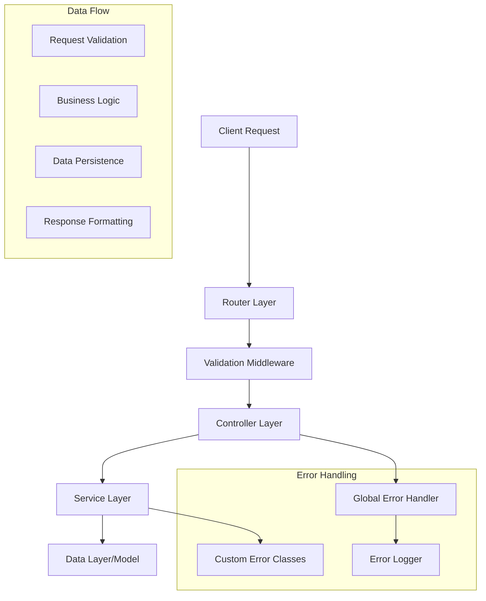

# 🎯 Reto Práctico: Sistema CRUD Completo para Students

> **Duración estimada**: 120-180 minutos
> **Dificultad**: Intermedio-Avanzado
> **Objetivo**: Desarrollar una API REST completa con operaciones CRUD, validación robusta, manejo de errores, y testing comprehensivo.

## 📋 Contexto

Implementarás un sistema completo de gestión de estudiantes que demuestre patrones profesionales de desarrollo backend. El sistema incluirá operaciones CRUD con validación de datos, paginación, filtros de búsqueda, y un conjunto completo de tests automatizados.

## 🎯 Objetivos de Aprendizaje

Al completar este reto serás capaz de:

- ✅ **Diseñar APIs REST** siguiendo convenciones estándar
- ✅ **Implementar validación de datos** robusta con express-validator
- ✅ **Crear servicios modulares** con separación de responsabilidades
- ✅ **Manejar errores** de forma consistente y profesional
- ✅ **Implementar paginación** y filtros de búsqueda
- ✅ **Escribir tests completos** unitarios e integración
- ✅ **Documentar APIs** con ejemplos claros

---

## 🏗️ Arquitectura del Sistema CRUD



---

## 📊 Modelo de Datos Student

```typescript
interface Student {
  id: string; // Unique identifier
  name: string; // Full name (2-100 characters)
  email: string; // Valid email format
  group: string; // Group identifier (1-50 characters)
  enrollmentDate: Date; // When student enrolled
  isActive: boolean; // Student status
  metadata: {
    createdAt: Date;
    updatedAt: Date;
    createdBy?: string;
    lastModifiedBy?: string;
  };
  tags?: string[]; // Optional tags for categorization
  notes?: string; // Optional notes (max 500 characters)
}
```

---

## 🔧 Implementación Paso a Paso

### 1. **Modelo de Datos y Estructura**

```javascript
// models/Student.js
export class Student {
  constructor(data) {
    this.id = data.id || this.generateId();
    this.name = data.name;
    this.email = data.email;
    this.group = data.group;
    this.enrollmentDate = data.enrollmentDate || new Date();
    this.isActive = data.isActive !== undefined ? data.isActive : true;
    this.tags = data.tags || [];
    this.notes = data.notes || "";
    this.metadata = {
      createdAt: data.metadata?.createdAt || new Date(),
      updatedAt: new Date(),
      createdBy: data.metadata?.createdBy,
      lastModifiedBy: data.metadata?.lastModifiedBy,
    };
  }

  generateId() {
    const timestamp = Date.now();
    const random = Math.random().toString(36).substr(2, 9);
    return `student_${timestamp}_${random}`;
  }

  // Update student data while preserving metadata
  update(data) {
    const allowedFields = [
      "name",
      "email",
      "group",
      "isActive",
      "tags",
      "notes",
    ];

    allowedFields.forEach((field) => {
      if (data[field] !== undefined) {
        this[field] = data[field];
      }
    });

    this.metadata.updatedAt = new Date();
    if (data.updatedBy) {
      this.metadata.lastModifiedBy = data.updatedBy;
    }
  }

  // Convert to JSON for API responses
  toJSON() {
    return {
      id: this.id,
      name: this.name,
      email: this.email,
      group: this.group,
      enrollmentDate: this.enrollmentDate,
      isActive: this.isActive,
      tags: this.tags,
      notes: this.notes,
      metadata: this.metadata,
    };
  }

  // Create summary version for list views
  toSummary() {
    return {
      id: this.id,
      name: this.name,
      email: this.email,
      group: this.group,
      isActive: this.isActive,
      enrollmentDate: this.enrollmentDate,
    };
  }
}

// In-memory storage with advanced features
export class StudentRepository {
  constructor() {
    this.students = new Map();
    this.initializeTestData();
  }

  initializeTestData() {
    const testStudents = [
      {
        name: "Ana García",
        email: "ana.garcia@example.com",
        group: "Frontend-2024",
        tags: ["javascript", "react"],
      },
      {
        name: "Carlos López",
        email: "carlos.lopez@example.com",
        group: "Backend-2024",
        tags: ["nodejs", "express"],
      },
      {
        name: "María Rodríguez",
        email: "maria.rodriguez@example.com",
        group: "Fullstack-2024",
        tags: ["react", "nodejs", "typescript"],
      },
      {
        name: "Juan Martínez",
        email: "juan.martinez@example.com",
        group: "Frontend-2024",
        isActive: false,
        tags: ["vue", "javascript"],
      },
      {
        name: "Isabel Fernández",
        email: "isabel.fernandez@example.com",
        group: "DevOps-2024",
        tags: ["docker", "kubernetes", "aws"],
      },
    ];

    testStudents.forEach((studentData) => {
      const student = new Student(studentData);
      this.students.set(student.id, student);
    });
  }

  async findAll(filters = {}) {
    let students = Array.from(this.students.values());

    // Apply filters
    if (filters.search) {
      const searchTerm = filters.search.toLowerCase();
      students = students.filter(
        (student) =>
          student.name.toLowerCase().includes(searchTerm) ||
          student.email.toLowerCase().includes(searchTerm) ||
          student.group.toLowerCase().includes(searchTerm) ||
          student.tags.some((tag) => tag.toLowerCase().includes(searchTerm))
      );
    }

    if (filters.group) {
      students = students.filter(
        (student) => student.group.toLowerCase() === filters.group.toLowerCase()
      );
    }

    if (filters.isActive !== undefined) {
      students = students.filter(
        (student) => student.isActive === filters.isActive
      );
    }

    if (filters.tags && filters.tags.length > 0) {
      students = students.filter((student) =>
        filters.tags.some((tag) =>
          student.tags.map((t) => t.toLowerCase()).includes(tag.toLowerCase())
        )
      );
    }

    // Sort by specified field or default to name
    const sortField = filters.sortBy || "name";
    const sortOrder = filters.sortOrder === "desc" ? -1 : 1;

    students.sort((a, b) => {
      let aVal = a[sortField];
      let bVal = b[sortField];

      // Handle nested fields like metadata.createdAt
      if (sortField.includes(".")) {
        const fields = sortField.split(".");
        aVal = fields.reduce((obj, field) => obj?.[field], a);
        bVal = fields.reduce((obj, field) => obj?.[field], b);
      }

      if (aVal < bVal) return -1 * sortOrder;
      if (aVal > bVal) return 1 * sortOrder;
      return 0;
    });

    return students;
  }

  async findById(id) {
    return this.students.get(id) || null;
  }

  async findByEmail(email) {
    return (
      Array.from(this.students.values()).find(
        (student) => student.email.toLowerCase() === email.toLowerCase()
      ) || null
    );
  }

  async create(studentData) {
    const student = new Student(studentData);
    this.students.set(student.id, student);
    return student;
  }

  async update(id, updateData) {
    const student = this.students.get(id);
    if (!student) return null;

    student.update(updateData);
    this.students.set(id, student);
    return student;
  }

  async delete(id) {
    const existed = this.students.has(id);
    this.students.delete(id);
    return existed;
  }

  async count(filters = {}) {
    const students = await this.findAll(filters);
    return students.length;
  }

  async getGroups() {
    const groups = new Set();
    this.students.forEach((student) => groups.add(student.group));
    return Array.from(groups).sort();
  }

  async getTags() {
    const tagCount = new Map();

    this.students.forEach((student) => {
      student.tags.forEach((tag) => {
        tagCount.set(tag, (tagCount.get(tag) || 0) + 1);
      });
    });

    return Array.from(tagCount.entries())
      .map(([tag, count]) => ({ tag, count }))
      .sort((a, b) => b.count - a.count);
  }
}
```

### 2. **Validación Avanzada con Express-Validator**

```javascript
// validators/studentValidator.js
import { body, param, query } from "express-validator";

// Common validation rules
const nameValidation = body("name")
  .trim()
  .isLength({ min: 2, max: 100 })
  .withMessage("Name must be between 2 and 100 characters")
  .matches(/^[a-zA-ZÀ-ÿ\u00f1\u00d1\s]+$/)
  .withMessage("Name must contain only letters and spaces");

const emailValidation = body("email")
  .trim()
  .isEmail()
  .normalizeEmail()
  .withMessage("Must be a valid email address")
  .isLength({ max: 254 })
  .withMessage("Email must not exceed 254 characters");

const groupValidation = body("group")
  .trim()
  .isLength({ min: 1, max: 50 })
  .withMessage("Group must be between 1 and 50 characters")
  .matches(/^[a-zA-Z0-9-_\s]+$/)
  .withMessage(
    "Group can only contain letters, numbers, hyphens, underscores and spaces"
  );

const isActiveValidation = body("isActive")
  .optional()
  .isBoolean()
  .withMessage("isActive must be a boolean value");

const tagsValidation = body("tags")
  .optional()
  .isArray({ max: 10 })
  .withMessage("Tags must be an array with maximum 10 items")
  .custom((tags) => {
    if (tags && tags.length > 0) {
      const invalidTags = tags.filter(
        (tag) =>
          typeof tag !== "string" ||
          tag.trim().length === 0 ||
          tag.length > 30 ||
          !/^[a-zA-Z0-9-_]+$/.test(tag)
      );

      if (invalidTags.length > 0) {
        throw new Error(
          "Each tag must be a string (1-30 chars, letters, numbers, hyphens, underscores only)"
        );
      }

      // Remove duplicates
      const uniqueTags = [...new Set(tags.map((tag) => tag.toLowerCase()))];
      if (uniqueTags.length !== tags.length) {
        throw new Error("Tags must be unique (case-insensitive)");
      }
    }
    return true;
  });

const notesValidation = body("notes")
  .optional()
  .trim()
  .isLength({ max: 500 })
  .withMessage("Notes must not exceed 500 characters");

// Validation for student creation
export const createStudentValidation = [
  nameValidation,
  emailValidation,
  groupValidation,
  isActiveValidation,
  tagsValidation,
  notesValidation,

  // Custom validation for unique email
  body("email").custom(async (email, { req }) => {
    // This would check database in real implementation
    // For now, we'll add this logic in the service layer
    return true;
  }),
];

// Validation for student updates
export const updateStudentValidation = [
  nameValidation.optional(),
  body("email")
    .optional()
    .trim()
    .isEmail()
    .normalizeEmail()
    .withMessage("Must be a valid email address")
    .isLength({ max: 254 })
    .withMessage("Email must not exceed 254 characters"),
  groupValidation.optional(),
  isActiveValidation,
  tagsValidation,
  notesValidation,
];

// Validation for URL parameters
export const studentIdValidation = [
  param("id")
    .trim()
    .notEmpty()
    .withMessage("Student ID is required")
    .matches(/^student_\d+_[a-z0-9]+$/)
    .withMessage("Invalid student ID format"),
];

// Validation for query parameters
export const listStudentsValidation = [
  query("page")
    .optional()
    .isInt({ min: 1, max: 1000 })
    .withMessage("Page must be a positive integer between 1 and 1000"),

  query("limit")
    .optional()
    .isInt({ min: 1, max: 100 })
    .withMessage("Limit must be a positive integer between 1 and 100"),

  query("search")
    .optional()
    .trim()
    .isLength({ min: 1, max: 100 })
    .withMessage("Search term must be between 1 and 100 characters"),

  query("group")
    .optional()
    .trim()
    .isLength({ min: 1, max: 50 })
    .withMessage("Group filter must be between 1 and 50 characters"),

  query("isActive")
    .optional()
    .isBoolean()
    .withMessage("isActive filter must be a boolean"),

  query("tags")
    .optional()
    .custom((value) => {
      if (typeof value === "string") {
        // Single tag or comma-separated tags
        const tags = value.split(",").map((tag) => tag.trim());
        if (tags.some((tag) => tag.length === 0 || tag.length > 30)) {
          throw new Error("Each tag must be 1-30 characters long");
        }
        return true;
      }
      if (Array.isArray(value)) {
        if (
          value.some(
            (tag) =>
              typeof tag !== "string" || tag.length === 0 || tag.length > 30
          )
        ) {
          throw new Error("Each tag must be a string 1-30 characters long");
        }
        return true;
      }
      throw new Error("Tags must be a string or array of strings");
    }),

  query("sortBy")
    .optional()
    .isIn([
      "name",
      "email",
      "group",
      "enrollmentDate",
      "metadata.createdAt",
      "metadata.updatedAt",
    ])
    .withMessage("Invalid sort field"),

  query("sortOrder")
    .optional()
    .isIn(["asc", "desc"])
    .withMessage("Sort order must be asc or desc"),
];

// Middleware to handle validation errors
export const handleValidationErrors = (req, res, next) => {
  const errors = validationResult(req);

  if (!errors.isEmpty()) {
    const formattedErrors = errors.array().map((error) => ({
      field: error.path || error.param,
      message: error.msg,
      value: error.value,
      location: error.location,
    }));

    return res.status(400).json({
      success: false,
      error: "Validation failed",
      code: "VALIDATION_ERROR",
      details: formattedErrors,
      timestamp: new Date().toISOString(),
      requestId: req.requestId,
    });
  }

  next();
};
```

### 3. **Service Layer con Business Logic**

```javascript
// services/studentService.js
import { StudentRepository } from "../models/Student.js";
import { Logger } from "../utils/logger.js";
import {
  ValidationError,
  NotFoundError,
  ConflictError,
} from "../utils/errors.js";

export class StudentService {
  constructor() {
    this.repository = new StudentRepository();
  }

  async getAllStudents(options = {}) {
    try {
      const {
        page = 1,
        limit = 10,
        search,
        group,
        isActive,
        tags,
        sortBy = "name",
        sortOrder = "asc",
        includeSummaryOnly = false,
      } = options;

      // Parse tags if it's a string
      let parsedTags = tags;
      if (typeof tags === "string") {
        parsedTags = tags
          .split(",")
          .map((tag) => tag.trim())
          .filter(Boolean);
      }

      const filters = {
        search,
        group,
        isActive,
        tags: parsedTags,
        sortBy,
        sortOrder,
      };

      // Get total count for pagination
      const total = await this.repository.count(filters);

      // Get all matching students
      const allStudents = await this.repository.findAll(filters);

      // Apply pagination
      const startIndex = (page - 1) * limit;
      const endIndex = startIndex + limit;
      const paginatedStudents = allStudents.slice(startIndex, endIndex);

      // Convert to appropriate format
      const data = includeSummaryOnly
        ? paginatedStudents.map((student) => student.toSummary())
        : paginatedStudents.map((student) => student.toJSON());

      Logger.info("Retrieved students", {
        total,
        page,
        limit,
        returned: data.length,
        filters: Object.fromEntries(
          Object.entries(filters).filter(([_, value]) => value !== undefined)
        ),
      });

      return {
        data,
        pagination: {
          page: parseInt(page),
          limit: parseInt(limit),
          total,
          pages: Math.ceil(total / limit),
          hasNext: endIndex < total,
          hasPrev: page > 1,
        },
      };
    } catch (error) {
      Logger.error("Error getting all students", error);
      throw error;
    }
  }

  async getStudentById(id) {
    try {
      const student = await this.repository.findById(id);

      if (!student) {
        throw new NotFoundError(`Student with ID ${id} not found`);
      }

      Logger.info(`Retrieved student: ${student.name}`, { studentId: id });
      return student.toJSON();
    } catch (error) {
      Logger.error(`Error getting student ${id}`, error);
      throw error;
    }
  }

  async createStudent(studentData) {
    try {
      // Check for duplicate email
      const existingStudent = await this.repository.findByEmail(
        studentData.email
      );
      if (existingStudent) {
        throw new ConflictError(
          `Student with email ${studentData.email} already exists`
        );
      }

      // Create student
      const student = await this.repository.create(studentData);

      Logger.info(`Created student: ${student.name}`, {
        studentId: student.id,
        email: student.email,
        group: student.group,
      });

      return student.toJSON();
    } catch (error) {
      Logger.error("Error creating student", error, {
        studentData: this.sanitizeStudentData(studentData),
      });
      throw error;
    }
  }

  async updateStudent(id, updateData) {
    try {
      // Check if student exists
      const existingStudent = await this.repository.findById(id);
      if (!existingStudent) {
        throw new NotFoundError(`Student with ID ${id} not found`);
      }

      // Check for duplicate email if email is being updated
      if (updateData.email && updateData.email !== existingStudent.email) {
        const duplicateStudent = await this.repository.findByEmail(
          updateData.email
        );
        if (duplicateStudent) {
          throw new ConflictError(
            `Student with email ${updateData.email} already exists`
          );
        }
      }

      // Update student
      const updatedStudent = await this.repository.update(id, updateData);

      Logger.info(`Updated student: ${updatedStudent.name}`, {
        studentId: id,
        updatedFields: Object.keys(updateData),
        previousEmail: existingStudent.email,
        newEmail: updatedStudent.email,
      });

      return updatedStudent.toJSON();
    } catch (error) {
      Logger.error(`Error updating student ${id}`, error, {
        updateData: this.sanitizeStudentData(updateData),
      });
      throw error;
    }
  }

  async deleteStudent(id) {
    try {
      const student = await this.repository.findById(id);
      if (!student) {
        throw new NotFoundError(`Student with ID ${id} not found`);
      }

      const deleted = await this.repository.delete(id);

      Logger.info(`Deleted student: ${student.name}`, {
        studentId: id,
        email: student.email,
      });

      return deleted;
    } catch (error) {
      Logger.error(`Error deleting student ${id}`, error);
      throw error;
    }
  }

  async getStudentStats() {
    try {
      const allStudents = await this.repository.findAll();
      const groups = await this.repository.getGroups();
      const tags = await this.repository.getTags();

      const stats = {
        total: allStudents.length,
        active: allStudents.filter((s) => s.isActive).length,
        inactive: allStudents.filter((s) => !s.isActive).length,
        byGroup: {},
        topTags: tags.slice(0, 10),
        recentEnrollments: allStudents
          .sort(
            (a, b) => new Date(b.enrollmentDate) - new Date(a.enrollmentDate)
          )
          .slice(0, 5)
          .map((s) => s.toSummary()),
      };

      // Group statistics
      groups.forEach((group) => {
        const groupStudents = allStudents.filter((s) => s.group === group);
        stats.byGroup[group] = {
          total: groupStudents.length,
          active: groupStudents.filter((s) => s.isActive).length,
          inactive: groupStudents.filter((s) => !s.isActive).length,
        };
      });

      Logger.info("Generated student statistics", stats);
      return stats;
    } catch (error) {
      Logger.error("Error generating student statistics", error);
      throw error;
    }
  }

  async bulkUpdateStudents(updates) {
    try {
      const results = {
        updated: [],
        errors: [],
      };

      for (const update of updates) {
        try {
          const updatedStudent = await this.updateStudent(
            update.id,
            update.data
          );
          results.updated.push(updatedStudent);
        } catch (error) {
          results.errors.push({
            id: update.id,
            error: error.message,
            code: error.code,
          });
        }
      }

      Logger.info("Bulk update completed", {
        totalRequests: updates.length,
        successful: results.updated.length,
        failed: results.errors.length,
      });

      return results;
    } catch (error) {
      Logger.error("Error in bulk update", error);
      throw error;
    }
  }

  // Utility method to sanitize sensitive data for logging
  sanitizeStudentData(data) {
    const sanitized = { ...data };
    // Remove or mask any sensitive information if needed
    return sanitized;
  }
}
```

### 4. **Controller Layer**

```javascript
// controllers/studentController.js
import { StudentService } from "../services/studentService.js";
import { BaseController } from "./baseController.js";

export class StudentController extends BaseController {
  constructor() {
    super();
    this.studentService = new StudentService();
  }

  // GET /api/v1/students
  getAllStudents = this.asyncHandler(async (req, res) => {
    const options = {
      page: parseInt(req.query.page) || 1,
      limit: parseInt(req.query.limit) || 10,
      search: req.query.search,
      group: req.query.group,
      isActive: req.query.isActive ? req.query.isActive === "true" : undefined,
      tags: req.query.tags,
      sortBy: req.query.sortBy || "name",
      sortOrder: req.query.sortOrder || "asc",
      includeSummaryOnly: req.query.summary === "true",
    };

    const result = await this.studentService.getAllStudents(options);

    this.sendPaginated(
      res,
      result.data,
      result.pagination,
      "Students retrieved successfully"
    );
  });

  // GET /api/v1/students/:id
  getStudentById = this.asyncHandler(async (req, res) => {
    const { id } = req.params;
    const student = await this.studentService.getStudentById(id);

    this.sendSuccess(res, student, "Student retrieved successfully");
  });

  // POST /api/v1/students
  createStudent = this.asyncHandler(async (req, res) => {
    const studentData = req.body;
    const newStudent = await this.studentService.createStudent(studentData);

    this.sendSuccess(res, newStudent, "Student created successfully", 201);
  });

  // PUT /api/v1/students/:id
  updateStudent = this.asyncHandler(async (req, res) => {
    const { id } = req.params;
    const updateData = req.body;

    const updatedStudent = await this.studentService.updateStudent(
      id,
      updateData
    );

    this.sendSuccess(res, updatedStudent, "Student updated successfully");
  });

  // DELETE /api/v1/students/:id
  deleteStudent = this.asyncHandler(async (req, res) => {
    const { id } = req.params;
    await this.studentService.deleteStudent(id);

    this.sendSuccess(res, null, "Student deleted successfully", 204);
  });

  // GET /api/v1/students/stats
  getStudentStats = this.asyncHandler(async (req, res) => {
    const stats = await this.studentService.getStudentStats();

    this.sendSuccess(res, stats, "Student statistics retrieved successfully");
  });

  // PATCH /api/v1/students/bulk
  bulkUpdateStudents = this.asyncHandler(async (req, res) => {
    const { updates } = req.body;

    if (!Array.isArray(updates) || updates.length === 0) {
      return this.sendError(
        res,
        "Updates array is required and must not be empty",
        400,
        "INVALID_BULK_DATA"
      );
    }

    if (updates.length > 50) {
      return this.sendError(
        res,
        "Maximum 50 updates allowed per request",
        400,
        "BULK_LIMIT_EXCEEDED"
      );
    }

    const results = await this.studentService.bulkUpdateStudents(updates);

    const statusCode = results.errors.length === 0 ? 200 : 207; // 207 Multi-Status
    this.sendSuccess(res, results, "Bulk update completed", statusCode);
  });
}
```

### 5. **Routes Configuration**

```javascript
// routes/api/v1/students.js
import express from "express";
import { StudentController } from "../../../controllers/studentController.js";
import {
  createStudentValidation,
  updateStudentValidation,
  studentIdValidation,
  listStudentsValidation,
  handleValidationErrors,
} from "../../../validators/studentValidator.js";
import { authenticateToken } from "../../../middlewares/auth.js";
import { rateLimiter } from "../../../middlewares/rateLimiter.js";

const router = express.Router();
const studentController = new StudentController();

// Apply authentication middleware to all routes
router.use(authenticateToken);

// Apply rate limiting
router.use(
  rateLimiter({
    windowMs: 15 * 60 * 1000, // 15 minutes
    max: 100, // limit each IP to 100 requests per windowMs
  })
);

/**
 * @swagger
 * components:
 *   schemas:
 *     Student:
 *       type: object
 *       required:
 *         - name
 *         - email
 *         - group
 *       properties:
 *         id:
 *           type: string
 *           description: Auto-generated unique identifier
 *         name:
 *           type: string
 *           minLength: 2
 *           maxLength: 100
 *           description: Full name of the student
 *         email:
 *           type: string
 *           format: email
 *           description: Student's email address
 *         group:
 *           type: string
 *           minLength: 1
 *           maxLength: 50
 *           description: Group or class identifier
 *         enrollmentDate:
 *           type: string
 *           format: date-time
 *           description: When the student enrolled
 *         isActive:
 *           type: boolean
 *           default: true
 *           description: Whether the student is currently active
 *         tags:
 *           type: array
 *           items:
 *             type: string
 *           maxItems: 10
 *           description: Tags for categorization
 *         notes:
 *           type: string
 *           maxLength: 500
 *           description: Additional notes about the student
 */

/**
 * @swagger
 * /api/v1/students:
 *   get:
 *     summary: Get all students
 *     tags: [Students]
 *     parameters:
 *       - in: query
 *         name: page
 *         schema:
 *           type: integer
 *           minimum: 1
 *           default: 1
 *         description: Page number
 *       - in: query
 *         name: limit
 *         schema:
 *           type: integer
 *           minimum: 1
 *           maximum: 100
 *           default: 10
 *         description: Number of students per page
 *       - in: query
 *         name: search
 *         schema:
 *           type: string
 *         description: Search in name, email, group, or tags
 *       - in: query
 *         name: group
 *         schema:
 *           type: string
 *         description: Filter by group
 *       - in: query
 *         name: isActive
 *         schema:
 *           type: boolean
 *         description: Filter by active status
 *       - in: query
 *         name: tags
 *         schema:
 *           type: string
 *         description: Filter by tags (comma-separated)
 *       - in: query
 *         name: sortBy
 *         schema:
 *           type: string
 *           enum: [name, email, group, enrollmentDate, metadata.createdAt, metadata.updatedAt]
 *         description: Field to sort by
 *       - in: query
 *         name: sortOrder
 *         schema:
 *           type: string
 *           enum: [asc, desc]
 *         description: Sort order
 *     responses:
 *       200:
 *         description: List of students
 *         content:
 *           application/json:
 *             schema:
 *               type: object
 *               properties:
 *                 success:
 *                   type: boolean
 *                 data:
 *                   type: array
 *                   items:
 *                     $ref: '#/components/schemas/Student'
 *                 pagination:
 *                   type: object
 */
router.get(
  "/",
  listStudentsValidation,
  handleValidationErrors,
  studentController.getAllStudents
);

/**
 * @swagger
 * /api/v1/students/stats:
 *   get:
 *     summary: Get student statistics
 *     tags: [Students]
 *     responses:
 *       200:
 *         description: Student statistics
 */
router.get("/stats", studentController.getStudentStats);

/**
 * @swagger
 * /api/v1/students/{id}:
 *   get:
 *     summary: Get student by ID
 *     tags: [Students]
 *     parameters:
 *       - in: path
 *         name: id
 *         required: true
 *         schema:
 *           type: string
 *         description: Student ID
 *     responses:
 *       200:
 *         description: Student details
 *         content:
 *           application/json:
 *             schema:
 *               $ref: '#/components/schemas/Student'
 *       404:
 *         description: Student not found
 */
router.get(
  "/:id",
  studentIdValidation,
  handleValidationErrors,
  studentController.getStudentById
);

/**
 * @swagger
 * /api/v1/students:
 *   post:
 *     summary: Create a new student
 *     tags: [Students]
 *     requestBody:
 *       required: true
 *       content:
 *         application/json:
 *           schema:
 *             $ref: '#/components/schemas/Student'
 *     responses:
 *       201:
 *         description: Student created successfully
 *       400:
 *         description: Validation error
 *       409:
 *         description: Student with email already exists
 */
router.post(
  "/",
  createStudentValidation,
  handleValidationErrors,
  studentController.createStudent
);

/**
 * @swagger
 * /api/v1/students/{id}:
 *   put:
 *     summary: Update student
 *     tags: [Students]
 *     parameters:
 *       - in: path
 *         name: id
 *         required: true
 *         schema:
 *           type: string
 *         description: Student ID
 *     requestBody:
 *       required: true
 *       content:
 *         application/json:
 *           schema:
 *             $ref: '#/components/schemas/Student'
 *     responses:
 *       200:
 *         description: Student updated successfully
 *       400:
 *         description: Validation error
 *       404:
 *         description: Student not found
 *       409:
 *         description: Email already exists
 */
router.put(
  "/:id",
  studentIdValidation,
  updateStudentValidation,
  handleValidationErrors,
  studentController.updateStudent
);

/**
 * @swagger
 * /api/v1/students/{id}:
 *   delete:
 *     summary: Delete student
 *     tags: [Students]
 *     parameters:
 *       - in: path
 *         name: id
 *         required: true
 *         schema:
 *           type: string
 *         description: Student ID
 *     responses:
 *       204:
 *         description: Student deleted successfully
 *       404:
 *         description: Student not found
 */
router.delete(
  "/:id",
  studentIdValidation,
  handleValidationErrors,
  studentController.deleteStudent
);

/**
 * @swagger
 * /api/v1/students/bulk:
 *   patch:
 *     summary: Bulk update students
 *     tags: [Students]
 *     requestBody:
 *       required: true
 *       content:
 *         application/json:
 *           schema:
 *             type: object
 *             properties:
 *               updates:
 *                 type: array
 *                 maxItems: 50
 *                 items:
 *                   type: object
 *                   properties:
 *                     id:
 *                       type: string
 *                     data:
 *                       $ref: '#/components/schemas/Student'
 *     responses:
 *       200:
 *         description: All updates successful
 *       207:
 *         description: Some updates failed
 */
router.patch("/bulk", studentController.bulkUpdateStudents);

export default router;
```

### 6. **Testing Completo**

```javascript
// tests/unit/services/studentService.test.js
import { describe, it, expect, beforeEach, vi } from "vitest";
import { StudentService } from "../../../src/services/studentService.js";
import { NotFoundError, ConflictError } from "../../../src/utils/errors.js";

// Mock the repository
const mockRepository = {
  findAll: vi.fn(),
  findById: vi.fn(),
  findByEmail: vi.fn(),
  create: vi.fn(),
  update: vi.fn(),
  delete: vi.fn(),
  count: vi.fn(),
};

vi.mock("../../../src/models/Student.js", () => ({
  StudentRepository: vi.fn(() => mockRepository),
}));

describe("StudentService", () => {
  let studentService;
  let mockStudent;

  beforeEach(() => {
    studentService = new StudentService();
    mockStudent = {
      id: "student_123",
      name: "John Doe",
      email: "john@example.com",
      group: "Test Group",
      isActive: true,
      tags: ["javascript", "react"],
      toJSON: vi.fn().mockReturnValue({
        id: "student_123",
        name: "John Doe",
        email: "john@example.com",
        group: "Test Group",
      }),
    };

    vi.clearAllMocks();
  });

  describe("getAllStudents", () => {
    it("should return paginated students with default options", async () => {
      const mockStudents = [mockStudent];
      mockRepository.count.mockResolvedValue(1);
      mockRepository.findAll.mockResolvedValue(mockStudents);

      const result = await studentService.getAllStudents();

      expect(result.data).toHaveLength(1);
      expect(result.pagination).toEqual({
        page: 1,
        limit: 10,
        total: 1,
        pages: 1,
        hasNext: false,
        hasPrev: false,
      });

      expect(mockRepository.findAll).toHaveBeenCalledWith({
        search: undefined,
        group: undefined,
        isActive: undefined,
        tags: undefined,
        sortBy: "name",
        sortOrder: "asc",
      });
    });

    it("should apply search filters correctly", async () => {
      const options = {
        search: "john",
        group: "Test Group",
        isActive: true,
        tags: "javascript,react",
        page: 2,
        limit: 5,
      };

      mockRepository.count.mockResolvedValue(10);
      mockRepository.findAll.mockResolvedValue([mockStudent]);

      await studentService.getAllStudents(options);

      expect(mockRepository.findAll).toHaveBeenCalledWith({
        search: "john",
        group: "Test Group",
        isActive: true,
        tags: ["javascript", "react"],
        sortBy: "name",
        sortOrder: "asc",
      });
    });
  });

  describe("createStudent", () => {
    const validStudentData = {
      name: "Jane Smith",
      email: "jane@example.com",
      group: "New Group",
    };

    it("should create student successfully", async () => {
      mockRepository.findByEmail.mockResolvedValue(null);
      mockRepository.create.mockResolvedValue(mockStudent);

      const result = await studentService.createStudent(validStudentData);

      expect(mockRepository.findByEmail).toHaveBeenCalledWith(
        "jane@example.com"
      );
      expect(mockRepository.create).toHaveBeenCalledWith(validStudentData);
      expect(result).toEqual(mockStudent.toJSON());
    });

    it("should throw ConflictError for duplicate email", async () => {
      mockRepository.findByEmail.mockResolvedValue(mockStudent);

      await expect(
        studentService.createStudent(validStudentData)
      ).rejects.toThrow(ConflictError);

      expect(mockRepository.create).not.toHaveBeenCalled();
    });
  });

  describe("updateStudent", () => {
    const updateData = { name: "John Updated" };

    it("should update student successfully", async () => {
      mockRepository.findById.mockResolvedValue(mockStudent);
      mockRepository.update.mockResolvedValue({
        ...mockStudent,
        name: "John Updated",
      });

      const result = await studentService.updateStudent(
        "student_123",
        updateData
      );

      expect(mockRepository.findById).toHaveBeenCalledWith("student_123");
      expect(mockRepository.update).toHaveBeenCalledWith(
        "student_123",
        updateData
      );
    });

    it("should throw NotFoundError for non-existent student", async () => {
      mockRepository.findById.mockResolvedValue(null);

      await expect(
        studentService.updateStudent("nonexistent", updateData)
      ).rejects.toThrow(NotFoundError);
    });

    it("should check for email conflicts on email update", async () => {
      const emailUpdateData = { email: "newemail@example.com" };
      const existingStudent = { ...mockStudent, email: "old@example.com" };
      const conflictingStudent = { ...mockStudent, id: "different_id" };

      mockRepository.findById.mockResolvedValue(existingStudent);
      mockRepository.findByEmail.mockResolvedValue(conflictingStudent);

      await expect(
        studentService.updateStudent("student_123", emailUpdateData)
      ).rejects.toThrow(ConflictError);
    });
  });

  describe("deleteStudent", () => {
    it("should delete student successfully", async () => {
      mockRepository.findById.mockResolvedValue(mockStudent);
      mockRepository.delete.mockResolvedValue(true);

      const result = await studentService.deleteStudent("student_123");

      expect(mockRepository.findById).toHaveBeenCalledWith("student_123");
      expect(mockRepository.delete).toHaveBeenCalledWith("student_123");
      expect(result).toBe(true);
    });

    it("should throw NotFoundError for non-existent student", async () => {
      mockRepository.findById.mockResolvedValue(null);

      await expect(studentService.deleteStudent("nonexistent")).rejects.toThrow(
        NotFoundError
      );
    });
  });
});

// tests/integration/api/students.test.js
import { describe, it, expect, beforeAll, afterAll, beforeEach } from "vitest";
import request from "supertest";
import app from "../../../src/app.js";

describe("Students API Integration", () => {
  let server;
  let authToken;
  let createdStudentId;

  beforeAll(async () => {
    server = app.listen(0);

    // Get auth token (mock authentication)
    const authResponse = await request(server)
      .post("/api/v1/auth/login")
      .send({ username: "test", password: "test" });

    authToken = authResponse.body.token;
  });

  afterAll(async () => {
    await server.close();
  });

  describe("POST /api/v1/students", () => {
    const validStudent = {
      name: "Integration Test Student",
      email: "integration@test.com",
      group: "Test Group",
      tags: ["test", "integration"],
    };

    it("should create a new student", async () => {
      const response = await request(server)
        .post("/api/v1/students")
        .set("Authorization", `Bearer ${authToken}`)
        .send(validStudent)
        .expect(201);

      expect(response.body.success).toBe(true);
      expect(response.body.data.name).toBe(validStudent.name);
      expect(response.body.data.email).toBe(validStudent.email);
      expect(response.body.data.id).toBeDefined();

      createdStudentId = response.body.data.id;
    });

    it("should return validation error for invalid data", async () => {
      const invalidStudent = {
        name: "A", // Too short
        email: "invalid-email",
        group: "",
      };

      const response = await request(server)
        .post("/api/v1/students")
        .set("Authorization", `Bearer ${authToken}`)
        .send(invalidStudent)
        .expect(400);

      expect(response.body.success).toBe(false);
      expect(response.body.code).toBe("VALIDATION_ERROR");
      expect(response.body.details).toBeInstanceOf(Array);
    });

    it("should return conflict error for duplicate email", async () => {
      await request(server)
        .post("/api/v1/students")
        .set("Authorization", `Bearer ${authToken}`)
        .send(validStudent)
        .expect(409);
    });
  });

  describe("GET /api/v1/students", () => {
    it("should return paginated list of students", async () => {
      const response = await request(server)
        .get("/api/v1/students?page=1&limit=5")
        .set("Authorization", `Bearer ${authToken}`)
        .expect(200);

      expect(response.body.success).toBe(true);
      expect(response.body.data).toBeInstanceOf(Array);
      expect(response.body.pagination).toEqual({
        page: 1,
        limit: 5,
        total: expect.any(Number),
        pages: expect.any(Number),
        hasNext: expect.any(Boolean),
        hasPrev: false,
      });
    });

    it("should filter students by search term", async () => {
      const response = await request(server)
        .get("/api/v1/students?search=Integration")
        .set("Authorization", `Bearer ${authToken}`)
        .expect(200);

      expect(response.body.data.length).toBeGreaterThan(0);
      expect(response.body.data[0].name).toContain("Integration");
    });

    it("should filter students by group", async () => {
      const response = await request(server)
        .get("/api/v1/students?group=Test Group")
        .set("Authorization", `Bearer ${authToken}`)
        .expect(200);

      response.body.data.forEach((student) => {
        expect(student.group).toBe("Test Group");
      });
    });
  });

  describe("GET /api/v1/students/:id", () => {
    it("should return student by ID", async () => {
      const response = await request(server)
        .get(`/api/v1/students/${createdStudentId}`)
        .set("Authorization", `Bearer ${authToken}`)
        .expect(200);

      expect(response.body.success).toBe(true);
      expect(response.body.data.id).toBe(createdStudentId);
      expect(response.body.data.name).toBe("Integration Test Student");
    });

    it("should return 404 for non-existent student", async () => {
      const response = await request(server)
        .get("/api/v1/students/nonexistent_id")
        .set("Authorization", `Bearer ${authToken}`)
        .expect(404);

      expect(response.body.success).toBe(false);
      expect(response.body.code).toBe("NOT_FOUND");
    });
  });

  describe("PUT /api/v1/students/:id", () => {
    it("should update student successfully", async () => {
      const updateData = {
        name: "Updated Integration Test Student",
        notes: "Updated via integration test",
      };

      const response = await request(server)
        .put(`/api/v1/students/${createdStudentId}`)
        .set("Authorization", `Bearer ${authToken}`)
        .send(updateData)
        .expect(200);

      expect(response.body.success).toBe(true);
      expect(response.body.data.name).toBe(updateData.name);
      expect(response.body.data.notes).toBe(updateData.notes);
    });
  });

  describe("DELETE /api/v1/students/:id", () => {
    it("should delete student successfully", async () => {
      await request(server)
        .delete(`/api/v1/students/${createdStudentId}`)
        .set("Authorization", `Bearer ${authToken}`)
        .expect(204);

      // Verify student is deleted
      await request(server)
        .get(`/api/v1/students/${createdStudentId}`)
        .set("Authorization", `Bearer ${authToken}`)
        .expect(404);
    });
  });

  describe("GET /api/v1/students/stats", () => {
    it("should return student statistics", async () => {
      const response = await request(server)
        .get("/api/v1/students/stats")
        .set("Authorization", `Bearer ${authToken}`)
        .expect(200);

      expect(response.body.success).toBe(true);
      expect(response.body.data).toHaveProperty("total");
      expect(response.body.data).toHaveProperty("active");
      expect(response.body.data).toHaveProperty("inactive");
      expect(response.body.data).toHaveProperty("byGroup");
      expect(response.body.data).toHaveProperty("topTags");
    });
  });
});
```

---

## ✅ Criterios de Evaluación

### Excelente (90-100%)

- ✅ API REST completa con todas las operaciones CRUD funcionando
- ✅ Validación robusta con express-validator y mensajes claros
- ✅ Arquitectura en capas (Controller → Service → Repository) bien implementada
- ✅ Manejo de errores centralizado y consistente
- ✅ Paginación, filtros y ordenamiento funcionando correctamente
- ✅ Suite de tests completa (unitarios + integración) con >90% cobertura
- ✅ Logging estructurado en todas las operaciones
- ✅ Documentación API con Swagger/OpenAPI
- ✅ Funcionalidades extra (stats, bulk operations)

### Bueno (75-89%)

- ✅ CRUD básico funcionando correctamente
- ✅ Validación de datos implementada
- ✅ Separación básica de responsabilidades
- ✅ Manejo de errores funcional
- ✅ Paginación básica implementada
- ✅ Tests unitarios para funcionalidades principales
- ✅ Logging básico funcionando

### Satisfactorio (60-74%)

- ✅ Operaciones CRUD básicas funcionando
- ✅ Validación mínima implementada
- ✅ Estructura de código organizada
- ✅ Tests básicos funcionando
- ✅ Manejo básico de errores

---

## 🎯 Entregables

1. **API completa** con endpoints CRUD funcionando
2. **Suite de tests** con Vitest (unitarios + integración)
3. **Documentación README** con ejemplos de uso
4. **Colección Postman/Thunder** con requests de ejemplo
5. **Demo en vivo** mostrando todas las funcionalidades

---

## 🚀 Bonus Features (Opcional)

- **Soft delete** en lugar de eliminación física
- **Audit trail** para trackear cambios
- **Import/Export** CSV de estudiantes
- **Advanced search** con múltiples criterios
- **Data seeding** con Faker.js
- **API versioning** strategy
- **Caching layer** con Redis
- **Background jobs** con Bull Queue

---

_¿Necesitas ayuda con algún patrón específico o testing? ¡Pregunta en el canal #nodejs-help de Slack!_ 🚀
