# 🧠 Módulo 06: Prompt Engineering - IA Aplicada para Developers

> **Duración**: 6-8 horas
> **Nivel**: Intermedio-Avanzado
> **Prerequisitos**: Experiencia básica con LLMs (ChatGPT, Claude, etc.), conceptos de desarrollo de software

---

## 🎯 Objetivos de Aprendizaje

Al finalizar este módulo serás capaz de:

- ✅ **Aplicar metodología SPICE** para prompts estructurados y reproducibles
- ✅ **Diseñar prompts específicos** para casos de uso en desarrollo
- ✅ **Automatizar tareas repetitivas** usando IA de forma eficiente
- ✅ **Evaluar y mejorar prompts** con métricas objetivas
- ✅ **Integrar IA en workflows** de desarrollo diario
- ✅ **Optimizar costos y tiempo** con estrategias de prompting avanzadas

---

## 🚀 La Revolución del Prompt Engineering

### ¿Por qué Prompt Engineering es Crítico?

En la era de la IA, saber comunicarse efectivamente con modelos de lenguaje se ha convertido en una habilidad fundamental para developers:

```mermaid
graph TB
    A[Problema de Desarrollo] --> B[Prompt Mal Diseñado]
    A --> C[Prompt Bien Diseñado]

    B --> D[Resultados Inconsistentes]
    B --> E[Pérdida de Tiempo]
    B --> F[Frustración]

    C --> G[Resultados Predecibles]
    C --> H[Automatización Eficaz]
    C --> I[Productividad 10x]

    subgraph "Metodología SPICE"
        J[Setup - Contexto]
        K[Persona - Rol]
        L[Inputs - Datos]
        M[Constraints - Límites]
        N[Evaluation - Métricas]
    end

    C --> J
```



### Casos de Uso Reales para Developers

- **🧪 Generación de Tests**: Crear casos de prueba comprehensivos
- **📚 Documentación**: Generar docs técnicas y READMEs
- **🐛 Debug y Code Review**: Encontrar bugs y mejorar código
- **🔄 Refactoring**: Modernizar código legacy
- **📝 Technical Writing**: Artículos y tutoriales técnicos
- **⚡ Code Generation**: Boilerplate y scaffolding
- **🔍 Code Analysis**: Análisis de performance y seguridad

---

## 🎯 Metodología SPICE: Framework Profesional

### Componentes del Framework SPICE

```typescript
interface SPICEPrompt {
  setup: {
    context: string;
    domain: string;
    background: string;
  };
  persona: {
    role: string;
    expertise: string[];
    perspective: string;
  };
  inputs: {
    data: any;
    format: string;
    constraints: string[];
  };
  constraints: {
    output_format: string;
    length: number;
    style: string;
    requirements: string[];
  };
  evaluation: {
    success_criteria: string[];
    metrics: string[];
    validation_steps: string[];
  };
}
```

### **S - Setup (Contexto)**

Establece el contexto y dominio del problema:

```markdown
## SETUP - Contexto del Problema

**Dominio**: Desarrollo de APIs REST con Node.js y Express
**Contexto**: Estamos desarrollando un sistema de gestión de estudiantes para una plataforma educativa
**Situación**: Necesitamos generar casos de prueba para validar endpoints CRUD
**Background**: La API maneja operaciones CREATE, READ, UPDATE, DELETE con validaciones específicas
**Ambiente**: Usando Jest y Supertest para testing automatizado
```

### **P - Persona (Rol y Expertise)**

Define quién es el "experto" que responderá:

```markdown
## PERSONA - Rol del Experto

**Rol**: Senior QA Engineer especializado en APIs
**Expertise**:

- Testing de APIs REST (5+ años)
- Jest y Supertest (expert level)
- Casos edge y validación de datos
- Performance testing y security testing

**Perspectiva**: Enfoque pragmático priorizando:

1. Cobertura completa de casos
2. Casos edge y errores
3. Validación de business rules
4. Performance y security concerns
```

### **I - Inputs (Datos de Entrada)**

Especifica exactamente qué datos proporcionas:

````markdown
## INPUTS - Datos de Entrada

**Endpoint Specification**:

```json
{
  "method": "POST",
  "path": "/api/v1/students",
  "body": {
    "name": "string (2-100 chars, letters and spaces only)",
    "email": "string (valid email format, unique)",
    "group": "string (1-50 chars, alphanumeric + hyphens)",
    "isActive": "boolean (default: true)",
    "tags": "array of strings (max 10 items, each 1-30 chars)"
  },
  "responses": {
    "201": "Student created successfully",
    "400": "Validation error",
    "409": "Email already exists"
  }
}
```
````

**Business Rules**:

- Email must be unique across all students
- Name cannot contain numbers or special characters
- Group format: "GroupName-Year" (e.g., "Frontend-2024")
- Tags are optional but if provided, must be lowercase alphanumeric

````

### **C - Constraints (Limitaciones)**

Define limitaciones y formato de salida:

```markdown
## CONSTRAINTS - Limitaciones y Formato

**Output Format**: JSON array of test cases
**Structure**: Each test case must include:
```json
{
  "name": "descriptive_test_name",
  "description": "human readable description",
  "category": "happy_path|validation|business_logic|edge_case",
  "input": { /* request data */ },
  "expected": {
    "status": 201,
    "body_contains": ["field1", "field2"],
    "headers": {"content-type": "application/json"}
  }
}
````

**Requirements**:

- Minimum 15 test cases
- Include at least 3 happy path scenarios
- Include at least 5 validation error cases
- Include at least 3 business logic edge cases
- Each test must be executable with Jest/Supertest
- Use realistic test data (no "test@test.com")

**Constraints**:

- No test case longer than 200 characters in description
- Focus on practical, actionable tests
- Avoid overly complex nested scenarios

````

### **E - Evaluation (Criterios de Éxito)**

Define cómo medir la calidad del resultado:

```markdown
## EVALUATION - Criterios de Éxito

**Success Criteria**:
1. ✅ All test cases are syntactically valid JSON
2. ✅ Test names are descriptive and follow naming conventions
3. ✅ Input data respects field constraints and formats
4. ✅ Expected responses match API specification
5. ✅ Edge cases cover boundary conditions
6. ✅ Error scenarios test all validation rules

**Quality Metrics**:
- **Coverage**: Tests cover 100% of validation rules
- **Realism**: Test data looks production-ready
- **Executability**: Tests can run without modification
- **Clarity**: Test descriptions are self-explanatory
- **Completeness**: Happy path + error cases + edge cases

**Validation Steps**:
1. Verify JSON syntax with online validator
2. Check test names follow kebab-case convention
3. Validate input data matches field constraints
4. Ensure expected status codes match API spec
5. Review edge cases cover min/max boundaries
````

---

## 🎨 Patrones de Prompts para Development

### 1. **Pattern: Code Generation**

```markdown
# SPICE: Generate React Component

## SETUP

**Context**: Building a modern React application with TypeScript
**Domain**: Frontend component development
**Goal**: Generate a reusable, accessible component

## PERSONA

**Role**: Senior React Developer with expertise in:

- TypeScript and React hooks
- Accessibility (WCAG 2.1 AA)
- Performance optimization
- Modern CSS (styled-components/emotion)

## INPUTS

**Component Requirements**:

- Name: UserProfileCard
- Props: user (User interface), onEdit (callback), isEditable (boolean)
- Features: Display user info, edit button, responsive design
- User Interface: { id, name, email, avatar, role, lastActive }

## CONSTRAINTS

**Output**: Complete TypeScript React component
**Requirements**:

- Use functional component with hooks
- Include PropTypes/TypeScript interfaces
- Add accessibility attributes
- Include responsive CSS-in-JS styles
- Add JSDoc documentation
- Maximum 150 lines of code

## EVALUATION

**Success Criteria**:

- Component compiles without TypeScript errors
- All accessibility requirements met
- Responsive design works on mobile/desktop
- Clean, maintainable code structure
```

### 2. **Pattern: Code Review**

````markdown
# SPICE: Code Review Analysis

## SETUP

**Context**: Code review for production API endpoint
**Domain**: Node.js/Express backend security and performance
**Goal**: Identify issues and provide actionable improvements

## PERSONA

**Role**: Senior Backend Architect with expertise in:

- Node.js security best practices
- Performance optimization
- Code maintainability
- Production debugging

## INPUTS

**Code to Review**:

```javascript
// [Your code here]
```
````

## CONSTRAINTS

**Output Format**: Structured review with categories:

1. 🔒 Security Issues (Critical/Medium/Low)
2. ⚡ Performance Concerns
3. 🧹 Code Quality & Maintainability
4. 🐛 Potential Bugs
5. ✅ Positive Aspects

**Requirements**:

- Provide specific line numbers for issues
- Include code examples for fixes
- Prioritize issues by severity
- Maximum 3 issues per category

## EVALUATION

**Quality Metrics**:

- Issues are actionable with clear solutions
- Security concerns follow OWASP guidelines
- Performance suggestions are measurable
- Code quality follows industry standards

````

### 3. **Pattern: Documentation Generation**

```markdown
# SPICE: API Documentation Generator

## SETUP
**Context**: Creating comprehensive API documentation
**Domain**: REST API documentation for external developers
**Goal**: Generate clear, complete API docs with examples

## PERSONA
**Role**: Technical Writer specializing in:
- API documentation best practices
- Developer experience optimization
- Clear technical communication
- Real-world usage examples

## INPUTS
**API Specification**:
- Endpoint details (method, path, parameters)
- Request/response schemas
- Authentication requirements
- Error handling patterns
- Business logic constraints

## CONSTRAINTS
**Output Format**: Markdown documentation following OpenAPI structure
**Sections Required**:
1. Endpoint overview
2. Authentication
3. Parameters table
4. Request examples (curl, JavaScript, Python)
5. Response examples (success + error cases)
6. Error codes reference

**Requirements**:
- Include realistic example data
- Cover all error scenarios
- Provide working code examples
- Maximum 500 words per endpoint

## EVALUATION
**Success Criteria**:
- Documentation is self-sufficient for new developers
- All examples are copy-pasteable and working
- Error scenarios are clearly explained
- Follows consistent formatting standards
````

---

## 🔧 Herramientas y Automation

### Prompt Templates Repository

```typescript
// prompt-templates.ts
export interface PromptTemplate {
  id: string;
  name: string;
  category: string;
  template: string;
  variables: string[];
  examples: Array<{
    input: Record<string, any>;
    output: string;
  }>;
}

export const TEST_GENERATION_TEMPLATE: PromptTemplate = {
  id: "test-generation-api",
  name: "API Test Case Generation",
  category: "testing",
  template: `
# SPICE: Generate API Test Cases

## SETUP
**Context**: {{context}}
**Domain**: API testing for {{api_type}}
**Goal**: Generate comprehensive test suite

## PERSONA
**Role**: Senior QA Engineer with expertise in:
- API testing frameworks ({{testing_framework}})
- {{domain_expertise}}
- Edge case identification
- Performance and security testing

## INPUTS
**API Specification**:
{{api_specification}}

**Business Rules**:
{{business_rules}}

## CONSTRAINTS
**Output Format**: {{output_format}}
**Requirements**:
- Minimum {{min_test_cases}} test cases
- Include {{required_categories}}
- Use realistic test data
- {{additional_constraints}}

## EVALUATION
**Success Criteria**:
{{success_criteria}}

Generate test cases now:
  `,
  variables: [
    "context",
    "api_type",
    "testing_framework",
    "domain_expertise",
    "api_specification",
    "business_rules",
    "output_format",
    "min_test_cases",
    "required_categories",
    "additional_constraints",
    "success_criteria",
  ],
  examples: [
    {
      input: {
        context: "Student management system",
        api_type: "REST API",
        testing_framework: "Jest + Supertest",
        // ... more variables
      },
      output: "Generated test cases JSON...",
    },
  ],
};

// Usage example
export function generatePrompt(
  template: PromptTemplate,
  variables: Record<string, string>
): string {
  return template.variables.reduce(
    (prompt, variable) =>
      prompt.replace(`{{${variable}}}`, variables[variable] || ""),
    template.template
  );
}
```

### Automation Scripts

```javascript
// prompt-automation.js
import fs from "fs/promises";
import path from "path";

export class PromptAutomation {
  constructor(llmClient) {
    this.llm = llmClient;
    this.templates = new Map();
  }

  // Load prompt templates from directory
  async loadTemplates(templatesDir) {
    const files = await fs.readdir(templatesDir);

    for (const file of files) {
      if (file.endsWith(".json")) {
        const templatePath = path.join(templatesDir, file);
        const template = JSON.parse(await fs.readFile(templatePath, "utf8"));
        this.templates.set(template.id, template);
      }
    }
  }

  // Generate content using template
  async generate(templateId, variables, options = {}) {
    const template = this.templates.get(templateId);
    if (!template) {
      throw new Error(`Template not found: ${templateId}`);
    }

    const prompt = this.buildPrompt(template, variables);

    try {
      const response = await this.llm.complete(prompt, {
        temperature: options.temperature || 0.1,
        max_tokens: options.max_tokens || 2000,
        ...options,
      });

      return {
        success: true,
        content: response.content,
        usage: response.usage,
        prompt_tokens: response.prompt_tokens,
        completion_tokens: response.completion_tokens,
      };
    } catch (error) {
      return {
        success: false,
        error: error.message,
        prompt: prompt, // Include for debugging
      };
    }
  }

  // Build prompt from template and variables
  buildPrompt(template, variables) {
    return template.variables.reduce((prompt, variable) => {
      const value = variables[variable];
      if (value === undefined) {
        throw new Error(`Missing variable: ${variable}`);
      }
      return prompt.replace(new RegExp(`{{${variable}}}`, "g"), value);
    }, template.template);
  }

  // Batch generation with rate limiting
  async batchGenerate(requests, options = {}) {
    const results = [];
    const delay = options.delay || 1000; // 1 second between requests

    for (let i = 0; i < requests.length; i++) {
      const request = requests[i];
      console.log(
        `Processing ${i + 1}/${requests.length}: ${request.templateId}`
      );

      try {
        const result = await this.generate(
          request.templateId,
          request.variables,
          request.options
        );

        results.push({
          id: request.id || i,
          ...result,
        });

        // Rate limiting delay
        if (i < requests.length - 1) {
          await new Promise((resolve) => setTimeout(resolve, delay));
        }
      } catch (error) {
        results.push({
          id: request.id || i,
          success: false,
          error: error.message,
        });
      }
    }

    return results;
  }

  // Evaluate prompt quality
  async evaluatePrompt(templateId, variables, criteria) {
    const result = await this.generate(templateId, variables);

    if (!result.success) {
      return { score: 0, errors: [result.error] };
    }

    const evaluation = {
      score: 0,
      max_score: criteria.length,
      passed: [],
      failed: [],
      suggestions: [],
    };

    for (const criterion of criteria) {
      try {
        const passed = await this.evaluateCriterion(result.content, criterion);
        if (passed) {
          evaluation.score++;
          evaluation.passed.push(criterion.name);
        } else {
          evaluation.failed.push({
            name: criterion.name,
            reason: criterion.failure_reason || "Criterion not met",
          });
        }
      } catch (error) {
        evaluation.failed.push({
          name: criterion.name,
          reason: `Evaluation error: ${error.message}`,
        });
      }
    }

    evaluation.score_percentage =
      (evaluation.score / evaluation.max_score) * 100;

    return evaluation;
  }

  // Evaluate individual criterion
  async evaluateCriterion(content, criterion) {
    switch (criterion.type) {
      case "contains":
        return content.includes(criterion.value);
      case "regex":
        return new RegExp(criterion.value).test(content);
      case "json_valid":
        try {
          JSON.parse(content);
          return true;
        } catch {
          return false;
        }
      case "length":
        return (
          content.length >= criterion.min && content.length <= criterion.max
        );
      case "llm_eval":
        // Use LLM to evaluate subjective criteria
        const evalPrompt = `
          Evaluate if the following content meets this criterion: "${criterion.description}"

          Content to evaluate:
          ${content}

          Respond with only "YES" or "NO" followed by a brief reason.
        `;
        const response = await this.llm.complete(evalPrompt, {
          max_tokens: 100,
        });
        return response.content.trim().toUpperCase().startsWith("YES");
      default:
        throw new Error(`Unknown criterion type: ${criterion.type}`);
    }
  }
}

// Usage example
const automation = new PromptAutomation(llmClient);
await automation.loadTemplates("./prompt-templates");

const testGeneration = await automation.generate("test-generation-api", {
  context: "E-commerce product API",
  api_type: "REST API",
  testing_framework: "Jest + Supertest",
  api_specification: JSON.stringify(apiSpec),
  // ... other variables
});

console.log("Generated tests:", testGeneration.content);
```

---

## 📊 Métricas y Optimización

### Cost-Effectiveness Analysis

```javascript
// prompt-analytics.js
export class PromptAnalytics {
  constructor() {
    this.sessions = [];
    this.templates = new Map();
  }

  // Track prompt usage
  trackUsage(session) {
    this.sessions.push({
      ...session,
      timestamp: new Date(),
      cost_per_token: this.calculateTokenCost(session.model),
    });
  }

  // Calculate cost per token based on model
  calculateTokenCost(model) {
    const pricing = {
      "gpt-4": { input: 0.03 / 1000, output: 0.06 / 1000 },
      "gpt-3.5-turbo": { input: 0.001 / 1000, output: 0.002 / 1000 },
      "claude-3-opus": { input: 0.015 / 1000, output: 0.075 / 1000 },
      "claude-3-sonnet": { input: 0.003 / 1000, output: 0.015 / 1000 },
    };

    return pricing[model] || pricing["gpt-3.5-turbo"];
  }

  // Analyze template performance
  analyzeTemplatePerformance(templateId) {
    const templateSessions = this.sessions.filter(
      (s) => s.templateId === templateId
    );

    if (templateSessions.length === 0) {
      return null;
    }

    const analysis = {
      total_uses: templateSessions.length,
      total_cost: 0,
      avg_prompt_tokens: 0,
      avg_completion_tokens: 0,
      avg_response_time: 0,
      success_rate: 0,
      cost_per_success: 0,
    };

    let successCount = 0;

    templateSessions.forEach((session) => {
      analysis.total_cost += session.total_cost || 0;
      analysis.avg_prompt_tokens += session.prompt_tokens || 0;
      analysis.avg_completion_tokens += session.completion_tokens || 0;
      analysis.avg_response_time += session.response_time || 0;

      if (session.success) successCount++;
    });

    // Calculate averages
    analysis.avg_prompt_tokens /= templateSessions.length;
    analysis.avg_completion_tokens /= templateSessions.length;
    analysis.avg_response_time /= templateSessions.length;
    analysis.success_rate = (successCount / templateSessions.length) * 100;
    analysis.cost_per_success =
      successCount > 0 ? analysis.total_cost / successCount : 0;

    return analysis;
  }

  // Generate optimization recommendations
  generateOptimizationRecommendations(templateId) {
    const performance = this.analyzeTemplatePerformance(templateId);
    const recommendations = [];

    if (!performance) {
      return ["No usage data available for analysis"];
    }

    // High token usage
    if (performance.avg_prompt_tokens > 2000) {
      recommendations.push({
        type: "token_optimization",
        priority: "high",
        suggestion:
          "Consider reducing prompt length. Try removing verbose examples or redundant instructions.",
        potential_savings: `~${(
          (performance.avg_prompt_tokens - 1500) *
          performance.total_uses *
          0.001
        ).toFixed(2)}$ saved`,
      });
    }

    // Low success rate
    if (performance.success_rate < 80) {
      recommendations.push({
        type: "success_rate",
        priority: "critical",
        suggestion:
          "Low success rate detected. Review CONSTRAINTS and EVALUATION sections for clarity.",
        impact: `${
          100 - performance.success_rate
        }% failure rate costing extra iterations`,
      });
    }

    // High cost per success
    if (performance.cost_per_success > 0.1) {
      recommendations.push({
        type: "cost_optimization",
        priority: "medium",
        suggestion:
          "Consider using a smaller model (e.g., GPT-3.5 instead of GPT-4) for this use case.",
        potential_savings: `Up to 90% cost reduction while maintaining quality`,
      });
    }

    // Response time optimization
    if (performance.avg_response_time > 10000) {
      // 10 seconds
      recommendations.push({
        type: "performance",
        priority: "medium",
        suggestion:
          "Long response times detected. Consider reducing output length or complexity.",
        impact: "Improve developer experience and iteration speed",
      });
    }

    return recommendations;
  }

  // Generate usage report
  generateUsageReport(timeframe = "month") {
    const now = new Date();
    const cutoff = new Date();

    switch (timeframe) {
      case "day":
        cutoff.setDate(now.getDate() - 1);
        break;
      case "week":
        cutoff.setDate(now.getDate() - 7);
        break;
      case "month":
        cutoff.setMonth(now.getMonth() - 1);
        break;
      case "year":
        cutoff.setFullYear(now.getFullYear() - 1);
        break;
    }

    const relevantSessions = this.sessions.filter((s) => s.timestamp >= cutoff);

    const report = {
      timeframe,
      period: `${cutoff.toDateString()} - ${now.toDateString()}`,
      total_sessions: relevantSessions.length,
      total_cost: relevantSessions.reduce(
        (sum, s) => sum + (s.total_cost || 0),
        0
      ),
      total_tokens: relevantSessions.reduce(
        (sum, s) => sum + (s.prompt_tokens || 0) + (s.completion_tokens || 0),
        0
      ),
      avg_cost_per_session: 0,
      most_used_templates: this.getMostUsedTemplates(relevantSessions),
      cost_by_model: this.getCostByModel(relevantSessions),
      success_rate:
        (relevantSessions.filter((s) => s.success).length /
          relevantSessions.length) *
        100,
    };

    if (report.total_sessions > 0) {
      report.avg_cost_per_session = report.total_cost / report.total_sessions;
    }

    return report;
  }

  getMostUsedTemplates(sessions) {
    const usage = new Map();

    sessions.forEach((session) => {
      const template = session.templateId || "unknown";
      usage.set(template, (usage.get(template) || 0) + 1);
    });

    return Array.from(usage.entries())
      .sort((a, b) => b[1] - a[1])
      .slice(0, 5)
      .map(([template, count]) => ({ template, count }));
  }

  getCostByModel(sessions) {
    const costs = new Map();

    sessions.forEach((session) => {
      const model = session.model || "unknown";
      costs.set(model, (costs.get(model) || 0) + (session.total_cost || 0));
    });

    return Object.fromEntries(costs);
  }
}
```

---

## 🎯 Best Practices y Anti-Patterns

### ✅ Best Practices

1. **Prompt Versioning**

```markdown
# Always version your prompts

PROMPT_VERSION: v2.1.0
CREATED: 2024-01-15
LAST_MODIFIED: 2024-02-20
CHANGES:

- Improved constraint specificity
- Added output format validation
- Enhanced evaluation criteria
```

2. **Context Window Management**

```javascript
// Manage context efficiently
const optimizeContext = (prompt, maxTokens = 4000) => {
  const sections = prompt.split("\n## ");
  let optimized = sections[0]; // Always keep SETUP
  let currentTokens = estimateTokens(optimized);

  // Prioritize sections by importance
  const priority = ["PERSONA", "CONSTRAINTS", "INPUTS", "EVALUATION"];

  for (const section of priority) {
    const sectionContent = sections.find((s) => s.startsWith(section));
    if (sectionContent) {
      const sectionTokens = estimateTokens(sectionContent);
      if (currentTokens + sectionTokens <= maxTokens) {
        optimized += "\n## " + sectionContent;
        currentTokens += sectionTokens;
      }
    }
  }

  return optimized;
};
```

3. **Error Recovery**

```javascript
// Implement retry logic with prompt refinement
const generateWithRetry = async (prompt, maxRetries = 3) => {
  let attempt = 0;
  let lastError = null;

  while (attempt < maxRetries) {
    try {
      const result = await llm.complete(prompt);

      // Validate result
      if (validateOutput(result)) {
        return result;
      }

      // Refine prompt for next attempt
      prompt = refinePrompt(prompt, result, attempt);
    } catch (error) {
      lastError = error;
      prompt = addErrorRecovery(prompt, error);
    }

    attempt++;
  }

  throw new Error(
    `Failed after ${maxRetries} attempts. Last error: ${lastError}`
  );
};
```

### ❌ Anti-Patterns a Evitar

1. **Prompts Vagos**

```markdown
❌ BAD: "Generate some tests for my API"

✅ GOOD: "Generate 15 Jest test cases for the POST /api/v1/students endpoint, including happy path, validation errors, and edge cases, formatted as executable JavaScript test suites"
```

2. **Sobrecarga de Contexto**

```markdown
❌ BAD: Incluir documentación completa de 10 páginas en el prompt

✅ GOOD: Extraer solo la información relevante y estructurarla claramente
```

3. **Evaluación Subjetiva**

```markdown
❌ BAD: "Generate good quality code"

✅ GOOD: "Generate TypeScript code that compiles without errors, follows ESLint rules, has 90%+ test coverage, and includes JSDoc documentation"
```

---

## 🔧 Integration con Development Workflow

### VS Code Extension Integration

```typescript
// vscode-prompt-helper/extension.ts
import * as vscode from "vscode";
import { PromptAutomation } from "./prompt-automation";

export function activate(context: vscode.ExtensionContext) {
  // Command to generate tests for selected API endpoint
  const generateTests = vscode.commands.registerCommand(
    "promptHelper.generateTests",
    async () => {
      const editor = vscode.window.activeTextEditor;
      if (!editor) return;

      const selection = editor.document.getText(editor.selection);
      if (!selection) {
        vscode.window.showErrorMessage("Please select API endpoint definition");
        return;
      }

      try {
        const automation = new PromptAutomation(llmClient);
        const result = await automation.generate("test-generation-api", {
          api_specification: selection,
          testing_framework: "Jest + Supertest",
          context: vscode.workspace.name || "Current Project",
        });

        if (result.success) {
          // Create new file with generated tests
          const testFileName = `${editor.document.fileName.replace(
            /\.(js|ts)$/,
            ""
          )}.test.js`;
          const testUri = vscode.Uri.file(testFileName);

          await vscode.workspace.fs.writeFile(
            testUri,
            Buffer.from(result.content)
          );

          // Open generated test file
          const testDoc = await vscode.workspace.openTextDocument(testUri);
          await vscode.window.showTextDocument(testDoc);

          vscode.window.showInformationMessage(
            "Test cases generated successfully!"
          );
        } else {
          vscode.window.showErrorMessage(`Generation failed: ${result.error}`);
        }
      } catch (error) {
        vscode.window.showErrorMessage(`Error: ${error.message}`);
      }
    }
  );

  context.subscriptions.push(generateTests);

  // Command palette integration
  const generateDocumentation = vscode.commands.registerCommand(
    "promptHelper.generateDocs",
    async () => {
      const editor = vscode.window.activeTextEditor;
      if (!editor) return;

      // Get function or class definition
      const selection =
        editor.document.getText(editor.selection) || getCurrentFunction(editor);

      if (!selection) {
        vscode.window.showErrorMessage("Please select code to document");
        return;
      }

      const automation = new PromptAutomation(llmClient);
      const result = await automation.generate("documentation-generator", {
        code_to_document: selection,
        language: editor.document.languageId,
        style: "JSDoc",
      });

      if (result.success) {
        // Insert documentation above selection
        const position = editor.selection.start;
        editor.edit((editBuilder) => {
          editBuilder.insert(position, result.content + "\n");
        });
      }
    }
  );

  context.subscriptions.push(generateDocumentation);
}

function getCurrentFunction(editor: vscode.TextEditor): string {
  // Logic to extract current function definition
  // This would parse the AST or use regex to find function boundaries
  return "";
}
```

### GitHub Actions Integration

```yaml
# .github/workflows/ai-code-review.yml
name: AI Code Review

on:
  pull_request:
    types: [opened, synchronize]

jobs:
  ai-review:
    runs-on: ubuntu-latest

    steps:
      - uses: actions/checkout@v3
        with:
          fetch-depth: 0

      - name: Get changed files
        id: changed-files
        uses: tj-actions/changed-files@v35
        with:
          files: |
            **/*.js
            **/*.ts
            **/*.jsx
            **/*.tsx

      - name: Setup Node.js
        uses: actions/setup-node@v3
        with:
          node-version: "18"

      - name: Install dependencies
        run: npm install

      - name: Run AI Code Review
        env:
          OPENAI_API_KEY: ${{ secrets.OPENAI_API_KEY }}
          GITHUB_TOKEN: ${{ secrets.GITHUB_TOKEN }}
        run: |
          node scripts/ai-code-review.js \
            --files="${{ steps.changed-files.outputs.all_changed_files }}" \
            --pr-number="${{ github.event.number }}" \
            --repo="${{ github.repository }}"
```

```javascript
// scripts/ai-code-review.js
import { PromptAutomation } from "../src/prompt-automation.js";
import { Octokit } from "@octokit/rest";
import fs from "fs/promises";

const octokit = new Octokit({ auth: process.env.GITHUB_TOKEN });
const automation = new PromptAutomation(llmClient);

async function reviewCode(files, prNumber, repo) {
  const [owner, repoName] = repo.split("/");

  for (const file of files.split(" ")) {
    if (!file.trim()) continue;

    try {
      const content = await fs.readFile(file, "utf8");

      const review = await automation.generate("code-review", {
        code_to_review: content,
        file_path: file,
        language: getLanguageFromExtension(file),
        focus_areas: "security,performance,maintainability",
      });

      if (review.success && review.content.includes("Issues found")) {
        // Post review comment
        await octokit.pulls.createReview({
          owner,
          repo: repoName,
          pull_number: prNumber,
          body: `## 🤖 AI Code Review for \`${file}\`\n\n${review.content}`,
          event: "COMMENT",
        });
      }
    } catch (error) {
      console.error(`Error reviewing ${file}:`, error);
    }
  }
}

function getLanguageFromExtension(filename) {
  const ext = filename.split(".").pop();
  const mapping = {
    js: "JavaScript",
    ts: "TypeScript",
    jsx: "React JSX",
    tsx: "React TSX",
    py: "Python",
    java: "Java",
  };
  return mapping[ext] || "Unknown";
}

// Parse command line arguments
const args = process.argv.slice(2);
const files = args.find((arg) => arg.startsWith("--files="))?.split("=")[1];
const prNumber = args
  .find((arg) => arg.startsWith("--pr-number="))
  ?.split("=")[1];
const repo = args.find((arg) => arg.startsWith("--repo="))?.split("=")[1];

if (files && prNumber && repo) {
  reviewCode(files, parseInt(prNumber), repo);
} else {
  console.error("Missing required arguments: --files, --pr-number, --repo");
  process.exit(1);
}
```

---

## 📚 Recursos y Referencias

### Librerías y Herramientas

```json
{
  "dependencies": {
    "@anthropic-ai/sdk": "^0.20.0",
    "openai": "^4.24.0",
    "langchain": "^0.1.0",
    "tiktoken": "^1.0.0"
  },
  "devDependencies": {
    "@types/node": "^20.0.0",
    "jest": "^29.0.0",
    "typescript": "^5.0.0"
  }
}
```

### Prompt Libraries

- [Anthropic Prompt Library](https://docs.anthropic.com/claude/prompt-library)
- [OpenAI Prompt Examples](https://platform.openai.com/examples)
- [LangChain Hub](https://smith.langchain.com/hub)
- [PromptBase Community](https://promptbase.com/)

### Evaluation Tools

- [PromptFoo](https://www.promptfoo.dev/) - Prompt testing framework
- [Phoenix](https://phoenix.arize.com/) - LLM evaluation platform
- [Weights & Biases](https://wandb.ai/) - Experiment tracking
- [LangSmith](https://smith.langchain.com/) - LLM application debugging

---

El dominio del Prompt Engineering te convertirá en un developer 10x más productivo. La combinación de metodología SPICE, automation inteligente, y integration en tu workflow diario transformará completamente tu forma de trabajar con IA.
