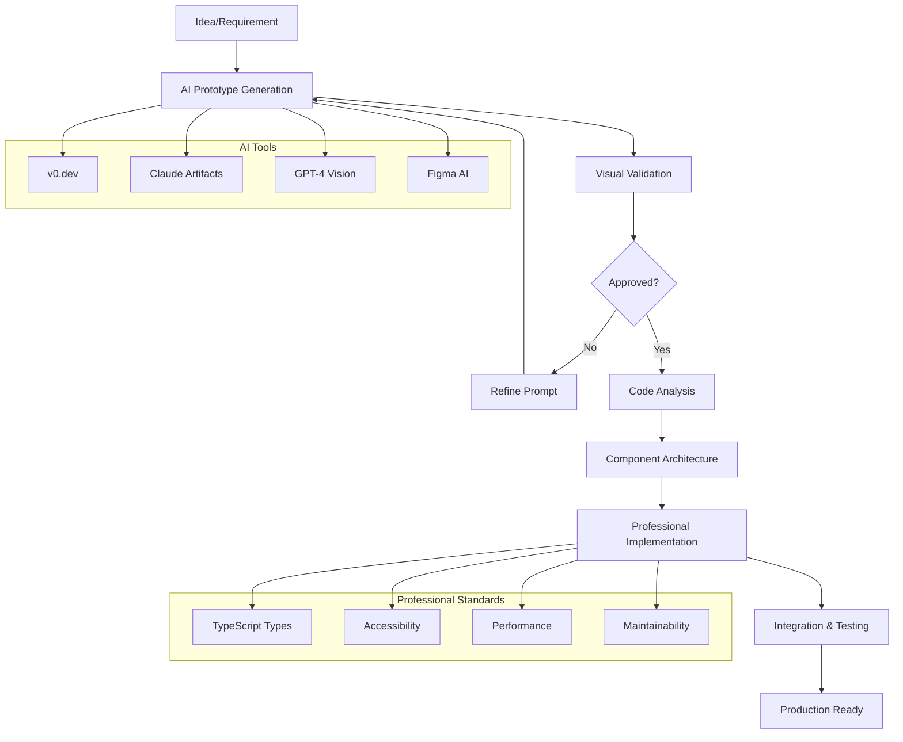

# 🎨 Módulo 07: Vibe Coding - Prototipado UI con IA

> **Duración**: 8-10 horas
> **Nivel**: Intermedio-Avanzado
> **Prerequisitos**: React fundamentals, CSS conocimientos básicos, familiaridad con herramientas IA

---

## 🎯 Objetivos de Aprendizaje

Al finalizar este módulo serás capaz de:

- ✅ **Crear prototipos UI rapidamente** usando herramientas IA como v0.dev, Claude Artifacts
- ✅ **Transformar designs generados** a componentes React profesionales
- ✅ **Establecer workflows eficientes** de design-to-code con IA
- ✅ **Implementar design systems** coherentes y escalables
- ✅ **Optimizar handoff** entre diseño y desarrollo
- ✅ **Mantener calidad de código** en desarrollo asistido por IA

---

## 🚀 ¿Qué es Vibe Coding?

**Vibe Coding** es una metodología de desarrollo frontend que combina:

1. **🎨 Prototipado Visual Rápido** con IA generativa
2. **🔧 Transformación Sistemática** a código profesional
3. **📋 Workflows Establecidos** para mantener calidad
4. **🎯 Iteración Ágil** basada en feedback visual



### Ventajas del Vibe Coding

| **Aspecto**        | **Tradicional** | **Vibe Coding** |
| ------------------ | --------------- | --------------- |
| **Prototipado**    | 2-4 días        | 30 minutos      |
| **Iteraciones**    | Costosas        | Instantáneas    |
| **Exploración**    | Limitada        | Ilimitada       |
| **Handoff**        | Complejo        | Fluido          |
| **Time-to-Market** | Semanas         | Días            |

---

## 🛠️ Herramientas del Ecosistema IA

### **v0.dev by Vercel**

La herramienta líder para generación de UI con IA:

```typescript
// Ejemplo de prompt para v0.dev
const v0Prompt = `
Create a modern dashboard for a task management app with:

LAYOUT:
- Sidebar navigation with icons (Dashboard, Projects, Tasks, Settings)
- Main content area with header containing search and user avatar
- 3-column layout for tasks: To Do, In Progress, Done

COMPONENTS:
- Task cards with priority indicators (High: red, Medium: yellow, Low: green)
- Progress bars for project completion
- Recent activity feed in the sidebar
- Quick add task button (floating action button)

STYLING:
- Use Tailwind CSS with shadcn/ui components
- Dark mode support
- Clean, minimal design with subtle shadows
- Responsive design for mobile and desktop

INTERACTIONS:
- Drag and drop between columns
- Hover effects on task cards
- Smooth transitions and animations
- Loading states for async operations

DATA STRUCTURE:
interface Task {
  id: string;
  title: string;
  description: string;
  priority: 'high' | 'medium' | 'low';
  status: 'todo' | 'in-progress' | 'done';
  assignee: string;
  dueDate: Date;
  projectId: string;
}

Generate complete React components with TypeScript.
`;
```

### **Claude Artifacts**

Excelente para componentes complejos e interactivos:

````markdown
# Claude Artifacts Prompt Pattern

## Component Request

Create a [COMPONENT_TYPE] that [MAIN_FUNCTIONALITY]

## Visual Requirements

- **Layout**: [describe layout structure]
- **Styling**: [color scheme, typography, spacing]
- **Responsive**: [breakpoints and behavior]
- **Interactions**: [hover states, animations, micro-interactions]

## Technical Requirements

- **Framework**: React 18+ with TypeScript
- **Styling**: Tailwind CSS + shadcn/ui
- **State Management**: [useState, useReducer, Zustand, etc.]
- **Accessibility**: WCAG 2.1 AA compliance
- **Performance**: Optimized renders, lazy loading

## Business Logic

- **Data Flow**: [how data moves through component]
- **Validation**: [form validation, error handling]
- **API Integration**: [if applicable]

## Example Usage

```tsx
<MyComponent prop1="value" prop2={data} onAction={handleAction} />
```
````

Generate the complete implementation with:

1. TypeScript interfaces
2. Component implementation
3. Custom hooks (if needed)
4. Unit tests
5. Storybook stories

````

### **GPT-4 Vision + Code**

Ideal para convertir designs existentes:

```typescript
// Pattern para GPT-4 Vision
const visionToCodePrompt = `
I'm attaching a UI design mockup. Please analyze it and generate:

1. **Component Structure**:
   - Break down into logical React components
   - Identify reusable elements
   - Define component hierarchy

2. **Styling Analysis**:
   - Extract color palette
   - Identify typography scales
   - Note spacing and layout patterns
   - Detect responsive behavior

3. **Implementation Plan**:
   - List required dependencies
   - Suggest state management approach
   - Identify complex interactions
   - Note accessibility considerations

4. **Generated Code**:
   - TypeScript React components
   - Tailwind CSS classes
   - Custom hooks if needed
   - prop interfaces and types

Please make the code production-ready with:
- Error boundaries
- Loading states
- Proper TypeScript types
- Accessibility attributes
- Performance optimizations

Design uploaded: [attach image]
`;
````

---

## 🏗️ Arquitectura de Componentes Profesionales

### **Component Architecture Pattern**

```typescript
// Professional component structure
// components/ui/TaskCard/index.ts
export { TaskCard } from "./TaskCard";
export { TaskCardSkeleton } from "./TaskCardSkeleton";
export type { TaskCardProps } from "./types";

// components/ui/TaskCard/types.ts
export interface Task {
  id: string;
  title: string;
  description?: string;
  priority: "high" | "medium" | "low";
  status: "todo" | "in-progress" | "done";
  assignee: {
    id: string;
    name: string;
    avatar?: string;
  };
  dueDate?: Date;
  tags: string[];
  projectId: string;
  createdAt: Date;
  updatedAt: Date;
}

export interface TaskCardProps {
  task: Task;
  onEdit: (task: Task) => void;
  onDelete: (taskId: string) => void;
  onStatusChange: (taskId: string, status: Task["status"]) => void;
  onPriorityChange: (taskId: string, priority: Task["priority"]) => void;
  isDragging?: boolean;
  isSelected?: boolean;
  compact?: boolean;
  showProject?: boolean;
  className?: string;
}

export interface TaskCardActions {
  edit: () => void;
  delete: () => void;
  duplicate: () => void;
  archive: () => void;
}

// components/ui/TaskCard/TaskCard.tsx
import React, { memo, useState, useCallback } from "react";
import { motion } from "framer-motion";
import {
  Calendar,
  User,
  MoreVertical,
  Clock,
  AlertTriangle,
  CheckCircle,
} from "lucide-react";

import { cn } from "@/lib/utils";
import { Badge } from "@/components/ui/badge";
import { Button } from "@/components/ui/button";
import {
  DropdownMenu,
  DropdownMenuContent,
  DropdownMenuItem,
  DropdownMenuTrigger,
  DropdownMenuSeparator,
} from "@/components/ui/dropdown-menu";
import { Avatar, AvatarFallback, AvatarImage } from "@/components/ui/avatar";

import { TaskCardProps, Task } from "./types";
import { getPriorityConfig, getStatusConfig, formatDueDate } from "./utils";

const TaskCard = memo<TaskCardProps>(
  ({
    task,
    onEdit,
    onDelete,
    onStatusChange,
    onPriorityChange,
    isDragging = false,
    isSelected = false,
    compact = false,
    showProject = false,
    className,
  }) => {
    const [isActionsOpen, setIsActionsOpen] = useState(false);

    const priorityConfig = getPriorityConfig(task.priority);
    const statusConfig = getStatusConfig(task.status);

    const handleEdit = useCallback(() => {
      onEdit(task);
      setIsActionsOpen(false);
    }, [task, onEdit]);

    const handleDelete = useCallback(() => {
      onDelete(task.id);
      setIsActionsOpen(false);
    }, [task.id, onDelete]);

    const handleStatusChange = useCallback(
      (newStatus: Task["status"]) => {
        onStatusChange(task.id, newStatus);
      },
      [task.id, onStatusChange]
    );

    const handlePriorityChange = useCallback(
      (newPriority: Task["priority"]) => {
        onPriorityChange(task.id, newPriority);
      },
      [task.id, onPriorityChange]
    );

    const isOverdue =
      task.dueDate && task.dueDate < new Date() && task.status !== "done";

    return (
      <motion.div
        layout
        initial={{ opacity: 0, y: 20 }}
        animate={{ opacity: 1, y: 0 }}
        exit={{ opacity: 0, y: -20 }}
        whileHover={{ y: -2 }}
        transition={{ duration: 0.2 }}
        className={cn(
          "group relative bg-white rounded-lg border border-gray-200 shadow-sm hover:shadow-md transition-all duration-200",
          "focus-within:ring-2 focus-within:ring-blue-500 focus-within:ring-opacity-50",
          {
            "scale-105 shadow-lg ring-2 ring-blue-500 ring-opacity-50":
              isDragging,
            "ring-2 ring-blue-600 ring-opacity-70": isSelected,
            "p-3": compact,
            "p-4": !compact,
            "opacity-50": task.status === "done",
          },
          className
        )}
        role="article"
        aria-labelledby={`task-title-${task.id}`}
        tabIndex={0}
      >
        {/* Priority Indicator */}
        <div
          className={cn(
            "absolute top-0 left-0 w-1 h-full rounded-l-lg",
            priorityConfig.color
          )}
          aria-label={`Priority: ${task.priority}`}
        />

        {/* Header */}
        <div className="flex items-start justify-between mb-2">
          <div className="flex items-center gap-2 flex-1 min-w-0">
            <statusConfig.icon
              className={cn("w-4 h-4 flex-shrink-0", statusConfig.color)}
              aria-hidden="true"
            />

            <h3
              id={`task-title-${task.id}`}
              className={cn("font-medium text-sm text-gray-900 truncate", {
                "line-through text-gray-500": task.status === "done",
              })}
              title={task.title}
            >
              {task.title}
            </h3>
          </div>

          <DropdownMenu open={isActionsOpen} onOpenChange={setIsActionsOpen}>
            <DropdownMenuTrigger asChild>
              <Button
                variant="ghost"
                size="sm"
                className="opacity-0 group-hover:opacity-100 focus:opacity-100 transition-opacity h-6 w-6 p-0"
                aria-label={`More actions for ${task.title}`}
              >
                <MoreVertical className="w-3 h-3" />
              </Button>
            </DropdownMenuTrigger>

            <DropdownMenuContent align="end" className="w-48">
              <DropdownMenuItem onClick={handleEdit}>
                Edit Task
              </DropdownMenuItem>

              <DropdownMenuSeparator />

              {/* Status Change Options */}
              {(["todo", "in-progress", "done"] as const).map(
                (status) =>
                  status !== task.status && (
                    <DropdownMenuItem
                      key={status}
                      onClick={() => handleStatusChange(status)}
                    >
                      Move to {getStatusConfig(status).label}
                    </DropdownMenuItem>
                  )
              )}

              <DropdownMenuSeparator />

              {/* Priority Change Options */}
              {(["high", "medium", "low"] as const).map(
                (priority) =>
                  priority !== task.priority && (
                    <DropdownMenuItem
                      key={priority}
                      onClick={() => handlePriorityChange(priority)}
                    >
                      Set {priority} priority
                    </DropdownMenuItem>
                  )
              )}

              <DropdownMenuSeparator />

              <DropdownMenuItem
                onClick={handleDelete}
                className="text-red-600 focus:text-red-600"
              >
                Delete Task
              </DropdownMenuItem>
            </DropdownMenuContent>
          </DropdownMenu>
        </div>

        {/* Description */}
        {task.description && !compact && (
          <p className="text-xs text-gray-600 mb-3 line-clamp-2">
            {task.description}
          </p>
        )}

        {/* Tags */}
        {task.tags.length > 0 && (
          <div className="flex flex-wrap gap-1 mb-3">
            {task.tags.slice(0, compact ? 2 : 3).map((tag) => (
              <Badge
                key={tag}
                variant="secondary"
                className="text-xs px-1.5 py-0.5"
              >
                {tag}
              </Badge>
            ))}
            {task.tags.length > (compact ? 2 : 3) && (
              <Badge variant="outline" className="text-xs px-1.5 py-0.5">
                +{task.tags.length - (compact ? 2 : 3)}
              </Badge>
            )}
          </div>
        )}

        {/* Footer */}
        <div className="flex items-center justify-between pt-2 border-t border-gray-100">
          {/* Assignee */}
          <div className="flex items-center gap-2">
            <Avatar className="w-5 h-5">
              <AvatarImage
                src={task.assignee.avatar}
                alt={task.assignee.name}
              />
              <AvatarFallback className="text-xs">
                {task.assignee.name.charAt(0).toUpperCase()}
              </AvatarFallback>
            </Avatar>

            {!compact && (
              <span className="text-xs text-gray-600 truncate max-w-20">
                {task.assignee.name}
              </span>
            )}
          </div>

          {/* Due Date */}
          {task.dueDate && (
            <div
              className={cn("flex items-center gap-1 text-xs", {
                "text-red-600": isOverdue,
                "text-gray-600": !isOverdue,
              })}
            >
              {isOverdue && <AlertTriangle className="w-3 h-3" />}
              <Calendar className="w-3 h-3" />
              <span>{formatDueDate(task.dueDate)}</span>
            </div>
          )}
        </div>

        {/* Overdue Badge */}
        {isOverdue && (
          <div className="absolute -top-1 -right-1">
            <Badge variant="destructive" className="text-xs px-1.5 py-0.5">
              Overdue
            </Badge>
          </div>
        )}
      </motion.div>
    );
  }
);

TaskCard.displayName = "TaskCard";

export { TaskCard };

// components/ui/TaskCard/utils.ts
import { AlertTriangle, Circle, Clock, CheckCircle2 } from "lucide-react";

export function getPriorityConfig(priority: "high" | "medium" | "low") {
  const configs = {
    high: {
      color: "bg-red-500",
      textColor: "text-red-600",
      bgColor: "bg-red-50",
      label: "High Priority",
    },
    medium: {
      color: "bg-yellow-500",
      textColor: "text-yellow-600",
      bgColor: "bg-yellow-50",
      label: "Medium Priority",
    },
    low: {
      color: "bg-green-500",
      textColor: "text-green-600",
      bgColor: "bg-green-50",
      label: "Low Priority",
    },
  };

  return configs[priority];
}

export function getStatusConfig(status: "todo" | "in-progress" | "done") {
  const configs = {
    todo: {
      icon: Circle,
      color: "text-gray-500",
      label: "To Do",
      bgColor: "bg-gray-50",
    },
    "in-progress": {
      icon: Clock,
      color: "text-blue-500",
      label: "In Progress",
      bgColor: "bg-blue-50",
    },
    done: {
      icon: CheckCircle2,
      color: "text-green-500",
      label: "Done",
      bgColor: "bg-green-50",
    },
  };

  return configs[status];
}

export function formatDueDate(date: Date): string {
  const now = new Date();
  const diffTime = date.getTime() - now.getTime();
  const diffDays = Math.ceil(diffTime / (1000 * 60 * 60 * 24));

  if (diffDays < 0) {
    return `${Math.abs(diffDays)}d overdue`;
  } else if (diffDays === 0) {
    return "Today";
  } else if (diffDays === 1) {
    return "Tomorrow";
  } else if (diffDays <= 7) {
    return `${diffDays}d left`;
  } else {
    return date.toLocaleDateString("en-US", {
      month: "short",
      day: "numeric",
    });
  }
}

// components/ui/TaskCard/TaskCard.stories.tsx
import type { Meta, StoryObj } from "@storybook/react";
import { TaskCard } from "./TaskCard";

const meta: Meta<typeof TaskCard> = {
  title: "UI/TaskCard",
  component: TaskCard,
  parameters: {
    layout: "padded",
  },
  tags: ["autodocs"],
};

export default meta;
type Story = StoryObj<typeof TaskCard>;

const mockTask = {
  id: "1",
  title: "Implement user authentication",
  description:
    "Add login/logout functionality with JWT tokens and remember me option.",
  priority: "high" as const,
  status: "in-progress" as const,
  assignee: {
    id: "user1",
    name: "John Doe",
    avatar:
      "https://images.unsplash.com/photo-1472099645785-5658abf4ff4e?w=32&h=32&fit=crop&crop=face",
  },
  dueDate: new Date(Date.now() + 3 * 24 * 60 * 60 * 1000), // 3 days from now
  tags: ["frontend", "security", "urgent"],
  projectId: "proj1",
  createdAt: new Date(),
  updatedAt: new Date(),
};

export const Default: Story = {
  args: {
    task: mockTask,
    onEdit: (task) => console.log("Edit task:", task),
    onDelete: (id) => console.log("Delete task:", id),
    onStatusChange: (id, status) => console.log("Status change:", id, status),
    onPriorityChange: (id, priority) =>
      console.log("Priority change:", id, priority),
  },
};

export const HighPriority: Story = {
  args: {
    ...Default.args,
    task: {
      ...mockTask,
      priority: "high",
      title: "Critical bug in payment system",
    },
  },
};

export const Overdue: Story = {
  args: {
    ...Default.args,
    task: {
      ...mockTask,
      dueDate: new Date(Date.now() - 2 * 24 * 60 * 60 * 1000), // 2 days ago
      status: "todo",
      title: "Overdue task example",
    },
  },
};

export const Completed: Story = {
  args: {
    ...Default.args,
    task: {
      ...mockTask,
      status: "done",
      title: "Completed task example",
    },
  },
};

export const Compact: Story = {
  args: {
    ...Default.args,
    compact: true,
  },
};

// components/ui/TaskCard/TaskCard.test.tsx
import { render, screen, fireEvent, waitFor } from "@testing-library/react";
import userEvent from "@testing-library/user-event";
import { TaskCard } from "./TaskCard";

const mockTask = {
  id: "1",
  title: "Test task",
  description: "Test description",
  priority: "medium" as const,
  status: "todo" as const,
  assignee: {
    id: "user1",
    name: "John Doe",
    avatar: undefined,
  },
  dueDate: new Date(Date.now() + 24 * 60 * 60 * 1000),
  tags: ["test", "ui"],
  projectId: "proj1",
  createdAt: new Date(),
  updatedAt: new Date(),
};

const defaultProps = {
  task: mockTask,
  onEdit: jest.fn(),
  onDelete: jest.fn(),
  onStatusChange: jest.fn(),
  onPriorityChange: jest.fn(),
};

describe("TaskCard", () => {
  beforeEach(() => {
    jest.clearAllMocks();
  });

  it("renders task information correctly", () => {
    render(<TaskCard {...defaultProps} />);

    expect(screen.getByText("Test task")).toBeInTheDocument();
    expect(screen.getByText("Test description")).toBeInTheDocument();
    expect(screen.getByText("John Doe")).toBeInTheDocument();
    expect(screen.getByText("test")).toBeInTheDocument();
    expect(screen.getByText("ui")).toBeInTheDocument();
  });

  it("calls onEdit when edit is clicked", async () => {
    const user = userEvent.setup();
    render(<TaskCard {...defaultProps} />);

    // Open dropdown menu
    const moreButton = screen.getByLabelText(/more actions/i);
    await user.click(moreButton);

    // Click edit
    const editButton = screen.getByText("Edit Task");
    await user.click(editButton);

    expect(defaultProps.onEdit).toHaveBeenCalledWith(mockTask);
  });

  it("calls onDelete when delete is clicked", async () => {
    const user = userEvent.setup();
    render(<TaskCard {...defaultProps} />);

    // Open dropdown menu
    const moreButton = screen.getByLabelText(/more actions/i);
    await user.click(moreButton);

    // Click delete
    const deleteButton = screen.getByText("Delete Task");
    await user.click(deleteButton);

    expect(defaultProps.onDelete).toHaveBeenCalledWith("1");
  });

  it("shows overdue badge for overdue tasks", () => {
    const overdueTask = {
      ...mockTask,
      dueDate: new Date(Date.now() - 24 * 60 * 60 * 1000), // yesterday
    };

    render(<TaskCard {...defaultProps} task={overdueTask} />);

    expect(screen.getByText("Overdue")).toBeInTheDocument();
  });

  it("applies correct styling for completed tasks", () => {
    const completedTask = {
      ...mockTask,
      status: "done" as const,
    };

    render(<TaskCard {...defaultProps} task={completedTask} />);

    const title = screen.getByText("Test task");
    expect(title).toHaveClass("line-through", "text-gray-500");
  });

  it("renders in compact mode", () => {
    render(<TaskCard {...defaultProps} compact />);

    // Description should not be visible in compact mode
    expect(screen.queryByText("Test description")).not.toBeInTheDocument();

    // Should show limited tags
    expect(screen.getByText("test")).toBeInTheDocument();
    expect(screen.getByText("ui")).toBeInTheDocument();
  });

  it("handles keyboard navigation", () => {
    render(<TaskCard {...defaultProps} />);

    const card = screen.getByRole("article");
    expect(card).toHaveAttribute("tabIndex", "0");

    card.focus();
    expect(card).toHaveFocus();
  });

  it("has proper accessibility attributes", () => {
    render(<TaskCard {...defaultProps} />);

    const card = screen.getByRole("article");
    expect(card).toHaveAttribute("aria-labelledby", "task-title-1");

    const title = screen.getByText("Test task");
    expect(title).toHaveAttribute("id", "task-title-1");

    const moreButton = screen.getByLabelText(/more actions for test task/i);
    expect(moreButton).toBeInTheDocument();
  });
});
```

---

## 🎯 Metodología de Transformación IA → Código

### **Phase 1: AI Generation & Validation**

```typescript
// Step 1: Generate initial prototype
interface GenerationRequest {
  type: 'component' | 'page' | 'feature';
  description: string;
  requirements: {
    functionality: string[];
    styling: string[];
    interactions: string[];
    data: any;
  };
  constraints: {
    framework: 'react' | 'vue' | 'svelte';
    styling: 'tailwind' | 'styled-components' | 'css-modules';
    typescript: boolean;
    accessibility: boolean;
  };
}

// Step 2: Quality validation checklist
interface QualityChecklist {
  functionality: {
    ✅: 'All requirements implemented',
    ✅: 'Edge cases handled',
    ✅: 'Error states included',
    ✅: 'Loading states present'
  };
  code_quality: {
    ✅: 'TypeScript types defined',
    ✅: 'Props interfaces documented',
    ✅: 'Performance optimized',
    ✅: 'Clean component structure'
  };
  accessibility: {
    ✅: 'ARIA attributes present',
    ✅: 'Keyboard navigation works',
    ✅: 'Screen reader friendly',
    ✅: 'Color contrast sufficient'
  };
  styling: {
    ✅: 'Responsive design',
    ✅: 'Consistent design system',
    ✅: 'Hover/focus states',
    ✅: 'Animation performance'
  };
}
```

### **Phase 2: Professional Enhancement**

```typescript
// Enhancement pipeline
class ComponentEnhancer {
  async enhance(aiGeneratedCode: string): Promise<EnhancedComponent> {
    const steps = [
      this.addTypeScript,
      this.improveAccessibility,
      this.optimizePerformance,
      this.addTesting,
      this.addDocumentation,
      this.addErrorHandling,
    ];

    let code = aiGeneratedCode;

    for (const step of steps) {
      code = await step(code);
    }

    return {
      component: code,
      types: this.extractTypes(code),
      tests: this.generateTests(code),
      stories: this.generateStories(code),
      docs: this.generateDocs(code),
    };
  }

  private async addTypeScript(code: string): Promise<string> {
    // Convert to TypeScript with proper types
    return this.llm.enhance(`
      Convert this React component to TypeScript:
      - Add proper interface definitions
      - Type all props and state
      - Add generic types where appropriate
      - Ensure type safety throughout

      Original code:
      ${code}

      Return only the enhanced TypeScript code.
    `);
  }

  private async improveAccessibility(code: string): Promise<string> {
    return this.llm.enhance(`
      Enhance this React component for accessibility:
      - Add ARIA attributes where needed
      - Ensure keyboard navigation works
      - Add screen reader support
      - Improve focus management
      - Add proper semantic HTML

      Component:
      ${code}

      Return the accessibility-enhanced code.
    `);
  }

  private async optimizePerformance(code: string): Promise<string> {
    return this.llm.enhance(`
      Optimize this React component for performance:
      - Add React.memo where appropriate
      - Use useCallback for event handlers
      - Implement useMemo for expensive calculations
      - Add lazy loading if applicable
      - Optimize re-renders

      Component:
      ${code}

      Return the performance-optimized code.
    `);
  }

  private async addErrorHandling(code: string): Promise<string> {
    return this.llm.enhance(`
      Add comprehensive error handling to this React component:
      - Add Error Boundaries
      - Handle async operation failures
      - Add fallback UI for error states
      - Implement retry mechanisms
      - Add proper error logging

      Component:
      ${code}

      Return code with robust error handling.
    `);
  }
}
```

### **Phase 3: Integration & Testing**

```typescript
// Integration workflow
class IntegrationWorkflow {
  async integrateComponent(
    enhancedComponent: EnhancedComponent,
    project: ProjectContext
  ): Promise<IntegrationResult> {
    // 1. Analyze existing codebase
    const codebaseAnalysis = await this.analyzeCodebase(project);

    // 2. Check for conflicts
    const conflicts = await this.detectConflicts(
      enhancedComponent,
      codebaseAnalysis
    );

    if (conflicts.length > 0) {
      await this.resolveConflicts(conflicts);
    }

    // 3. Update design system
    await this.updateDesignSystem(enhancedComponent, project);

    // 4. Generate integration tests
    const integrationTests = await this.generateIntegrationTests(
      enhancedComponent,
      project
    );

    // 5. Update documentation
    await this.updateDocumentation(enhancedComponent, project);

    return {
      success: true,
      component: enhancedComponent,
      tests: integrationTests,
      documentation: this.generatedDocs,
      conflicts: conflicts.length,
    };
  }

  private async analyzeCodebase(project: ProjectContext) {
    return {
      designSystem: await this.extractDesignSystem(project),
      componentPatterns: await this.extractPatterns(project),
      namingConventions: await this.extractNaming(project),
      testingStrategy: await this.extractTestStrategy(project),
    };
  }
}
```

---

## 🎨 Design System Integration

### **Automated Design Token Extraction**

```typescript
// Design token extraction from AI-generated components
class DesignTokenExtractor {
  async extractTokens(components: string[]): Promise<DesignTokens> {
    const prompt = `
      Analyze these React components and extract consistent design tokens:

      COMPONENTS:
      ${components.join("\n\n---\n\n")}

      Extract and standardize:
      1. **Colors**: Primary, secondary, accent, semantic colors
      2. **Typography**: Font families, sizes, weights, line heights
      3. **Spacing**: Margin, padding patterns (4px, 8px, 16px, etc.)
      4. **Shadows**: Box shadow variations
      5. **Border Radius**: Corner radius patterns
      6. **Breakpoints**: Responsive breakpoint usage
      7. **Animations**: Duration, easing, transforms

      Output as design tokens in this format:

      \`\`\`typescript
      export const designTokens = {
        colors: {
          primary: {
            50: '#...',
            100: '#...',
            // ... full scale
            900: '#...'
          },
          // ... other colors
        },
        spacing: {
          px: '1px',
          0.5: '2px',
          1: '4px',
          // ... spacing scale
        },
        typography: {
          // ... font definitions
        }
      };
      \`\`\`

      Also provide Tailwind CSS config integration.
    `;

    const result = await this.llm.complete(prompt);
    return this.parseDesignTokens(result);
  }

  async generateTailwindConfig(tokens: DesignTokens): Promise<string> {
    return `
// tailwind.config.js
module.exports = {
  content: ['./src/**/*.{js,ts,jsx,tsx}'],
  theme: {
    extend: {
      colors: ${JSON.stringify(tokens.colors, null, 2)},
      spacing: ${JSON.stringify(tokens.spacing, null, 2)},
      fontFamily: ${JSON.stringify(tokens.typography.families, null, 2)},
      fontSize: ${JSON.stringify(tokens.typography.sizes, null, 2)},
      boxShadow: ${JSON.stringify(tokens.shadows, null, 2)},
      borderRadius: ${JSON.stringify(tokens.radii, null, 2)},
      screens: ${JSON.stringify(tokens.breakpoints, null, 2)},
      animation: ${JSON.stringify(tokens.animations, null, 2)},
    },
  },
  plugins: [
    require('@tailwindcss/forms'),
    require('@tailwindcss/typography'),
    require('@tailwindcss/aspect-ratio'),
  ],
};
    `;
  }
}

// Usage example
const extractor = new DesignTokenExtractor();
const tokens = await extractor.extractTokens([
  taskCardComponent,
  dashboardComponent,
  modalComponent,
]);

const tailwindConfig = await extractor.generateTailwindConfig(tokens);
```

### **Component Library Generation**

```typescript
// Automated component library creation
class ComponentLibraryGenerator {
  async generateLibrary(
    components: EnhancedComponent[],
    tokens: DesignTokens
  ): Promise<ComponentLibrary> {
    const library = {
      components: new Map(),
      documentation: "",
      storybook: "",
      tests: "",
    };

    for (const component of components) {
      // Generate variations
      const variations = await this.generateVariations(component);

      // Create compound components
      const compounds = await this.createCompoundComponents(
        component,
        variations
      );

      // Add to library
      library.components.set(component.name, {
        base: component,
        variations,
        compounds,
        props: await this.extractProps(component),
        examples: await this.generateExamples(component),
      });
    }

    // Generate index files
    library.exports = await this.generateExports(library.components);

    // Generate documentation
    library.documentation = await this.generateLibraryDocs(library);

    return library;
  }

  private async generateVariations(component: EnhancedComponent) {
    const variations = ["size", "variant", "state", "theme"];
    const results = new Map();

    for (const variation of variations) {
      const prompt = `
        Create ${variation} variations for this component:
        ${component.code}

        Generate:
        - Small, medium, large sizes (if size variation)
        - Primary, secondary, outline variants (if variant variation)
        - Default, hover, active, disabled states (if state variation)
        - Light, dark theme versions (if theme variation)

        Keep the same API but add the ${variation} prop.
        Return complete component code.
      `;

      const result = await this.llm.complete(prompt);
      results.set(variation, result);
    }

    return results;
  }
}
```

---

## ⚡ Performance Optimization

### **AI-Assisted Performance Analysis**

```typescript
// Performance optimization prompts
const performanceOptimizer = {
  analyzeComponent: `
    Analyze this React component for performance issues:

    COMPONENT CODE:
    {code}

    PERFORMANCE CHECKLIST:
    1. **Unnecessary Re-renders**:
       - Check for inline object/function creation
       - Missing useCallback/useMemo
       - Props drilling causing cascade re-renders

    2. **Bundle Size Impact**:
       - Large dependency imports
       - Unused code
       - Tree shaking opportunities

    3. **Runtime Performance**:
       - Expensive calculations in render
       - DOM manipulation inefficiencies
       - Memory leaks potential

    4. **Loading Performance**:
       - Code splitting opportunities
       - Lazy loading potential
       - Preloading strategies

    Provide:
    - Performance issues found
    - Impact assessment (High/Medium/Low)
    - Specific fix recommendations with code examples
    - Before/after performance metrics estimate
  `,

  optimizeCode: `
    Optimize this React component for maximum performance:

    ORIGINAL CODE:
    {code}

    OPTIMIZATION REQUIREMENTS:
    1. **Minimize Re-renders**: Add React.memo, useCallback, useMemo where beneficial
    2. **Code Splitting**: Implement lazy loading for heavy components
    3. **Bundle Optimization**: Use dynamic imports, tree shaking
    4. **Memory Management**: Prevent memory leaks, optimize event listeners
    5. **DOM Optimization**: Minimize DOM operations, optimize animations

    CONSTRAINTS:
    - Maintain exact same API and functionality
    - Keep code readable and maintainable
    - Add performance comments explaining optimizations
    - Include performance monitoring hooks

    Return optimized component with performance improvements documented.
  `,

  generatePerfTests: `
    Generate performance tests for this optimized component:

    COMPONENT:
    {optimizedCode}

    Create tests that verify:
    1. **Render Performance**: Component renders within acceptable time
    2. **Re-render Optimization**: Unnecessary re-renders are prevented
    3. **Memory Usage**: No memory leaks during mount/unmount cycles
    4. **Bundle Size**: Component doesn't exceed size budget
    5. **Runtime Metrics**: CPU usage, animation frame rates

    Use React Testing Library + performance measurement APIs.
    Include benchmarks and regression tests.
  `,
};

// Implementation example
class PerformanceOptimizer {
  async optimizeComponent(code: string): Promise<OptimizationResult> {
    // Step 1: Analyze current performance
    const analysis = await this.llm.complete(
      performanceOptimizer.analyzeComponent.replace("{code}", code)
    );

    const issues = this.parsePerformanceIssues(analysis);

    if (issues.length === 0) {
      return { optimized: false, reason: "No performance issues found" };
    }

    // Step 2: Apply optimizations
    const optimizedCode = await this.llm.complete(
      performanceOptimizer.optimizeCode.replace("{code}", code)
    );

    // Step 3: Generate performance tests
    const perfTests = await this.llm.complete(
      performanceOptimizer.generatePerfTests.replace(
        "{optimizedCode}",
        optimizedCode
      )
    );

    // Step 4: Validate optimizations
    const validation = await this.validateOptimizations(code, optimizedCode);

    return {
      optimized: true,
      originalCode: code,
      optimizedCode,
      performanceTests: perfTests,
      issues: issues,
      improvements: validation.improvements,
      regressionRisk: validation.riskAssessment,
    };
  }

  private async validateOptimizations(
    original: string,
    optimized: string
  ): Promise<ValidationResult> {
    // Use AST analysis to compare code changes
    const originalAST = this.parseAST(original);
    const optimizedAST = this.parseAST(optimized);

    const changes = this.diffAST(originalAST, optimizedAST);

    return {
      improvements: this.estimatePerformanceGains(changes),
      riskAssessment: this.assessRegressionRisk(changes),
      apiChanges: this.detectAPIChanges(changes),
    };
  }
}
```

---

## 🔄 Workflow Templates

### **Complete Vibe Coding Workflow**

```typescript
// End-to-end workflow automation
class VibeCodingWorkflow {
  async executeFullWorkflow(
    requirement: ProjectRequirement
  ): Promise<DeliveryPackage> {
    console.log("🚀 Starting Vibe Coding Workflow...");

    // Phase 1: AI Generation
    const prototypeResult = await this.generatePrototype(requirement);
    console.log("✅ Prototype generated");

    // Phase 2: Quality Validation
    const validationResult = await this.validatePrototype(prototypeResult);

    if (!validationResult.isValid) {
      console.log("⚠️ Prototype failed validation, regenerating...");
      return this.executeFullWorkflow({
        ...requirement,
        refinements: validationResult.issues,
      });
    }
    console.log("✅ Prototype validated");

    // Phase 3: Professional Enhancement
    const enhancedComponents = await this.enhanceComponents(
      prototypeResult.components
    );
    console.log("✅ Components enhanced");

    // Phase 4: Design System Integration
    const designSystemResult = await this.integrateDesignSystem(
      enhancedComponents,
      requirement.project
    );
    console.log("✅ Design system integrated");

    // Phase 5: Performance Optimization
    const optimizedComponents = await this.optimizePerformance(
      designSystemResult.components
    );
    console.log("✅ Performance optimized");

    // Phase 6: Testing & Documentation
    const testSuite = await this.generateTestSuite(optimizedComponents);
    const documentation = await this.generateDocumentation(
      optimizedComponents,
      designSystemResult
    );
    console.log("✅ Tests and docs generated");

    // Phase 7: Integration Package
    const integrationPackage = await this.createIntegrationPackage({
      components: optimizedComponents,
      designSystem: designSystemResult,
      tests: testSuite,
      documentation,
    });
    console.log("✅ Integration package created");

    return {
      deliveryPackage: integrationPackage,
      metrics: this.calculateMetrics(requirement, integrationPackage),
      qualityScore: this.assessQualityScore(integrationPackage),
      readyForProduction: true,
    };
  }

  private async generatePrototype(
    requirement: ProjectRequirement
  ): Promise<PrototypeResult> {
    const aiPrompt = this.buildComprehensivePrompt(requirement);

    // Try multiple AI services for best results
    const results = await Promise.allSettled([
      this.v0Service.generate(aiPrompt),
      this.claudeService.generateArtifact(aiPrompt),
      this.gptService.generateComponent(aiPrompt),
    ]);

    const successfulResults = results
      .filter(
        (result): result is PromiseFulfilledResult<any> =>
          result.status === "fulfilled"
      )
      .map((result) => result.value);

    // Select best result based on quality score
    const bestResult = await this.selectBestResult(successfulResults);

    return bestResult;
  }

  private buildComprehensivePrompt(requirement: ProjectRequirement): string {
    return `
# ${requirement.title}

## Context
${requirement.description}

## Requirements
### Functional Requirements
${requirement.functional.map((req) => `- ${req}`).join("\n")}

### Visual Requirements
${requirement.visual.map((req) => `- ${req}`).join("\n")}

### Technical Requirements
- Framework: ${requirement.tech.framework}
- Styling: ${requirement.tech.styling}
- State Management: ${requirement.tech.state}
- TypeScript: ${requirement.tech.typescript ? "Required" : "Optional"}
- Testing: ${requirement.tech.testing}

## Design System
${
  requirement.designSystem
    ? `
- Colors: ${JSON.stringify(requirement.designSystem.colors)}
- Typography: ${JSON.stringify(requirement.designSystem.typography)}
- Spacing: ${JSON.stringify(requirement.designSystem.spacing)}
`
    : "Create new design system"
}

## Data Schema
\`\`\`typescript
${requirement.dataSchema}
\`\`\`

## Success Criteria
${requirement.successCriteria.map((criteria) => `- ${criteria}`).join("\n")}

## Constraints
${requirement.constraints.map((constraint) => `- ${constraint}`).join("\n")}

Generate complete, production-ready React components with:
1. Full TypeScript implementation
2. Comprehensive prop interfaces
3. Accessibility features (WCAG 2.1 AA)
4. Responsive design
5. Error handling and loading states
6. Performance optimizations
7. Clean, maintainable code structure

Include multiple component variations and usage examples.
    `;
  }
}
```

### **CI/CD Integration**

```yaml
# .github/workflows/vibe-coding-validation.yml
name: Vibe Coding Validation

on:
  pull_request:
    paths:
      - "src/components/**"
      - "src/ui/**"

jobs:
  validate-ai-generated-components:
    runs-on: ubuntu-latest

    steps:
      - uses: actions/checkout@v4

      - name: Setup Node.js
        uses: actions/setup-node@v4
        with:
          node-version: "18"
          cache: "npm"

      - name: Install dependencies
        run: npm ci

      - name: Run component validation
        env:
          OPENAI_API_KEY: ${{ secrets.OPENAI_API_KEY }}
        run: |
          npm run validate:components

      - name: Performance benchmarks
        run: |
          npm run test:performance
          npm run lighthouse:components

      - name: Accessibility audit
        run: |
          npm run test:a11y

      - name: Bundle size analysis
        run: |
          npm run analyze:bundle
          npm run check:size-budget

      - name: Visual regression testing
        env:
          PERCY_TOKEN: ${{ secrets.PERCY_TOKEN }}
        run: |
          npm run test:visual

      - name: Generate quality report
        run: |
          npm run report:quality

      - name: Comment PR with results
        uses: actions/github-script@v7
        with:
          script: |
            const fs = require('fs');
            const report = fs.readFileSync('quality-report.md', 'utf8');

            github.rest.issues.createComment({
              issue_number: context.issue.number,
              owner: context.repo.owner,
              repo: context.repo.repo,
              body: report
            });
```

---

## 📚 Recursos y Herramientas

### **Essential Tools Stack**

```json
{
  "ai-generation": {
    "v0.dev": "https://v0.dev - Vercel's AI UI generator",
    "claude-artifacts": "Claude 3.5 with Artifacts feature",
    "gpt-4-vision": "OpenAI GPT-4 with vision capabilities",
    "figma-ai": "Figma AI for design-to-code"
  },
  "enhancement-tools": {
    "@typescript-eslint/parser": "^6.0.0",
    "prettier": "^3.0.0",
    "@storybook/react": "^7.0.0",
    "jest": "^29.0.0",
    "@testing-library/react": "^13.0.0",
    "playwright": "^1.40.0"
  },
  "performance-tools": {
    "@webpack-bundle-analyzer": "^4.9.0",
    "lighthouse": "^11.0.0",
    "@percy/cli": "^1.28.0",
    "react-devtools-profiler": "^4.28.0"
  },
  "design-system": {
    "@radix-ui/react-primitives": "^1.0.0",
    "tailwindcss": "^3.3.0",
    "@tailwindcss/forms": "^0.5.0",
    "class-variance-authority": "^0.7.0",
    "tailwind-merge": "^1.14.0"
  }
}
```

### **Prompt Libraries**

```typescript
// Professional prompt templates
export const vibeCodingPrompts = {
  dashboardGeneration: `
    Create a modern dashboard component for {domain} with:

    LAYOUT STRUCTURE:
    - Header with navigation, search, and user menu
    - Sidebar with collapsible navigation
    - Main content area with {sections}
    - Footer with {footer_content}

    KEY FEATURES:
    {features.map(f => `- ${f}`).join('\n')}

    DATA VISUALIZATION:
    {charts.map(chart => `- ${chart.type}: ${chart.description}`).join('\n')}

    INTERACTIONS:
    - Responsive design (mobile-first)
    - Dark/light mode toggle
    - Real-time data updates
    - Smooth animations and transitions
    - Keyboard navigation support

    TECHNICAL SPECS:
    - React 18+ with TypeScript
    - Tailwind CSS + shadcn/ui
    - React Query for data fetching
    - Framer Motion for animations
    - React Hook Form for forms

    Generate production-ready components with proper error handling and loading states.
  `,

  formGeneration: `
    Design a comprehensive form component for {form_purpose}:

    FORM STRUCTURE:
    {fields.map(field => `
    - ${field.name} (${field.type}):
      - Label: ${field.label}
      - Validation: ${field.validation.join(', ')}
      - Help text: ${field.help}
    `).join('\n')}

    FEATURES:
    - Multi-step form with progress indicator
    - Real-time validation with helpful error messages
    - Auto-save draft functionality
    - Conditional field visibility
    - File upload with drag & drop
    - Rich text editor integration

    UX REQUIREMENTS:
    - Accessible (WCAG 2.1 AA)
    - Mobile-optimized touch targets
    - Clear visual hierarchy
    - Intuitive error states
    - Success confirmation

    TECHNICAL:
    - React Hook Form + Zod validation
    - TypeScript interfaces for all form data
    - Optimistic updates
    - Error boundary wrapping
    - Performance optimizations
  `,

  dataTableGeneration: `
    Build a feature-rich data table for {data_type} management:

    DATA SCHEMA:
    \`\`\`typescript
    {dataSchema}
    \`\`\`

    TABLE FEATURES:
    - Sortable columns with multi-sort
    - Advanced filtering and search
    - Pagination with configurable page sizes
    - Row selection (single/multiple)
    - Bulk actions toolbar
    - Column visibility toggle
    - Export to CSV/Excel/PDF
    - Responsive design with horizontal scroll

    INTERACTIONS:
    - Inline editing for specific fields
    - Context menu for row actions
    - Keyboard navigation (arrow keys, enter, escape)
    - Drag & drop column reordering
    - Resizable columns

    PERFORMANCE:
    - Virtual scrolling for large datasets
    - Debounced search and filters
    - Memoized row components
    - Lazy loading with infinite scroll option

    Generate with proper TypeScript types and comprehensive accessibility.
  `
};
```

---

## 🏆 Métricas de Éxito

### **Quality Assessment Framework**

```typescript
interface QualityMetrics {
  generation: {
    time_to_prototype: number; // minutes
    iterations_required: number;
    ai_accuracy_score: number; // 0-100
  };
  code_quality: {
    typescript_coverage: number; // percentage
    accessibility_score: number; // lighthouse score
    performance_score: number; // lighthouse score
    maintainability_index: number; // 0-100
  };
  business_value: {
    time_saved_vs_manual: number; // hours
    development_cost_reduction: number; // percentage
    time_to_market_improvement: number; // days
    developer_satisfaction: number; // 1-10
  };
  production_readiness: {
    test_coverage: number; // percentage
    documentation_completeness: number; // percentage
    design_system_compliance: number; // percentage
    performance_budget_compliance: boolean;
  };
}

// Quality assessment automation
class QualityAssessment {
  async assessComponent(
    component: EnhancedComponent,
    context: ProjectContext
  ): Promise<QualityMetrics> {
    const metrics: QualityMetrics = {
      generation: await this.assessGeneration(component),
      code_quality: await this.assessCodeQuality(component),
      business_value: await this.assessBusinessValue(component, context),
      production_readiness: await this.assessProductionReadiness(component),
    };

    const overallScore = this.calculateOverallScore(metrics);

    return {
      ...metrics,
      overall_score: overallScore,
      recommendation: this.getRecommendation(overallScore),
      areas_for_improvement: this.identifyImprovements(metrics),
    };
  }

  private calculateOverallScore(metrics: QualityMetrics): number {
    const weights = {
      generation: 0.2,
      code_quality: 0.4,
      business_value: 0.25,
      production_readiness: 0.15,
    };

    return (
      metrics.generation.ai_accuracy_score * weights.generation +
      this.normalizeCodeQuality(metrics.code_quality) * weights.code_quality +
      this.normalizeBusinessValue(metrics.business_value) *
        weights.business_value +
      this.normalizeProductionReadiness(metrics.production_readiness) *
        weights.production_readiness
    );
  }
}
```

---

El **Vibe Coding** representa el futuro del desarrollo frontend: la perfecta simbiosis entre creatividad humana e inteligencia artificial para crear interfaces excepcionales en tiempo récord.

Dominar esta metodología te convertirá en un developer capaz de iterar, experimentar y entregar a velocidades nunca antes posibles, manteniendo siempre los más altos estándares de calidad profesional. 🚀
