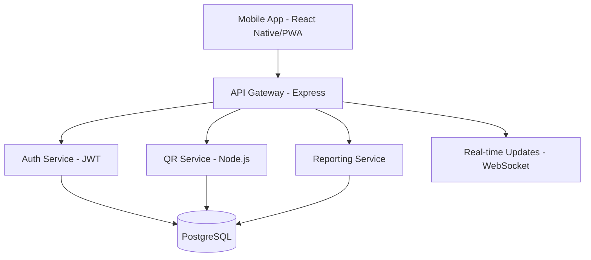

# Onboarding Técnico Indaptados 🚀

¡Bienvenido al programa de onboarding más completo para desarrolladores que quieren construir productos que realmente importen!

## 🎯 ¿Qué aprenderás en 2 semanas?

Este programa intensivo te dará las herramientas, metodologías y mindset para ser un **developer full-stack orientado a producto**:

### Semana 1: Fundamentos y Metodología

- **🎨 Ágil & UX**: Pensar en el usuario, validar hipótesis, crear valor
- **⚡ Scrum**: Organización, entrega continua, trabajo en equipo efectivo
- **🔒 Secure SDLC**: Seguridad desde el diseño, OWASP, threat modeling
- **⚛️ Next.js & React**: Frontend moderno, server components, performance

### Semana 2: Desarrollo y Especialización

- **🔧 Node.js & Express**: Backend robusto, APIs RESTful, arquitectura escalable
- **🤖 Prompt Engineering**: IA aplicada al desarrollo, automatización inteligente
- **✨ Vibe Coding**: Prototipado rápido, co-creación con IA
- **🎭 Integración**: Proyecto final combinando todos los conocimientos

## 🛠️ Stack Tecnológico

Durante el programa trabajarás con tecnologías modernas y demandadas:

### Frontend

- **React 18** con Server Components
- **Next.js 14** con App Router
- **TypeScript** para type safety
- **Tailwind CSS** para styling eficiente

### Backend

- **Node.js** con Express
- **PostgreSQL** para persistencia
- **JWT** para autenticación
- **Docker** para containerización

### Herramientas

- **Git & GitHub** para control de versiones
- **VS Code** como editor principal
- **Postman** para testing de APIs
- **Figma** para prototipado y diseño

## 📈 Metodología de Aprendizaje

### Aprender Haciendo

- **Teoría mínima**: Conceptos esenciales sin overwhelm
- **Práctica máxima**: 70% del tiempo construyendo
- **Proyectos reales**: Casos de uso del mundo real
- **Feedback inmediato**: Code reviews y demos diarias

### Estructura Diaria

```
09:00 - 09:15  Daily Standup
09:15 - 11:00  Contenido teórico + ejemplos
11:00 - 12:30  Reto práctico (hands-on)
12:30 - 13:30  Almuerzo
13:30 - 16:30  Implementación y desarrollo
16:30 - 17:00  Code review y feedback
17:00 - 17:30  Demo y retrospectiva
```

## 🎯 Proyecto Central: Sistema de Asistencias QR

A lo largo del programa desarrollarás un **sistema completo de asistencias por QR** que incluye:

### Funcionalidades Core

- 👨‍🏫 **Dashboard para profesores**: Generar QR únicos por sesión
- 📱 **App móvil para estudiantes**: Escanear QR y registrar asistencia
- 📊 **Panel administrativo**: Reportes, analytics, gestión de usuarios
- 🔐 **Sistema de autenticación**: Login seguro, roles y permisos

### Arquitectura del Sistema



### Stack del Proyecto

- **Frontend**: Next.js + React + TypeScript
- **Backend**: Node.js + Express + TypeScript
- **Database**: PostgreSQL con migrations
- **Authentication**: JWT + refresh tokens
- **Real-time**: WebSockets para updates en vivo
- **Testing**: Jest + Supertest
- **Deployment**: Docker + Railway/Vercel

## 💡 Competencias que Desarrollarás

### Technical Skills

- ✅ **Full-stack development** con tecnologías modernas
- ✅ **API design** RESTful y GraphQL
- ✅ **Database modeling** y optimización
- ✅ **Authentication & authorization** robusta
- ✅ **Testing strategies** (unit, integration, e2e)
- ✅ **Performance optimization** frontend y backend
- ✅ **Security best practices** (OWASP Top 10)
- ✅ **DevOps basics** (CI/CD, containerization)

### Product Skills

- ✅ **User-centered thinking** con Jobs-to-be-Done
- ✅ **Agile methodologies** (Scrum, Kanban)
- ✅ **Product discovery** (user research, validation)
- ✅ **Metrics-driven development** (KPIs, A/B testing)
- ✅ **Stakeholder communication** técnica y no-técnica

### AI-Enhanced Development

- ✅ **Prompt engineering** para desarrollo
- ✅ **Code generation** asistida por IA
- ✅ **Documentation automation** con LLMs
- ✅ **Test case generation** inteligente
- ✅ **Code review** augmentado con IA

## 🎓 Certificaciones y Reconocimientos

Al completar exitosamente el programa recibirás:

- 🏆 **Certificado de Completación** de Indaptados
- 📊 **Portfolio de proyectos** documentado en GitHub
- 📝 **Recomendaciones** de mentors y compañeros
- 🌟 **Badge de LinkedIn** verificado
- 📚 **Plan de desarrollo** personalizado post-onboarding

## 🤝 Apoyo y Mentoría

### Tu Equipo de Soporte

- **🧑‍💼 Product Owner**: Define requirements y prioridades
- **👨‍💻 Tech Lead**: Mentoring técnico y code reviews
- **🎯 Scrum Master**: Facilitación de procesos ágiles
- **👥 Compañeros**: Peer learning y pair programming

### Canales de Comunicación

- **Slack workspace** para comunicación diaria
- **GitHub issues** para tracking de problemas técnicos
- **Daily standups** para alineación del equipo
- **Office hours** 1:1 con mentors

## 📚 Recursos Complementarios

Este sitio incluye:

- 📖 **Documentación detallada** de cada módulo
- 💻 **Ejemplos de código** y templates
- 🧪 **Retos prácticos** con criterios de evaluación
- 📚 **Biblioteca de recursos** curada
- 🛠️ **Plantillas reutilizables** para futuros proyectos

## 🚀 ¿Listo para Comenzar?

### Pre-requisitos

- **JavaScript** básico-intermedio
- **HTML/CSS** fundamentals
- **Git** básico (clone, commit, push)
- **Mindset** de crecimiento y curiosidad

### Setup Inicial

1. **Clonar** este repositorio
2. **Instalar** Node.js 18+ y npm
3. **Configurar** VS Code con extensiones recomendadas
4. **Crear** cuentas en GitHub, Figma, Railway
5. **Unirse** al workspace de Slack del equipo

### Primer Paso

Dirígete al **[Módulo 00 - Bienvenida](/docs/00-bienvenida/)** para conocer expectativas, cultura de trabajo y metodología detallada.

---

## 💪 ¡Es Hora de Construir el Futuro!

Durante las próximas 2 semanas no solo aprenderás tecnologías, sino que desarrollarás el **mindset de un product engineer**:

> _"No construimos software porque podemos, construimos software porque resuelve problemas reales para personas reales."_

¡Empecemos este viaje de transformación profesional! 🌟

**Siguiente paso**: [Módulo 00 - Bienvenida →](/docs/00-bienvenida/)

- [Node.js](https://nodejs.org/en/download/) version 18.0 or above:
  - When installing Node.js, you are recommended to check all checkboxes related to dependencies.

## Generate a new site

Generate a new Docusaurus site using the **classic template**.

The classic template will automatically be added to your project after you run the command:

```bash
npm init docusaurus@latest my-website classic
```

You can type this command into Command Prompt, Powershell, Terminal, or any other integrated terminal of your code editor.

The command also installs all necessary dependencies you need to run Docusaurus.

## Start your site

Run the development server:

```bash
cd my-website
npm run start
```

The `cd` command changes the directory you're working with. In order to work with your newly created Docusaurus site, you'll need to navigate the terminal there.

The `npm run start` command builds your website locally and serves it through a development server, ready for you to view at http://localhost:3000/.

Open `docs/intro.md` (this page) and edit some lines: the site **reloads automatically** and displays your changes.
